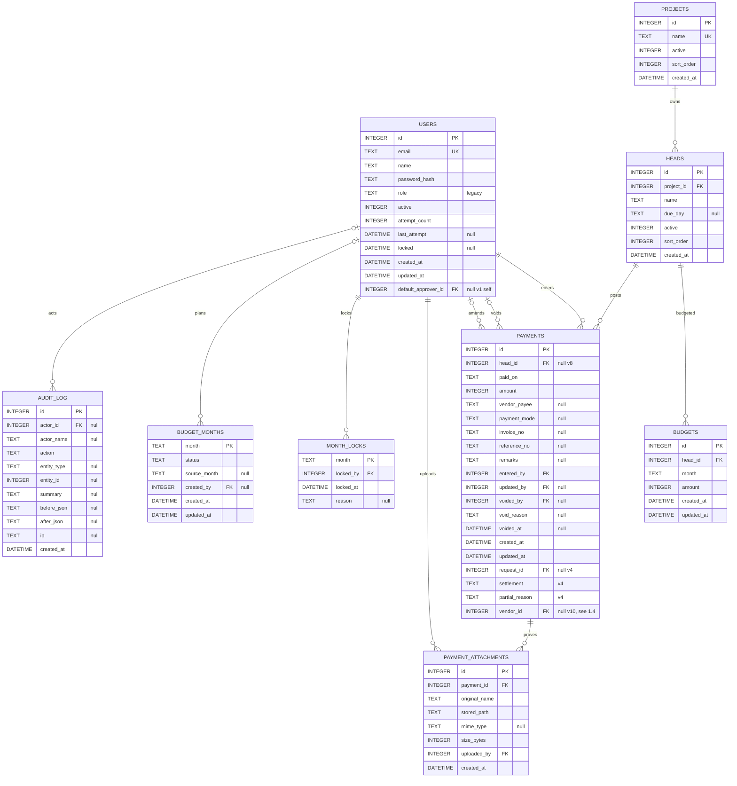
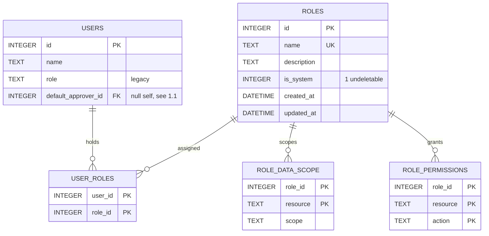
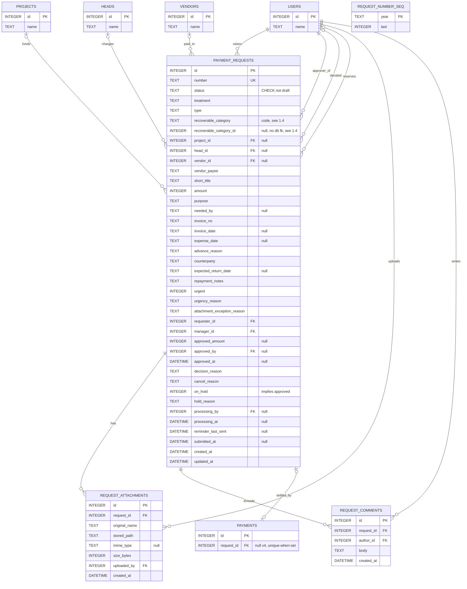
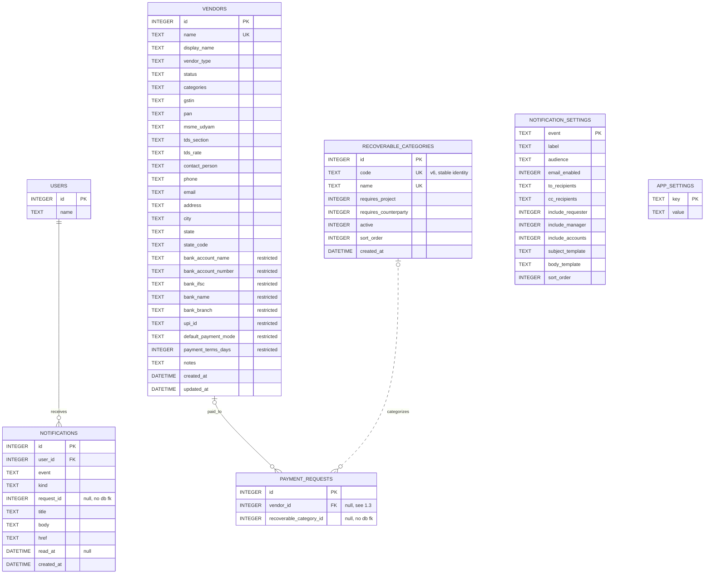
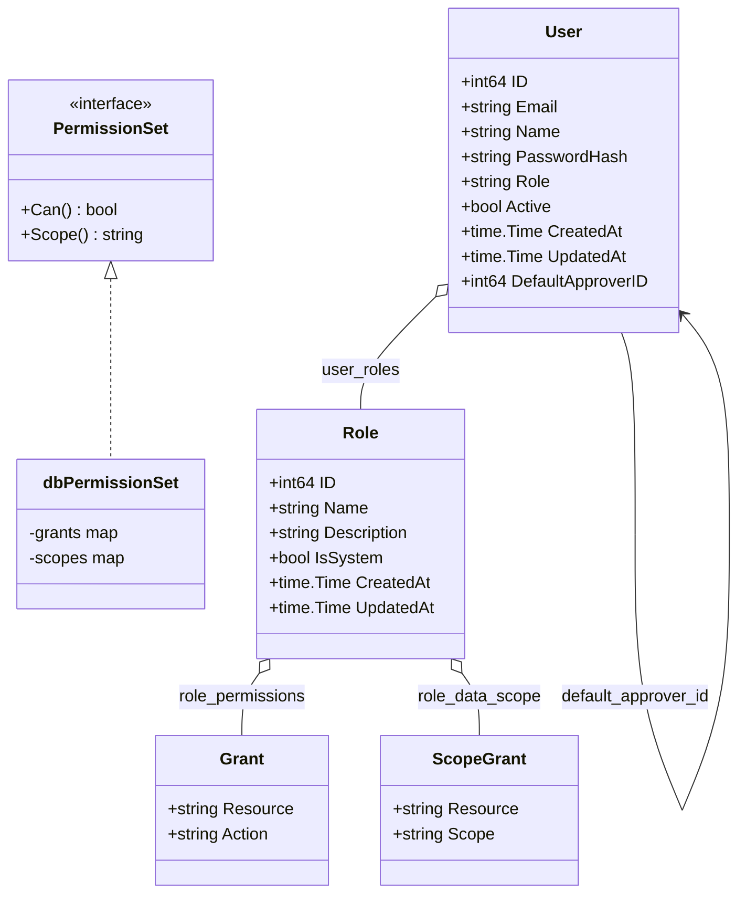
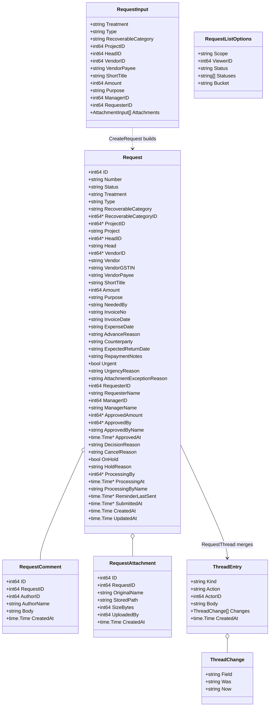
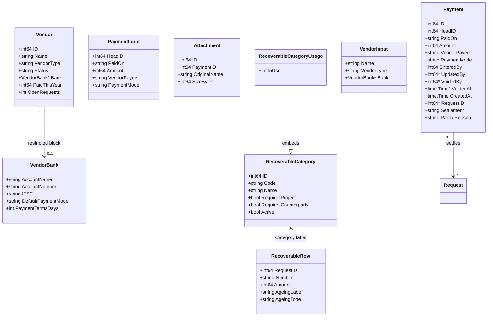
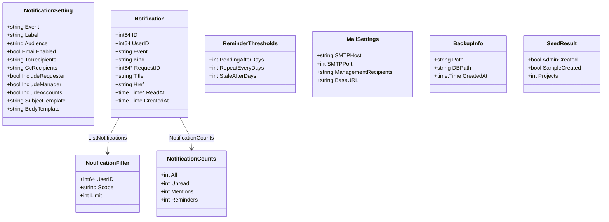

# 01 — Domain Model

Derived entirely from code: `internal/store/schema.go` (v0 baseline), `internal/store/migrations.go`
(v1–v10), `internal/store/migrations_notifications.go` (v7 and v9 detail), `internal/store/recoverables.go`
(v6 detail), `internal/store/models.go`, `permissions.go`, `vendors.go`, `notifications.go`,
`inapp.go`, `reminders.go`, `settings.go`, `badges.go`, `backup.go`, `seed.go`, `store.go`,
`requests.go`, `internal/app/linking.go`, `internal/money/money.go`, and (for the request-status
cross-check) `internal/store/requests_test.go`. Where a claim could not be confirmed from code it is
marked **UNVERIFIED**.

The database has **22 tables**. Migrations are strictly append-only and
contiguous — v1 permissions, v2 vendors, v3 requests, v4 payments-request-linking, v5
accounts-reservation-grants (permission rows only, no schema), v6 recoverable categories, v7
notifications (`internal/store/migrations.go:15-30`).

**Since the audit:** three more migrations landed during the repair waves, so the sequence now runs
**v1 through v10 as of this writing** — v8 `payments_head_nullable` (`migrations.go:336`), v9
`notification_events_audit` (`migrations.go:344`), v10 `payments_vendor_id` (`migrations.go:352`).
The table count is unchanged at 22: v8 rebuilds `payments` through two scratch tables it drops in the
same transaction (`migrations.go:447,451,480-481,486`), v9 inserts rows only, v10 adds a column. This
document is otherwise written against commit `30edd6a`; the list above is the authority for numbering
and a v11 may follow it.

---

## 1. Entity-relationship diagrams

Split by subject area per the brief: (1.1) core budget/ledger, (1.2) permissions, (1.3) requests +
attachments + comments, (1.4) vendors + recoverables + notifications + settings. Entities that are
foreign-key targets from a neighbouring diagram are repeated as **stubs** (PK + name only) so each
diagram stands alone; the full column list for a stub always lives in the diagram that owns that
table. A dashed (`..`) relationship line marks a link that is *not* enforced by a SQL `REFERENCES`
clause — everything else is a real, `PRAGMA foreign_keys=ON`-checked foreign key
(`internal/store/schema.go:4`, `internal/store/store.go:36`).

### 1.1 Core budget & ledger (schema v0 baseline)

Columns tagged `v4` (`payments.request_id`, `settlement`, `partial_reason`) were added by `ALTER
TABLE` in migration v4 (`internal/store/migrations.go:272-289`) — every row written before Phase 3
keeps `request_id NULL`, which is what X6 depends on. `users.default_approver_id` was added in v1
(`internal/store/migrations.go:333-340`, `addDefaultApproverColumn`), not v0, even though it is
drawn here with the rest of `users` for locality. Composite uniqueness that Mermaid cannot express
on a single attribute — `heads(project_id, name)` and `budgets(head_id, month)` — is listed in the
§2 index inventory instead of forced into this diagram.

**Since the audit:** two `payments` columns changed and are re-tagged above.

- `head_id` was `NOT NULL` at `30edd6a`; migration **v8** rebuilt the table with it **nullable**
  (`migrations.go:453`, `head_id INTEGER REFERENCES heads(id)`). A recoverable request carries no
  budget head — the recoverable fieldset never collects one — so the payment settling it could not
  satisfy a `NOT NULL` head. `validatePayment` now takes a `headOptional bool`
  (`internal/store/store.go:1922-1923`); of its three callers only `RecordPaymentForRequest` passes
  it true, as `treatment == "recoverable"` (`store.go:1115`), while the two free-standing payment
  writers pass `false` (`store.go:701,744`). So a recoverable payment settles carrying no head at
  all and every other payment still needs one. Fixed in Wave 1, commit `633997b`, decision 1
  (`docs/qa/results/REPAIR-LOG.md:24,36`). The `HEADS ||--o{ PAYMENTS : posts` line above is
  therefore now optional-to-one on the `PAYMENTS` side.
- `vendor_id` was added by migration **v10** (`migrations.go:390`), back-filled from the request the
  payment settles, so the vendor master no longer infers a vendor from a payee name (F-G-009,
  F-G-010). It is drawn as an attribute only; the `VENDORS` relationship line lives in §1.4, which
  owns that table.

### 1.2 Permissions (migration v1)

`role_id` on `role_permissions`/`role_data_scope` and both columns on `user_roles` carry `ON DELETE
CASCADE` (`internal/store/migrations.go:54,61,68-69`) — the only cascades in the whole schema.
Deleting a non-system role silently empties its grant and scope rows; there is no `DeleteUser` store
method, so the `user_roles` cascade is dormant in practice. `roles.name` is unique
**case-insensitively** via `idx_roles_name_nocase` (`migrations.go:51`), not via the plain-text `name`
column, because `seedSystemRoles`/`backfillUserRoles`/`assignDefaultRoleTx` all resolve a system role
by `lower(name)` (`migrations.go:419,488,507`).

### 1.3 Requests, attachments, comments

All 40 `payment_requests` columns were created in a single migration, v3
(`internal/store/migrations.go:151-201`), including `processing_by`/`processing_at` (Phase 3 fields)
and `reminder_last_sent` (Phase 5 field) — they sit unused until their owning phase writes to them.
`request_number_seq` has **no foreign key to anything**; it is a free-standing per-year counter that
`NextRequestNumber` increments with `UPDATE … SET last=last+1 … RETURNING last` inside the caller's
transaction (`internal/store/requests.go:52-76`) — the only link to `payment_requests.number` is that
the formatted string is spliced together in Go, never enforced by SQL. `payments.request_id` is a
real `REFERENCES payment_requests(id)` (`migrations.go:273`), and the `PAYMENT_REQUESTS
|o--o| PAYMENTS` line is backed by the partial unique index `idx_payments_request` — see §2 and S9 in
§5 for exactly what it prevents.

### 1.4 Vendors, recoverables, notifications, settings

`vendors` (migration v2, `internal/store/migrations.go:100-131`) has **no foreign keys at all** — it
is a self-contained master; the bank block (`bank_*`, `upi_id`, `default_payment_mode`,
`payment_terms_days`) lives on the same row rather than a child table, and is kept from unauthorised
eyes purely by the `Store` never selecting those columns for a caller without `vendor_bank:view`
(`internal/store/vendors.go:143-148`), not by a schema boundary. `recoverable_categories` (v6,
`internal/store/recoverables.go:39-50`) adds a `code` column the overview spec's Phase-4 table never
had (see §6 divergence log). `notification_settings` and `notifications` (both v7,
`internal/store/migrations_notifications.go:75-100`) are the only tables in the whole schema whose
column comments in code (`recoverable_category_id`, `notifications.request_id`) explicitly or
implicitly forgo a `REFERENCES` clause on an integer id column — the dashed relationship line above
is the deliberate, documented one (A21, `internal/store/migrations.go:160-167`); `notifications
.request_id` is the second, undocumented instance (see §5 and §6).

---

## 2. Table inventory

| ID | Table | Introduced in | Purpose | Row-count driver |
|---|---|---|---|---|
| T01 | `users` | v0 | Every human actor: login, legacy role, lockout state, default approver | one row per employee/admin account, rarely deleted |
| T02 | `projects` | v0 | Budget project master | small, admin-maintained |
| T03 | `heads` | v0 | Budget line (head) within a project | small, admin-maintained |
| T04 | `budgets` | v0 | Planned amount for one head in one month | heads × months in use |
| T05 | `budget_months` | v0 | Per-month plan status (open/locked) and provenance | one row per month that has ever had a plan or a lock |
| T06 | `payments` | v0 (+v4 cols, +v8 rebuild, +v10 col) | The ledger: every rupee actually paid, plus (v4) the request it settles. Since the audit: v8 rebuilt the table so `head_id` is nullable (`migrations.go:453`) and v10 added `vendor_id` (`migrations.go:390`) | one row per payment ever recorded, append-mostly (voided, not deleted) |
| T07 | `payment_attachments` | v0 | Proof-of-payment files attached to a ledger row | payments with uploaded evidence |
| T08 | `month_locks` | v0 | Which months are frozen against further edits | one row per locked month |
| T09 | `audit_log` | v0 | Free-text, free-entity_type history of every mutation | grows with every write in the system |
| T10 | `roles` | v1 | Named, admin-editable permission bundles; 4 are system-seeded | small (system + a handful of custom roles) |
| T11 | `role_permissions` | v1 | One row per granted (resource, action) pair on a role | roles × grants (up to 66 canonical pairs per role) |
| T12 | `role_data_scope` | v1 | The broadest data scope (own/assigned/all) a role holds per scoped resource | roles × 2 (only `request`, `payment` are scoped) |
| T13 | `user_roles` | v1 | Many-to-many user↔role assignment | users × roles held |
| T14 | `vendors` | v2 | Vendor/payee master, including the access-restricted bank block | one row per distinct payee company/proprietor/individual |
| T15 | `payment_requests` | v3 | The request itself: type, amounts, approval, hold, reservation, all in one row | one row per request ever raised, all statuses |
| T16 | `request_attachments` | v3 | Supporting documents on a request | requests with uploaded evidence |
| T17 | `request_comments` | v3 | Conversation thread on a request | requests with back-and-forth |
| T18 | `request_number_seq` | v3 | Per-year monotonic counter feeding the human-readable request number | one row per calendar/financial year (or a single blank-year row if `number_year_mode='none'`) |
| T19 | `app_settings` | v3 (+v5 keys) | Generic key/value runtime configuration (numbering, attachments, urgency, SMTP, etc.) | fixed small set of keys |
| T20 | `recoverable_categories` | v6 | Admin-configurable recoverable-payment categories and their field rules | small (6 seeded + admin additions) |
| T21 | `notification_settings` | v7 (+v9 rows) | The 12 admin-editable event rules (recipients, templates, email on/off). **Since the audit: 21 rules** — v9 adds nine more (`migrations_notifications.go:87-129`) | ~~fixed at 12 rows, seeded once~~ **fixed at 21 rows**, seeded by two migrations; v9 uses `ON CONFLICT(event) DO NOTHING` so an administrator's edits to v7's twelve survive |
| T22 | `notifications` | v7 | In-app notification centre: one row per recipient per event | users × events fired at them, grows continuously |

### Indexes and unique constraints — what each one prevents

| ID | On | Definition | Prevents |
|---|---|---|---|
| IDX01 | `users` | `UNIQUE(email)` table constraint + `idx_users_email_nocase UNIQUE(lower(email))` (`schema.go:8,119`) | Two accounts sharing one email address, including differing only by case |
| IDX02 | `users` | `idx_users_login_lock (email, locked)` (`schema.go:122`) | Nothing structurally — a performance index for the login-lockout lookup |
| IDX03 | `projects` | `UNIQUE(name)` + `idx_projects_name_nocase UNIQUE(lower(name))` (`schema.go:22,120`) | Two projects with the same name, case-insensitively |
| IDX04 | `heads` | `UNIQUE(project_id, name)` + `idx_heads_project_name_nocase UNIQUE(project_id, lower(name))` (`schema.go:36,121`) | Two heads with the same name inside one project, case-insensitively |
| IDX05 | `budgets` | `UNIQUE(head_id, month)` (`schema.go:46`) | Two budget rows for the same head in the same month — `SetBudgets` relies on this for its upsert |
| IDX06 | `payments` | `idx_payments_head`, `idx_payments_paid_on`, `idx_payments_voided` (`schema.go:109-111`) | Nothing structurally — list/report query performance |
| IDX07 | `budgets` | `idx_budgets_head_month` (`schema.go:112`) | Nothing new — redundant with IDX05, kept for query planning |
| IDX08 | `budget_months` | `idx_budget_months_status` (`schema.go:113`) | Performance only |
| IDX09 | `audit_log` | `idx_audit_entity`, `idx_audit_created` (`schema.go:114-115`) | Performance only |
| IDX10 | `payment_attachments` | `idx_attachments_payment` (`schema.go:116`) | Performance only |
| IDX11 | `roles` | `idx_roles_name_nocase UNIQUE(lower(name))` (`migrations.go:51`) | Two roles with the same name, case-insensitively — load-bearing because system-role lookups resolve by `lower(name)` |
| IDX12 | `role_permissions` | `PRIMARY KEY(role_id, resource, action)` (`migrations.go:57`) | The same (resource, action) pair being granted twice to one role |
| IDX13 | `role_data_scope` | `PRIMARY KEY(role_id, resource)` (`migrations.go:64`) | A role holding two different scopes on the same resource at once |
| IDX14 | `user_roles` | `PRIMARY KEY(user_id, role_id)` (`migrations.go:70`) | Assigning the same role to the same user twice |
| IDX15 | `vendors` | `idx_vendors_name_nocase UNIQUE(lower(name))` (`migrations.go:131`) | Two vendors with the same name, case-insensitively — `CreateVendor`'s `classify(err)` turns the violation into `ErrDuplicate` |
| IDX16 | `vendors` | `idx_vendors_status` (`migrations.go:132`) | Performance only |
| IDX17 | `payment_requests` | `UNIQUE(number)` table constraint (`migrations.go:153`) | Two requests sharing one formatted number — belt-and-braces alongside the atomic `request_number_seq` counter |
| IDX18 | `payment_requests` | `idx_requests_status`, `idx_requests_manager`, `idx_requests_requester`, `idx_requests_vendor` (`migrations.go:203-206`) | Performance only (queue/list/history lookups) |
| IDX19 | `request_attachments` | `idx_request_attachments_request` (`migrations.go:218`) | Performance only |
| IDX20 | `request_comments` | `idx_request_comments_request` (`migrations.go:227`) | Performance only |
| IDX21 | `payments` | `idx_payments_request UNIQUE(request_id) WHERE request_id IS NOT NULL` (`migrations.go:289`) | **A second payment being linked to a request that already has one (S9).** Partial so the many historical rows with `request_id IS NULL` never collide with each other |
| IDX22 | `recoverable_categories` | `idx_recoverable_categories_code UNIQUE(code)` (`recoverables.go:49`) | Two categories sharing one stable code — the identity `payment_requests.recoverable_category` resolves rules by |
| IDX23 | `recoverable_categories` | `idx_recoverable_categories_name_nocase UNIQUE(lower(name))` (`recoverables.go:50`) | Two categories with the same display name, case-insensitively |
| IDX24 | `notifications` | `idx_notifications_user_unread (user_id, read_at, created_at DESC)`, `idx_notifications_request (request_id)` (`migrations_notifications.go:101-102`) | Performance only |
| IDX25 | `notification_settings` | `PRIMARY KEY(event)` (`migrations_notifications.go:76`) | Two settings rows for the same event |
| IDX26 | `app_settings` | `PRIMARY KEY(key)` (`schema.go:235`) | Two values for the same setting key |
| IDX27 | `request_number_seq` | `PRIMARY KEY(year)` (`migrations.go:230`) | Two counters for the same year |

The schema's **only** `CHECK` constraint anywhere is `payment_requests.status CHECK (status <>
'draft')` (`migrations.go:156`) — see D1 in §5 and §6. The schema's **only** `ON DELETE CASCADE`
relationships are the three on `role_permissions.role_id`, `role_data_scope.role_id`,
`user_roles.user_id`/`user_roles.role_id` (`migrations.go:54,61,68-69`).

---

## 3. Go domain class diagrams

Exported `store` package types, split the same way as the ER diagrams. `*T` denotes a pointer field
(nullable column or optional value); a bare type denotes a NOT NULL column or a value the store
always fills in. Method bodies are omitted from the diagrams for readability — the store-method
mapping table under each diagram gives full signatures.

### 3.1 Identity & permissions

`PermissionSet.Can(resource, action string) bool` and `.Scope(resource string) string`
(`internal/store/permissions.go:17-23`) are asked by every gate in the app; `dbPermissionSet` is the
**only** concrete implementation (`permissions.go:58-63`, pinned by `var _ PermissionSet =
(*dbPermissionSet)(nil)`), built either from the roles tables (`EffectivePermissions`) or from a
literal grant list (`NewPermissionSet`, used by fixtures and `AllGrants()`).

| Store method | Operates on |
|---|---|
| `AllRoles`, `Role`, `CreateRole`, `UpdateRole`, `DeleteRole`, `CopyRole` (`permissions.go:218-456`) | `Role` |
| `RolePermissions`, `UpdateRolePermissions` (`permissions.go:330-413`) | `Role`, `[]Grant`, `[]ScopeGrant` |
| `SetUserRoles`, `UserRoles` (`permissions.go:458-510`) | `User`, `Role` |
| `SetUserDefaultApprover` (`permissions.go:516-555`) | `User` |
| `EffectivePermissions` (`permissions.go:560-598`) | returns `PermissionSet` |
| `CreateUser`, `EnsureUser`, `UserByEmail`, `UserByID`, `ListUsers`, `UpdateUser`, `RequireAnotherActiveAdmin`, login-attempt methods (`store.go:54-232`) | `User` (legacy `role` column, not RBAC) |

### 3.2 Request lifecycle

`RequestInput.RequesterID` is filled by the store from the caller, never taken off the form
(`models.go:386-388`) — the field exists purely so `validateRequestInput` can reject self-approval
(G8). Nullable columns (`recoverable_category_id`, `project_id`, `head_id`, `vendor_id`,
`approved_amount`, `approved_by`, `approved_at`, `processing_by`, `processing_at`,
`reminder_last_sent`, `submitted_at`) are all `*T` on `Request`; everything else on the row is a
value type, matching the NOT NULL columns in §1.3.

| Store method | Operates on |
|---|---|
| `CreateRequest`, `UpdateRequest`, `SubmitRequest`, `WithdrawRequest` (`requests.go:365-643`) | `Request`, `RequestInput` |
| `ApproveRequest`, `ReturnRequest`, `RejectRequest`, `ReassignRequest`, `ReraiseRequest` (`requests.go:674-856`) | `Request` |
| `RequestCancellation`, `DecideCancellation`, `CancelRequest` (`requests.go:861-999`) | `Request` |
| `AddRequestComment`, `RequestComments` (`requests.go:1001-1049`) | `RequestComment` |
| `AddRequestAttachment`, `RequestAttachments` (`requests.go:1051-1080`, `330-346`) | `RequestAttachment` |
| `RequestThread` (`requests.go:1145-1197`) | `ThreadEntry`, `ThreadChange` |
| `ListRequests`, `CountRequests`, `SimilarRequests`, `Request` (`requests.go:255-354,1271-1354`) | `Request`, `RequestListOptions` |
| `ReserveRequest`, `ReleaseRequest`, `ReassignReservation`, `HoldRequest`, `UnholdRequest` (`store.go:730-1083`) | `Request` |
| `RecordPaymentForRequest`, `AcceptPartial`, `RaiseConcern`, `PaymentForRequest` (`store.go:866-1000,689-703`) | `Request`, `Payment` |
| `LinkablePaymentRequests` (`store.go:1090-1232`) | `Request`, `LinkableSet`, `LinkableCounts` |
| `RequestsPendingReminder`, `RequestsStaleProcessing`, `MarkReminderSent`, `ResetReminder` (`reminders.go:87-141`) | `Request`, `ReminderThresholds` |

### 3.3 Payments, vendors, recoverables

`Vendor.Bank` is `nil` unless the caller holds `vendor_bank:view` — a zero-valued `VendorBank` would
be indistinguishable from "no bank details on file", so `nil` deliberately means "withheld"
(`vendors.go:19-24,48-50`). `Payment.RequestID *int64` is `nil` for every historical (pre-Phase-3)
payment, which is what keeps those rows editable and voidable (X6); a non-nil `RequestID` makes the
payment immutable (S12, enforced in `UpdatePaymentWithAttachment` at `store.go:607-611` and
`VoidPayment` at `store.go:648-651`).

| Store method | Operates on |
|---|---|
| `CreatePayment`, `CreatePaymentWithAttachment`, `UpdatePayment`, `UpdatePaymentWithAttachment`, `VoidPayment` (`store.go:535-673`) | `Payment`, `PaymentInput` |
| `Payment`, `PaymentForRequest`, `ListPayments`, `RecentPayments` (`store.go:675-703,1234-1308`) | `Payment` |
| `AddAttachment`, `Attachments`, `AttachmentByID` (`store.go:1310-1361`) | `Attachment`, `AttachmentInput` |
| `Vendor`, `ListVendors`, `VendorStats`, `VendorCategories`, `SearchVendors` (`vendors.go:196-370`) | `Vendor`, `VendorListOptions` |
| `CreateVendor`, `UpdateVendor` (`vendors.go:432-543`) | `Vendor`, `VendorInput`, `VendorBank` |
| `ListRecoverableCategories`, `UpsertRecoverableCategory`, `ListRecoverableCategoriesWithUsage` (`recoverables.go:162-248`) | `RecoverableCategory`, `RecoverableCategoryUsage` |
| `RecoverableReport`, `RecoverableMetrics`, `RecoverableRollups` (`recoverables.go:281-454`) | `RecoverableRow`, `RecoverableMetrics`, `RecoverableRollup` |

There is **no `DeleteVendor` and no `DeleteRecoverableCategory` method anywhere** — deactivation
(`status='inactive'` / `active=0`) is the only removal path for either, even though the canonical
permission vocabulary grants `recoverable_category:delete` (see §6).

### 3.4 Notifications, reminders, settings, backup

`NotificationSetting.Event` is the string primary key shared with `notify.AllEvents`
(`internal/notify/events.go:71-79`) and with the rows the notification migrations seed — v7's twelve
(`migrations_notifications.go:28-68`) and v9's nine (`migrations_notifications.go:155`,
`UpAuditNotificationEvents`) — see §4 for the full event list and its divergence from the
overview spec. **Since the audit:** the vocabulary was twelve at `30edd6a` and is **21** now; the
`AllEvents` slice moved to `events.go:71-79` when v9's block was added above it. `MailSettings` deliberately has **no password field**; the SMTP password is read from
the environment and never persisted (`notifications.go:20-22`).

| Store method | Operates on |
|---|---|
| `NotificationSetting`, `AllNotificationSettings`, `SetNotificationSetting` (`notifications.go:91-150`) | `NotificationSetting` |
| `UsersWithPermission` (`notifications.go:155-175`) | `User` |
| `GetMailSettings`, `SetMailSettings` (`notifications.go:46-73`) | `MailSettings` |
| `AddNotification`, `ListNotifications`, `Notification`, `NotificationCounts`, `UnreadNotificationCount`, `MarkNotificationRead`, `MarkAllNotificationsRead` (`inapp.go:67-184`) | `Notification`, `NotificationFilter`, `NotificationCounts` |
| `ReminderThresholds`, `RequestsPendingReminder`, `RequestsStaleProcessing`, `MarkReminderSent`, `ResetReminder` (`reminders.go:64-141`) | `ReminderThresholds`, `Request` |
| `CreateBackup`/`Backup`, `RestoreBackup`/`Restore`, `PruneBackups` (`backup.go:39-187`) | `BackupOptions`, `BackupInfo`, `RestoreOptions` |
| `Seed`, `SeedSampleData` (`seed.go:36-68`) | `SeedOptions`, `SeedResult` |
| `AppSetting`, `AppSettings`, `SetAppSetting`, `SetAppSettings` (`settings.go:11-82`) | raw `map[string]string`, not a struct |
| `BadgeCounts` (`badges.go:71-120`) | raw `map[string]int`, not a struct |

---

## 4. Enumerations

Every value below is read from code, not inferred. Where the overview spec (§6) names a different
value or a different count, it is flagged inline and repeated in §6.

**Request statuses** — 11 live values (`internal/store/requests.go:86-89` for 7 of them, plus
`processing`, `partial_review`, `completed`, `completed_partial` used directly as string literals in
`store.go` and `requests.go`):

`pending` · `returned` · `approved` · `rejected` · `withdrawn` · `cancellation_requested` ·
`cancelled` · `processing` · `partial_review` · `completed` · `completed_partial`.

`draft` is **explicitly not a value** — `CHECK (status <> 'draft')` makes it unrepresentable
(`migrations.go:156`), `requestStatuses` never lists it, and `TestNoDraftStateExists`
(`internal/store/requests_test.go:313-339`) is a proof-of-absence test whose own comment reads "D1
proof of absence: coverage row L1 inverted." The overview spec's §6 enum (`draft, pending, returned,
rejected, withdrawn, approved, processing, partial_review, completed`) has `draft` **and** is missing
`cancellation_requested`, `cancelled` and `completed_partial` — see §6.

**Legal transitions enforced by `canTransition`** (`requests.go:91-105`) cover only the
Phase-2/G1/G2 request-decision edges: `returned→pending`; `pending→{approved, returned, rejected,
withdrawn}`; `approved→{cancellation_requested, cancelled}`; `cancellation_requested→{cancelled,
approved}`; `partial_review→{completed, completed_partial}`. The reservation/settlement edges
(`approved→processing`, `processing→approved`, `processing→{completed, partial_review}`) are **not**
in this map at all — they are enforced by conditional `UPDATE … WHERE status='…'` statements in
`ReserveRequest`, `ReleaseRequest` and `RecordPaymentForRequest` (`store.go:736-738, 788, 925`), a
second, separate enforcement mechanism for the same idea. `rejected`, `withdrawn`, `completed` and
`completed_partial` are terminal (no outgoing edge in `legalTransitions`, and no other function
transitions out of them).

**Treatments** (`requests.go:145-147`): `budget` · `recoverable`. Matches the overview spec exactly.

**Types** (`requests.go:78-81`): `vendor_invoice` · `vendor_advance` · `reimbursement` ·
`employee_advance` · `recoverable`. Matches the overview spec exactly.

**Settlement values** on `payments.settlement` (`store.go:867-873`, column default `''`):
`""` (historical/unlinked) · `settled` · `partial`. The corresponding request-status outcomes are
`completed` (settled) and `partial_review` → `completed_partial` (accepted) or remains
`partial_review` (concern raised) — see the state-machine document for the full graph.

**Data scopes** (`permissions.go:26,200-205`): `own` · `assigned` · `all` (`ScopeAll`), applicable
only to the two `scopedResources`, `request` and `payment` (`permissions.go:185`).

**Permission vocabulary** (`permissions.go:150-183`): **21 resources, 66 (resource, action) pairs**
— `request`(7) `approval`(6) `payment`(8) `reservation`(3) `attachment`(2) `vendor`(3)
`vendor_bank`(2) `project`(3) `head`(3) `budget`(2) `month`(3) `grid`(2) `report`(2)
`recoverable_category`(4) `recoverable_report`(2) `user`(3) `role`(4) `notification`(2) `config`(2)
`audit`(1) `backup`(2). `TestPermissionVocabularyIsCanonical` pins the total. The overview spec §5
lists 17 resources and 54 pairs (no `vendor`, `vendor_bank`, `reservation`, `config`; no
`request:cancel` or `approval:cancel`) — see §6.

**Notification events** — **21**, mirrored in `notify.AllEvents` (`internal/notify/events.go:71-79`),
in the seeded `sort_order`: v7's twelve, then v9's nine.

Seeded by migration v7 (`internal/notify/events.go:8-19`, `migrations_notifications.go:28-68`):

`request_submitted` · `request_edited` · `request_returned` · `request_rejected` ·
`request_approved` · `request_urgent` · `request_on_hold` · `request_cancellation_requested` ·
`payment_settled` · `payment_partial_review` · `reminder_pending` · `reminder_stale_reservation`.

**Since the audit** — nine more, seeded by migration v9 (`internal/notify/events.go:22-67`,
`migrations_notifications.go:155`, `UpAuditNotificationEvents`). At `30edd6a` this enumeration was
twelve and the count is now 21; the audit finding was F-F-06 (six workflow actions notified nobody
at all), fixed as vocabulary in Wave 2, commit `25411b8`, and wired in Wave 4:

`request_withdrawn` · `request_reraised` · `request_unheld` · `reservation_released` ·
`reservation_reassigned` · `payment_partial_accepted` · `payment_partial_concern` ·
`request_cancellation_accepted` · `request_cancellation_declined`.

v9 inserts with `ON CONFLICT(event) DO NOTHING` (`migrations_notifications.go:136`), so an
administrator's edits to v7's twelve survive — which is why it is a migration and never a re-seed
(`migrations.go:341-343`).

The overview spec §6 names only `request_approved`, `request_submitted_urgent`,
`request_approved_urgent`, `reminder_pending`, `reminder_processing_stale` — none of the "urgent"
pair exist in code (there is one `request_urgent` event, not two), and `reminder_stale_reservation`
is named differently from the spec's `reminder_processing_stale`. See §6.

**Audit `entity_type` values** — free text, not a declared enum; every literal actually used in
production code (`grep 'EntityType: "'`): `app_setting` · `backup` · `budget` · `budget_month` ·
`head` · `month_lock` · `notification_setting` · `payment` · `payment_request` · `project` ·
`recoverable_category` · `recoverable_report` · `report` · `role` · `user` · `vendor`. `role` also
covers `SetUserRoles`, which writes `EntityType: "user"` even though the mutation is role assignment
(`permissions.go:488`) — a minor naming inconsistency, not a defect.

**Payment modes** — two *different*, disconnected vocabularies exist in the running system:

1. The live one, hardcoded in `internal/app/linking.go:993-995` (`paymentModes()`) and spelled by
   `paymentModeText` (`internal/app/app.go:1815-1829`): `bank_transfer` · `cash` · `cheque` · `card` ·
   `upi` · `other` — six values, and this is what the payment-entry `<select>` actually renders
   (`internal/app/templates.go:415-417`).
2. The admin-configurable `app_settings['payment_modes']` key, default `"NEFT, RTGS, UPI, Cheque,
   Cash, Card, DD"`, seeded by migration v3 (`migrations.go:248`) and editable on the Configuration
   screen as "Payment modes offered" (`internal/app/configuration.go:72`) — **this value is never
   read anywhere else in the codebase** (confirmed by exhaustive grep: the only non-test reference is
   the Configuration screen's own field definition). Editing it has no observable effect. See §6 and
   the defects list.

`payments.payment_mode` itself is an unconstrained `TEXT` column (`schema.go:64`) — the database
accepts any string; only the Go `<select>` options limit what a normal user can enter.

---

## 5. Invariants and where they are enforced

| ID | Invariant | Enforced in | SQL or Go |
|---|---|---|---|
| INV01 | Exactly one non-voided payment may be linked to a request | `idx_payments_request UNIQUE(request_id) WHERE request_id IS NOT NULL` (`migrations.go:289`) | SQL (partial unique index) |
| INV02 | `on_hold=1` only ever describes a request that is currently `status='approved'` | `HoldRequest` sets it only `WHERE status='approved' AND on_hold=0` (`store.go:1047`); `RequestCancellation`, `DecideCancellation`, `CancelRequest` all clear `on_hold`/`hold_reason` in the same statement that moves the row off `approved` (`requests.go:889,941,985`); re-derived defensively at read time by `activeHold` (`internal/app/linking.go:808-810`) | Go (no CHECK or trigger ties the two columns together at the SQL level) |
| INV03 | Money is always integer paise, never a fractional or currency-formatted value | `int64` fields throughout `store` (`models.go`); parsed exclusively via `money.ParsePaise`, which rounds and rejects non-positive/non-numeric input (`internal/money/money.go:15-34`); rendered exclusively via `money.FormatPaise`/`FormatShort` (`money.go:36-61`) | Go only — `INTEGER` column *affinity* does not itself reject a non-integer write; the guarantee is that no code path other than raw SQL ever bypasses `ParsePaise` |
| INV04 | `PRAGMA foreign_keys` is ON for every pooled connection, not just the first | DSN query parameter `_pragma=foreign_keys(1)` applied by `modernc.org/sqlite` to each new connection (`store.go:27-36`); regression-pinned by `TestForeignKeysEnforcedOnEveryPooledConnection` (`pragma_test.go:17-53`), which opens 8 connections and proves a dangling insert fails on all of them | SQL (PRAGMA), Go-orchestrated via the DSN |
| INV05 | A request number is monotonic per year and never reused | `NextRequestNumber` performs `UPDATE request_number_seq SET last=last+1 WHERE year=? RETURNING last` inside the caller's transaction, so two concurrent creators cannot receive the same `last` (`requests.go:52-76`); belt-and-braces `UNIQUE(number)` on `payment_requests` (`migrations.go:153`) | SQL (atomic UPDATE…RETURNING) + SQL (unique constraint as a backstop) |
| INV06 | `payment_requests.recoverable_category_id` is a bare `INTEGER` with no `REFERENCES` clause | Declared without `REFERENCES` deliberately: `recoverable_categories` does not exist until v6, and with `PRAGMA foreign_keys=ON` a forward reference to a not-yet-created table would make every `INSERT` on `payment_requests` fail from v3 until v6 shipped, even when the value is `NULL` (`migrations.go:160-167`, comment "A21") | Go/schema design choice, not SQL-enforced |
| INV07 | Role name uniqueness is case-insensitive | `idx_roles_name_nocase UNIQUE(lower(name))` (`migrations.go:51`); relied on by `seedSystemRoles`, `backfillUserRoles`, `assignDefaultRoleTx`, all of which `SELECT … WHERE lower(name)=lower(?)` (`migrations.go:419,488,507`) | SQL (unique expression index) + Go (lookup convention) |
| INV08 | System roles (`is_system=1`) can never be deleted, and can never be renamed | `DeleteRole` refuses with `ErrForbidden` when `is_system=1` (`permissions.go:318-320`); `UpdateRole` refuses a name change (but allows a description change) when `is_system=1` and the new name differs case-insensitively (`permissions.go:290-292`) | Go only — no SQL trigger backs this |
| INV09 | Nobody may approve, decide on, or be reassigned their own request (G8) | Checked four separate times: `validateRequestInput` (`requests.go:142-144`), `ApproveRequest` (`requests.go:692-694`), `ReassignRequest` (`requests.go:780-782`), and `SetUserDefaultApprover` (`permissions.go:517-519`, so a user cannot even be set as their own default approver) | Go, defence-in-depth (no single choke point) |
| INV10 | A partial-settlement decision (`AcceptPartial`/`RaiseConcern`) belongs only to the request's own `manager_id`, never to anyone else holding `approval:accept_partial` | `AcceptPartial` (`store.go:980-982`) and `RaiseConcern` (`store.go:1021-1023`) both compare `before.ManagerID != actor.ID` and return `ErrForbidden` | Go |
| INV11 | A payment linked to a request is immutable once recorded (S12) | `UpdatePaymentWithAttachment` refuses when `before.RequestID != nil` (`store.go:607-611`); `VoidPayment` refuses the same way (`store.go:648-651`) | Go |
| INV12 | A paid amount may never exceed the approved (or, absent an adjustment, requested) amount (G13) | `RecordPaymentForRequest` computes the ceiling and rejects `in.Amount > ceiling` before any write (`store.go:901-910`) | Go |
| INV13 | Reservation is atomic: only the first committer of a race wins | `ReserveRequest`'s single conditional `UPDATE … WHERE status='approved' AND processing_by IS NULL AND on_hold=0`; a losing caller sees `RowsAffected()==0` (`store.go:736-747`) | SQL (conditional UPDATE used as a compare-and-swap) |
| INV14 | `recoverable_categories.code` is a stable identity that survives a rename of `name` | `UpsertRecoverableCategory`'s `UPDATE` statement deliberately omits `code` from its `SET` list (`recoverables.go:211-217`); enforced unique by `idx_recoverable_categories_code` | SQL (unique index) + Go (omitted from update) |
| INV15 | At least one active administrator must always remain — but only across the **legacy** `users.role='admin'` column | `RequireAnotherActiveAdmin`, called only from `UpdateUser` (`store.go:126-167`) | Go — **does not** consult the RBAC `user_roles`/`role_permissions` tables at all; see the defects list |

---

## 6. Divergence log

Every row is verified against both documents; `file:line` is given for each side.

| # | Area | Overview spec says | Shipped code does | Spec cite | Code cite |
|---|---|---|---|---|---|
| DV1 | Migration count/mapping | v1–v5, one per phase: v1 permissions, v2 requests, v3 payments-linking, v4 recoverables, v5 notifications | **v1–v10 as of this writing**: v1 permissions, v2 **vendors**, v3 requests, v4 payments-linking, v5 **accounts-reservation-grants (no schema)**, v6 recoverables, v7 notifications, v8 **payments head nullable**, v9 **nine more notification events**, v10 **payments.vendor_id**. The row read "v1–v7" at `30edd6a`; v8–v10 landed in the repair waves, so the *gap* this row records is now five migrations wide, not two | `overview.md:35,194-199` | `migrations.go:15-30`, `:336`, `:344`, `:352` |
| DV2 | Phase map | Five phases (1–5); no vendor master phase is named at all | An entire unplanned "Phase 1V" (vendor master) sits between Phase 1 and Phase 2 in the shipped migration sequence | `overview.md:19-29` (§2 Phase map) | `migrations.go:84-94` |
| DV3 | Permission vocabulary size | 17 resources, 54 (resource, action) pairs; no `vendor`, `vendor_bank`, `reservation`, `config`; no `request:cancel`/`approval:cancel` | 21 resources, 66 pairs (adds exactly those four resources and two actions) | `overview.md:209-230` | `permissions.go:150-183` |
| DV4 | `recoverable_categories` schema | `CREATE TABLE recoverable_categories(id, name, requires_project, requires_counterparty, active, sort_order, created_at)` — no `code` column, unique only on `lower(name)` | Adds a `code TEXT NOT NULL` column with its own `UNIQUE(code)` index; `code` (not `name`) is the stable identity `payment_requests.recoverable_category` resolves by | `overview.md:151-160` | `recoverables.go:39-50` |
| DV5 | `payment_requests.recoverable_category_id` | `INTEGER REFERENCES recoverable_categories(id)` declared directly in the Phase-2 (spec's v2) table — impossible as written, since `recoverable_categories` does not exist until the spec's own Phase 4 | Declared as a bare `INTEGER` with no `REFERENCES` at v3, deliberately, and back-filled once `recoverable_categories` is created at v6 | `overview.md:79` | `migrations.go:160-168`, `recoverables.go:71-78` |
| DV6 | `payment_requests` column set | The Phase-2 `CREATE TABLE` shown omits `recoverable_category` (the text code), `vendor_id`, `short_title`, `invoice_no`, `invoice_date`, `expense_date`, `advance_reason`, `attachment_exception_reason`, `urgency_reason`, `cancel_reason` | All ten columns exist from v3 onward and are load-bearing (per-type validation in `validateRequestInput`) | `overview.md:73-104` | `migrations.go:151-201`, `requests.go:127-247` |
| DV7 | Request status enum | 9 values: `draft, pending, returned, rejected, withdrawn, approved, processing, partial_review, completed` | 11 values, no `draft` (CHECK-forbidden), plus `cancellation_requested`, `cancelled`, `completed_partial` not in the spec at all | `overview.md:246` | `requests.go:86-89`, `migrations.go:156`, string literals in `store.go`/`requests.go` |
| DV8 | Draft state | §1 and §6 both assume a private, editable `draft` request exists before submission | D1: there is no draft. A request is created already `pending`, numbered, and submitted in one transaction (`CreateRequest`) | `overview.md:15,246,248` | `migrations.go:139-145,154-156`, `requests.go:362-364` |
| DV9 | Coverage matrix L1 ("Draft (private)") still claims VERIFIED against a named test | — | The cited test `TestCreateRequestDraftAssignsNumberAndForcesPayee` **does not exist** in the repository; the actual test was renamed `TestCreateRequestIsAtomicCreateAndSubmit`, and a separate proof-of-absence test's own comment reads "D1 proof of absence: coverage row L1 inverted" — the coverage matrix was never updated after the rename | `docs/superpowers/specs/2026-07-25-payment-requests-coverage.md:61` | `internal/store/requests_test.go:263,312-313` (test not found anywhere by that name — confirmed by repo-wide grep) |
| DV10 | Seeded Manager role | `approval` grants: approve, reject, return, reassign, accept_partial — no `cancel` | Manager also holds `approval:cancel` (G2's outright-cancellation power) | `overview.md:238` | `migrations.go:368-377` |
| DV11 | Seeded Accounts role | No `reservation` grants listed (resource doesn't exist in spec's vocabulary) | Accounts holds `reservation:reserve` and `reservation:release`, added by the one-off v5 migration specifically because `seedSystemRoles` only runs at v1 and a re-seed would clobber admin customisation | `overview.md:239` | `migrations.go:293-312,382-393` |
| DV12 | Notification events | Names `request_approved`, `request_submitted_urgent`, `request_approved_urgent`, `reminder_pending`, `reminder_processing_stale` (5 named) | **21** seeded events, differently named: one `request_urgent` (not two "…_urgent" variants), `reminder_stale_reservation` (not `reminder_processing_stale`), plus the rest the spec never names. This row read "12 seeded events" at `30edd6a`; migration v9 added nine more (F-F-06, Wave 2 `25411b8`), so the divergence is wider, not narrower | `overview.md:261` | `migrations_notifications.go:28-68` (v7's twelve), `:155` (v9's nine), `internal/notify/events.go:71-79` |
| DV13 | `payment_modes` app setting | Not mentioned in the overview at all (it is a Phase-2 `app_settings` seed row) | Exists, is admin-editable on the Configuration screen, and is **never read** by the payment form — the live payment-mode options are a separate hardcoded 6-value Go list | n/a | `migrations.go:248`, `internal/app/configuration.go:72`, `internal/app/linking.go:993-995` |
| DV14 | `recoverable_category:delete` permission | Not applicable (resource didn't exist in spec's 17) | Present in the canonical vocabulary and grantable to a role via the admin matrix, but no `DeleteRecoverableCategory` store method and no route ever checks it — a dead permission | n/a | `permissions.go:164`, `internal/app/permmap.go:114` (grep of `internal/app/*.go` and `internal/store/*.go` confirms no consumer) |
| DV15 | Last-active-administrator safety check | Not specified at this level of detail | `RequireAnotherActiveAdmin` guards only the legacy `users.role='admin'`/`active` columns (`UpdateUser`); it is never consulted by `SetUserRoles` or `UpdateRolePermissions`, so the RBAC path can strip every user of the `Admin` role, or strip the `Admin` role of `user:edit`/`role:edit`, with no safety net | n/a | `store.go:126-167`, `permissions.go:458-492,366-413`, `auth.go:122-148` (RequirePermission never consults the legacy column) |

---

## Report

**Deliverable:** `docs/qa/uml/01-domain-model.md` — sections: (1) four ER diagrams (core
budget/ledger; permissions; requests+attachments+comments; vendors/recoverables/notifications/settings);
(2) table inventory (22 tables) plus a 27-row index/unique-constraint inventory stating what each
prevents; (3) four Go `classDiagram`s (identity & permissions; request lifecycle; payments, vendors,
recoverables; notifications, reminders, settings, backup) each with a store-method-to-type mapping
table; (4) canonical enumerations (request statuses, transitions, treatments, types, settlement
values, data scopes, permission vocabulary, notification events, audit entity types, payment modes)
with spec-vs-code flags inline; (5) 15 invariants with `file:line` and SQL-vs-Go enforcement; (6) a
15-row divergence log against the overview spec.

**Divergences found:** the 15 rows of §6 above, most load-bearing: migration numbering (v1–v5 vs
v1–v10 as of this writing — v1–v7 when this was written, DV1), an entirely unplanned vendor-master
phase missing from the spec's phase map (DV2), 17→21
resources / 54→66 permission pairs (DV3), `recoverable_categories` gaining a `code` identity column
the spec never had (DV4), the spec's Phase-2 `recoverable_category_id` FK being physically impossible
as written (DV5), a materially incomplete `payment_requests` column list in the spec (DV6), the
request-status enum being wrong in both directions — has `draft` the code forbids, lacks three
statuses the code has (DV7/DV8) — and the coverage matrix citing a test that no longer exists for the
very requirement (L1/"Draft") that D1 inverted (DV9). Also two role-seeding differences (DV10, DV11)
and a completely different notification-event vocabulary (DV12).

**Suspected defects, ranked:**
1. **RBAC "last admin" gap (DV15).** `RequireAnotherActiveAdmin` only reads `users.role='admin'`,
   never the RBAC `user_roles`/`role_permissions` tables that `RequirePermission` actually checks.
   Concrete scenario: an administrator uses the Roles screen to strip the `Admin` system role's
   `user:edit`/`role:edit` grants (`UpdateRolePermissions`), or uses the Users screen to remove the
   last person's `Admin` role assignment (`SetUserRoles`) — neither call path consults the legacy
   column, so the system can be left with no user able to reach any admin route, with no in-app
   recovery.
2. **Dead `payment_modes` setting (DV13).** The Configuration screen persuasively offers "Payment
   modes offered" as an editable list, but no code path ever reads `app_settings['payment_modes']`;
   the actual dropdown is a separate hardcoded 6-value list. An admin who edits this setting expecting
   it to change what accountants can select will see no effect at all.
3. **Dead `recoverable_category:delete` permission (DV14).** Grantable through the roles matrix,
   never checked by any route or store method — granting or revoking it changes nothing observable,
   which is confusing for an auditor reading the roles matrix.
4. **Stale coverage-matrix citation (DV9).** `2026-07-25-payment-requests-coverage.md` still claims
   "92/92 VERIFIED" while citing a test name that does not exist in the repository for requirement L1.
   Anyone trusting the coverage matrix at face value would believe a draft state is tested; it not
   only isn't, it's proven absent by a different, correctly-passing test.
5. **`notifications.request_id` has no `REFERENCES` clause** and, unlike `recoverable_category_id`,
   no comment in code explains why — `payment_requests` already exists by the time the v7 migration
   runs, so the "forward reference" justification that applies to `recoverable_category_id` does not
   apply here. Likely just an oversight (notifications are never joined back to a request row in a
   way that would need cascading delete protection today, since nothing ever deletes a
   `payment_requests` row), but worth a second opinion from whoever built Phase 5.

**Coverage IDs touched:** this is a structural document, not a test-case document, so it does not
directly execute any of the 92 matrix IDs. It supplies the ground truth that downstream test-case
authors need for **C3** (currency/paise), **C4** (request number monotonic), **S9** (one payment per
request), **S12** (linked payment immutable), **L1/L11** (status enum and legal transitions — and
flags L1's own description as inverted by D1), **R1–R9** (permission vocabulary and role structure),
and **V4/V5** (recoverable category admin-configurability and per-category rules).

**Unverified:** (a) whether `idx_budgets_head_month` (`schema.go:112`) was ever intended to differ
from the table-level `UNIQUE(head_id, month)` constraint, or is simply a leftover — code gives no
comment either way, so it is recorded as "performance only, redundant" rather than guessed at; (b)
whether the `notifications.request_id` missing-`REFERENCES` gap (finding 5 above) is deliberate —
no comment in code says so, so it is reported as a finding, not asserted as a bug; (c) exact original
intent behind `SetUserRoles` writing `EntityType: "user"` for what is a role-assignment change — a
plausible convention (the *user's* profile changed) but not confirmed by any comment.
