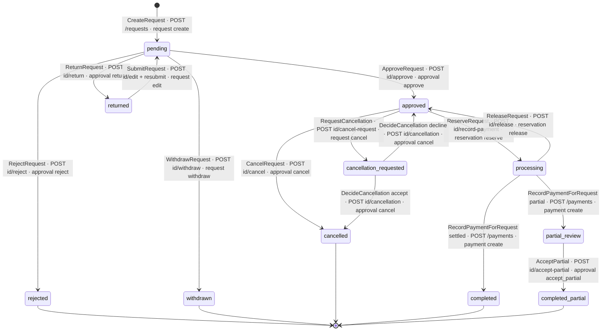
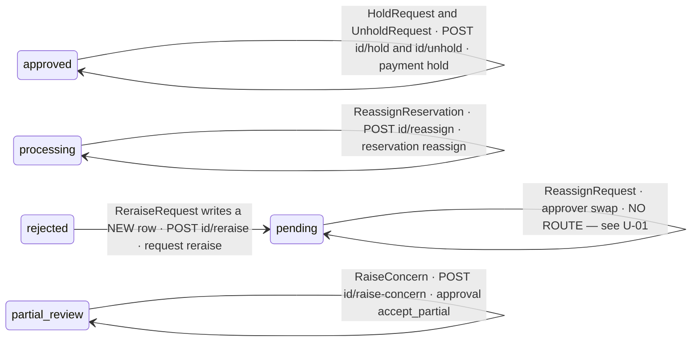
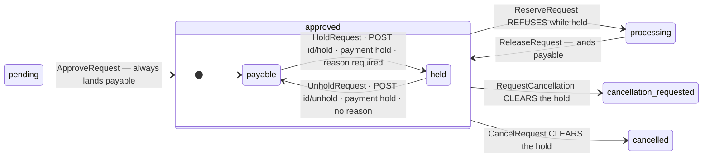
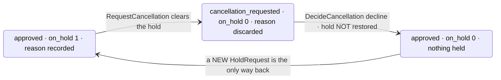
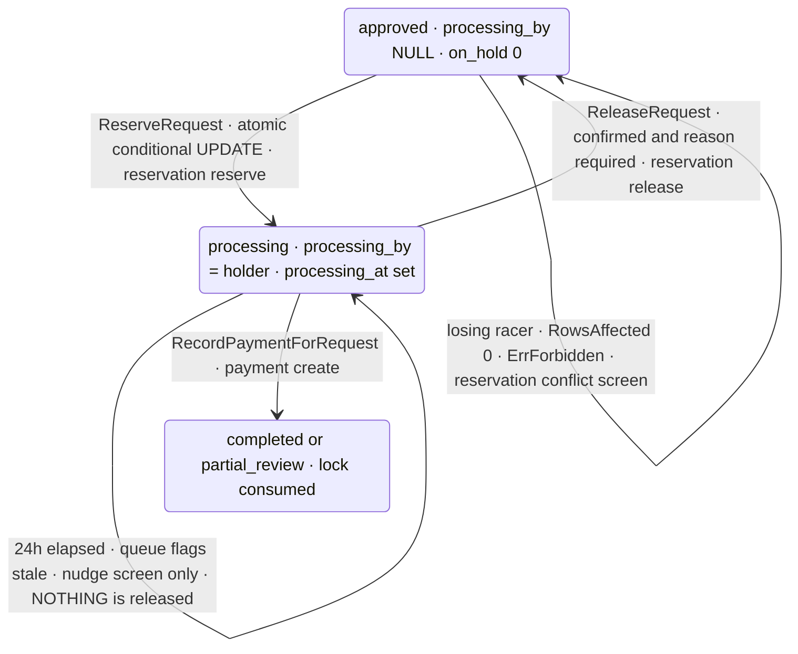
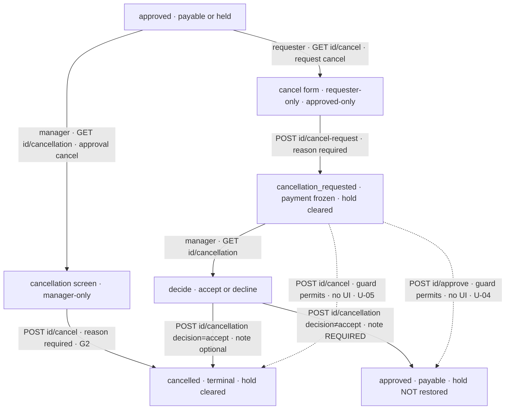
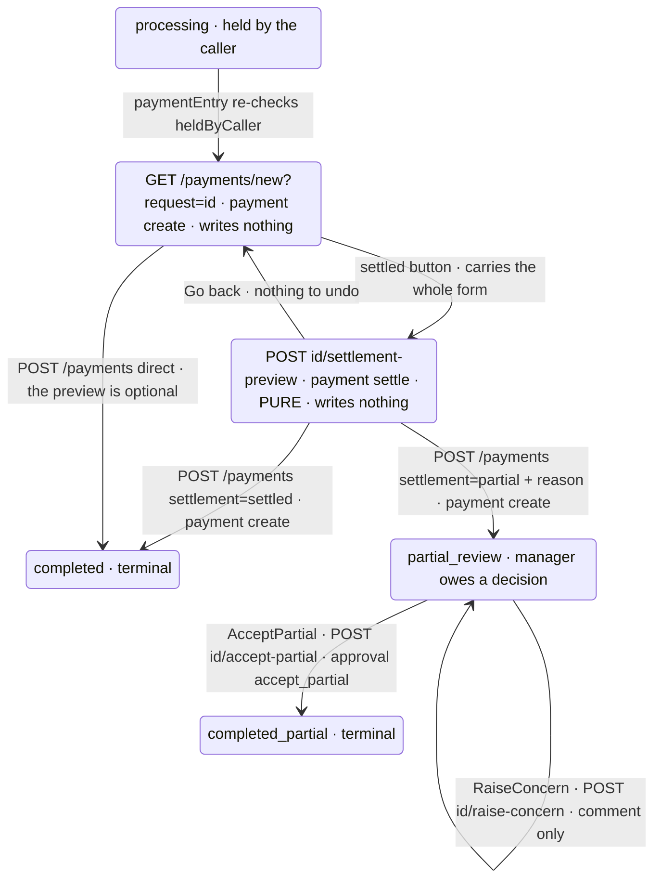
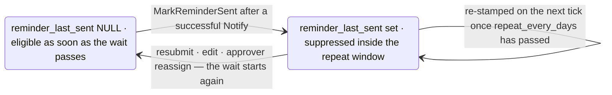
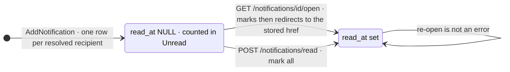

# 02 — State machines

Every machine in this document is derived from the enforcement code, not from the
specs. Where the overview spec §6
(`docs/superpowers/specs/2026-07-25-payment-requests-overview.md:244-261`) and the
Go disagree, the divergence is called out inline and listed again in §9.

**Reading rules for this file**

- A "guard" is a condition that makes a write fail. Two kinds exist and they are
  not interchangeable: the shared *transition table* (`legalTransitions` /
  `canTransition`, `internal/store/requests.go:91-105`), and *conditional-UPDATE*
  guards written into the SQL of individual Phase-3 writers. The transition table
  governs the Phase-2 statuses only. Every Phase-3 transition bypasses it
  entirely — see §7 and §8.
- "verb" is the `(resource, action)` pair the route's middleware resolves, from
  `App.routes` in `internal/app/app.go`.
- All statuses below are the literal enum values stored in
  `payment_requests.status`.

---

## 1. Request lifecycle

### 1.1 The status vocabulary as shipped

`ST-*` is the authoritative status list, taken from every literal the code writes
to `payment_requests.status`.

| ID | Status | Written by | Terminal | In overview spec §6? |
|----|--------|-----------|----------|----------------------|
| ST-01 | `pending` | `CreateRequest` `internal/store/requests.go:419`; `SubmitRequest` `:483`; `ReraiseRequest` `:834` | no | yes |
| ST-02 | `returned` | `decideRequest` via `ReturnRequest` `internal/store/requests.go:734,752` | no | yes |
| ST-03 | `approved` | `ApproveRequest` `internal/store/requests.go:698`; `DecideCancellation` decline `:941`; `ReleaseRequest` `internal/store/store.go:788` | no | yes |
| ST-04 | `rejected` | `decideRequest` via `RejectRequest` `internal/store/requests.go:734,756` | **yes** | yes |
| ST-05 | `withdrawn` | `WithdrawRequest` `internal/store/requests.go:661` | **yes** | yes |
| ST-06 | `cancellation_requested` | `RequestCancellation` `internal/store/requests.go:889` | no | **no — spec omits it** |
| ST-07 | `cancelled` | `CancelRequest` `internal/store/requests.go:985`; `DecideCancellation` accept `:941` | **yes** | **no — spec omits it** |
| ST-08 | `processing` | `ReserveRequest` `internal/store/store.go:737` | no | yes |
| ST-09 | `partial_review` | `RecordPaymentForRequest` `internal/store/store.go:923,925` | no | yes |
| ST-10 | `completed` | `RecordPaymentForRequest` `internal/store/store.go:921,925` | **yes** | yes |
| ST-11 | `completed_partial` | `AcceptPartial` `internal/store/store.go:983` | **yes** | **no — spec omits it** |
| ST-12 | `draft` | **nothing** | n/a | yes — spec is wrong |

Eleven live statuses, not the nine the brief and the spec name. Three of the
eleven (`cancellation_requested`, `cancelled`, `completed_partial`) are absent
from the spec's canonical enumeration; one of the spec's nine (`draft`) does not
exist.

### 1.2 Is `draft` reachable in the shipped product?

**No. It is unrepresentable, and three independent barriers say so.**

1. **The schema forbids it.** `payment_requests.status` carries
   `CHECK (status <> 'draft')` and has no `DEFAULT`
   (`internal/store/migrations.go:154-156`). A direct `INSERT` of `'draft'` is
   rejected by SQLite — proven at `internal/store/requests_test.go:326-328`.
2. **No writer emits it.** Every `status=` literal in the codebase is in the
   ST-01…ST-11 table above. `CreateRequest` hard-codes `'pending'` inside the
   `INSERT` (`internal/store/requests.go:419`) in the same transaction that
   reserves the number and stamps `submitted_at` — that is D1 in one statement.
   `ReraiseRequest` copies a rejected request into a **new row already
   `'pending'`** (`:834`), so even "raise it again" produces no draft.
3. **No route could produce one.** There is no `POST /requests/draft`, no
   `submit_action=draft`, and `POST /requests` (`internal/app/app.go:446`, handler
   `internal/app/requests.go:147-174`) has exactly one success path: create →
   redirect to `/requests/{id}/submitted`. The transition table has no `draft`
   key and no value naming it, so `canTransition("draft", …)` and
   `canTransition(…, "draft")` are both false for every argument
   (`internal/store/requests_test.go:321-325`).

Consequence for the diagram: the initial pseudostate goes straight to `pending`.
Coverage row **L1 "Draft (private)"** is satisfied *by inversion* — the shipped
proof is `TestNoDraftStateExists` (`internal/store/requests_test.go:313`), an
absence test.

### 1.3 The lifecycle diagram

Edge labels read `store method · route · permission verb`. Guard conditions are
tabulated in §1.4 rather than crammed into the labels.



Self-loops and the one edge that leaves a state without changing it, kept in a
second diagram so the first stays readable:



`rejected --> pending` is drawn dashed in intent, not in fact: `ReraiseRequest`
(`internal/store/requests.go:805-856`) leaves the rejected row untouched and
`INSERT … SELECT`s a copy with a fresh number at `:829-838`. `rejected` really is
terminal for the row it names.

### 1.4 Edge guards, in full

Every row is one code-verified edge. "Actor gate" is the identity check inside the
store — it is *additional* to the route's permission verb, and it is what stops an
administrator holding every grant from acting in someone else's place.

| ID | From → To | Store method | Route · verb | Guards, with file:line |
|----|-----------|--------------|--------------|------------------------|
| E-01 | ∅ → `pending` | `CreateRequest` `store/requests.go:365` | `POST /requests` · `request:create` `app/app.go:446` | `validateRequestInput` `:375` (amount>0, short title, purpose, manager chosen, per-type fields); **G8 self-approval refused** `:142-144`; urgency policy `:386`; attachment policy `:393`; number + `submitted_at` in the same tx `:406-419` |
| E-02 | `returned` → `pending` | `SubmitRequest` `store/requests.go:456` | `POST /requests/{id}/edit` with `submit_action=resubmit` · `request:edit` `app/app.go:490`, handler `app/requests.go:663-665` | requester-only `:466`; `canTransition(status,"pending")` `:469` — true **only** from `returned`; attachment policy re-checked against stored count `:477-481`; clears `reminder_last_sent` `:483` |
| E-03 | `pending` → `approved` | `ApproveRequest` `store/requests.go:674` | `POST /requests/{id}/approve` · `approval:approve` `app/app.go:494` | `approvedAmount > 0` `:675`; **manager-only** `:687`; **G8 last line of defence** `:692`; `canTransition(status,"approved")` `:695`; writes `approved_amount/by/at` + `decision_reason` `:698` |
| E-04 | `pending` → `returned` | `ReturnRequest` → `decideRequest` `store/requests.go:752,714` | `POST /requests/{id}/return` · `approval:return` `app/app.go:495` | non-empty comment `:715-718`; manager-only `:728`; `canTransition` `:731` |
| E-05 | `pending` → `rejected` | `RejectRequest` → `decideRequest` `store/requests.go:756,714` | `POST /requests/{id}/reject` · `approval:reject` `app/app.go:496` | non-empty reason `:715-718`; manager-only `:728`; `canTransition` `:731` |
| E-06 | `pending` → `withdrawn` | `WithdrawRequest` `store/requests.go:645` | `POST /requests/{id}/withdraw` · `request:withdraw` `app/app.go:492` | requester-only `:655`; `canTransition(status,"withdrawn")` `:658` — true only from `pending` |
| E-07 | `approved` → `cancellation_requested` | `RequestCancellation` `store/requests.go:861` | `POST /requests/{id}/cancel-request` · `request:cancel` `app/app.go:502` | non-empty reason `:862-865`; requester-only `:875`; `canTransition` `:878`; **clears the hold** `:889` |
| E-08 | `approved` → `cancelled` | `CancelRequest` `store/requests.go:962` | `POST /requests/{id}/cancel` · `approval:cancel` `app/app.go:503` | non-empty reason `:963-966`; manager-only `:976`; `canTransition(status,"cancelled")` `:979`; **clears the hold** `:985` |
| E-09 | `cancellation_requested` → `cancelled` | `DecideCancellation` accept `store/requests.go:909,918` | `POST /requests/{id}/cancellation` with `decision=accept` · `approval:cancel` `app/app.go:505`, handler `app/requests.go:852` | manager-only `:931`; `status=="cancellation_requested"` **and** `canTransition` `:934`; note optional; clears the hold `:941` |
| E-10 | `cancellation_requested` → `approved` | `DecideCancellation` decline `store/requests.go:909,919-921` | same route, `decision` ≠ `accept` | **note is mandatory when declining** `:911-913`; manager-only `:931`; status + `canTransition` `:934`; clears the hold `:941` — see §2.3 |
| E-11 | `approved` → `processing` | `ReserveRequest` `store/store.go:730` | `POST /requests/{id}/record-payment` · `reservation:reserve` `app/app.go:451` | one atomic conditional UPDATE `:736-738`: `status='approved' AND processing_by IS NULL AND on_hold=0`; `RowsAffected()==0` → `ErrForbidden` `:746`. **Not in `legalTransitions`** |
| E-12 | `processing` → `approved` | `ReleaseRequest` `store/store.go:761` | `POST /requests/{id}/release` · `reservation:release` `app/app.go:465` | `confirmed` required `:762`; reason required `:766`; `status=="processing"` `:782`; assignee **or** `authorized` `:785`; clears `processing_by`/`processing_at` `:788`. `authorized` is `reservation:reassign`, resolved in the handler `app/linking.go:630`. **Not in `legalTransitions`** |
| E-13 | `processing` → `completed` | `RecordPaymentForRequest` with `settlement="settled"` `store/store.go:866,921` | `POST /payments` · `payment:create` `app/app.go:387` | settlement ∈ {settled, partial} `:869`; `validatePayment` `:875`; caller **must hold the reservation** `:898`; **G13 ceiling** `:903-910`; final UPDATE re-asserts `status='processing' AND processing_by=actor` `:925` and fails the whole tx on 0 rows `:931`. **Not in `legalTransitions`** |
| E-14 | `processing` → `partial_review` | same method with `settlement="partial"` `store/store.go:872,923` | same route · same verb | as E-13 **plus** `partialReason` required `:872-874`. **Not in `legalTransitions`** |
| E-15 | `partial_review` → `completed_partial` | `AcceptPartial` `store/store.go:964` | `POST /requests/{id}/accept-partial` · `approval:accept_partial` `app/app.go:483` | **manager-only, not merely verb-holder** `:980`; conditional UPDATE `status='partial_review'` `:983`; 0 rows → `ErrForbidden` `:990`. Note optional `:965`. **Not in `legalTransitions`** — see DV-04 |
| E-16 | `rejected` → new `pending` row | `ReraiseRequest` `store/requests.go:805` | `POST /requests/{id}/reraise` · `request:reraise` `app/app.go:493` | requester-only `:815`; `status=="rejected"` `:818`; new number `:825`; source row unchanged |
| E-17 | `pending` → `pending` (approver swap) | `ReassignRequest` `store/requests.go:759` | **none — U-01** | reason required `:761`; `newManagerID>0` `:764`; `status=="pending"` `:776`; G8 holds for the new manager `:780`; resets `reminder_last_sent` `:783`; audit action deliberately `approval_reassign`, not `reassign` `:795` |
| E-18 | `processing` → `processing` (holder swap) | `ReassignReservation` `store/store.go:802` | `POST /requests/{id}/reassign` · `reservation:reassign` `app/app.go:466` | see §3.4 |
| E-19 | `partial_review` → `partial_review` | `RaiseConcern` `store/store.go:1004` | `POST /requests/{id}/raise-concern` · `approval:accept_partial` `app/app.go:484` | comment required `:1006`; **manager-only** `:1021`; `status=="partial_review"` `:1024`; writes a comment row + a `concern` audit row, **no status change** `:1027-1030` |
| E-20 | `cancellation_requested` → `approved` (second path) | `ApproveRequest` `store/requests.go:674` | `POST /requests/{id}/approve` · `approval:approve` | **The guard permits this.** `legalTransitions["cancellation_requested"]["approved"]` is `true` (`:97`), and `ApproveRequest` only asks `canTransition(status,"approved")` (`:695`). No screen offers it (the approve sheet is rendered only for `pending`, `app/templates.go:2425-2429,2472`), but a hand-rolled POST succeeds. See U-04 |
| E-21 | `cancellation_requested` → `cancelled` (second path) | `CancelRequest` `store/requests.go:962` | `POST /requests/{id}/cancel` · `approval:cancel` | Same shape: `canTransition("cancellation_requested","cancelled")` is `true` (`:97`), so the outright-cancel route also closes a *pending-cancellation* request, recording action `cancel` with the manager's own reason instead of the requester's. The UI only offers it while `approved` (`app/templates.go:2867,2899`). See U-05 |

Terminal states, verified by absence of any outgoing writer: `rejected`,
`withdrawn`, `cancelled`, `completed`, `completed_partial`. The code comment at
`internal/store/requests.go:99` states this intent for `completed_partial`.

---

## 2. The `on_hold` flag

### 2.1 Why it is an orthogonal region and not a status

`on_hold` is `INTEGER NOT NULL DEFAULT 0` on `payment_requests`
(`internal/store/migrations.go:194`), paired with `hold_reason`
(`:195`). It is set by exactly one writer and cleared by five.

The invariant the whole design rests on — **`on_hold=1` implies
`status='approved'`** — is not a database constraint. It is maintained by making
the *only* setter refuse any other status:

```
UPDATE payment_requests SET on_hold=1, hold_reason=?, updated_at=CURRENT_TIMESTAMP
 WHERE id=? AND status='approved' AND on_hold=0
```
— `internal/store/store.go:1047`, `RowsAffected()==0` → `ErrForbidden` at `:1054`.

Because `approved` is the only status in which the flag can be raised, and because
every exit from `approved` either clears the flag or refuses to run while it is
set (§2.2), the implication holds for every row the application can write. The
app layer still refuses to *trust* it: `activeHold` asks both questions
(`internal/app/linking.go:808-810`), and the queue's hold tab adds
`AND r.status='approved'` as belt and braces (`internal/store/store.go:1161`,
with the reasoning at `:1157-1160`).



### 2.2 Every exit from `approved`, and what it does to the flag

| ID | Exit | Method · file:line | Effect on `on_hold` |
|----|------|--------------------|---------------------|
| H-01 | reserve for payment | `ReserveRequest` `internal/store/store.go:736-738` | **Blocked.** The conditional UPDATE carries `AND on_hold=0`, so a held request cannot be reserved. Proven at `internal/store/linking_test.go:216-227` and `:684-687` |
| H-02 | requester asks for cancellation | `RequestCancellation` `internal/store/requests.go:889` | **Cleared** — `on_hold=0, hold_reason=''` in the same UPDATE as the status change. Reasoning at `:881-888`. Proven at `internal/app/linking_test.go:1484-1508` |
| H-03 | manager cancels outright | `CancelRequest` `internal/store/requests.go:985` | **Cleared** in the same UPDATE. Reasoning at `:982-984`. Proven at `internal/app/linking_test.go:1447-1478` |
| H-04 | manager decides a cancellation (either branch) | `DecideCancellation` `internal/store/requests.go:941` | **Cleared** in the same UPDATE. Belt and braces: the flag is already 0 because H-02 cleared it on the way in. Reasoning at `:937-940` |
| H-05 | Accounts lifts the hold | `UnholdRequest` `internal/store/store.go:1070` | **Cleared**, status untouched. Note the SQL is `WHERE id=? AND on_hold=1` — **no status predicate**. It is safe only because the flag cannot be 1 outside `approved` |
| H-06 | approve / return / reject / withdraw / submit | `ApproveRequest`, `decideRequest`, `WithdrawRequest`, `SubmitRequest` | Not applicable — none of them accepts `approved` as a source state (`legalTransitions`, `internal/store/requests.go:91-101`), so no held row ever reaches them |

There is **no** exit from `approved` that leaves `on_hold=1` behind.

### 2.3 The documented consequence: a declined cancellation loses the hold

**Verified. The behaviour is exactly as the brief describes, and it is a
deliberate one-way loss.**

The sequence:

1. Accounts holds an approved request. `on_hold=1`, `hold_reason='Which site is
   this for?'` — `HoldRequest`, `internal/store/store.go:1047`.
2. The requester asks for cancellation. `RequestCancellation` sets
   `status='cancellation_requested'` **and** `on_hold=0, hold_reason=''` in one
   statement — `internal/store/requests.go:889`. The hold reason is now gone
   from the row; only the audit `before`/`after` snapshot retains it
   (`:897-901`, and the code says so at `:887-888`).
3. The manager **declines**. `DecideCancellation` sets `status='approved'` **and**
   `on_hold=0, hold_reason=''` — `internal/store/requests.go:941`. Nothing in
   this method reads the audit trail, so the hold is not restored.

**Net effect:** the request returns to `approved` **payable and unheld**. The
question Accounts asked has silently disappeared from the row, and the request is
immediately re-reservable by any accountant, including one who never saw the hold
reason. Nobody is notified that the hold vanished — `DecideCancellation` fires no
event, and the decline handler (`internal/app/requests.go:850-858`) calls no
`a.fire`.

This is shown on the diagram in §2.1 as `approved --> cancellation_requested`
being labelled *CLEARS the hold*, with the return edge landing on `payable`
rather than on `held`.



Ranked as a suspected defect — see §10, SD-2.

---

## 3. The reservation sub-machine

`processing_by INTEGER REFERENCES users(id)` and `processing_at DATETIME`
(`internal/store/migrations.go:196-197`) together form an advisory lock over the
`approved → processing → approved` cycle. Both columns move as a pair in every
writer; neither is ever set without the other.



### 3.1 Atomic reserve, and the losing caller

There is one statement and no read-then-write window:

```
UPDATE payment_requests
   SET status='processing', processing_by=?, processing_at=CURRENT_TIMESTAMP, updated_at=CURRENT_TIMESTAMP
 WHERE id=? AND status='approved' AND processing_by IS NULL AND on_hold=0
```
— `internal/store/store.go:736-738`.

`RowsAffected()` is the entire concurrency protocol: the first committer matches
the predicate, every later one matches nothing and gets
`ErrForbidden: request is not available to process` (`:742-748`). The 8-way race
proof is `TestReserveRequestIsAtomicUnderConcurrency`
(`internal/store/linking_test.go:231-285`) — exactly one winner, seven
`ErrForbidden`, final `processing_by` equal to the winner.

The losing caller is a **screen, not an error** (G15). The handler catches
`ErrForbidden`, re-reads the request and renders `reservation_conflict` with HTTP
409 and the winner's name — `internal/app/linking.go:85-97` and `:58-71`. The
same funnel serves the queue, the picker and the entry form; `paymentEntry`
(`:240-243`) and `settlementPreview` (`:290-293`) both route through it via
`heldByCaller` (`:75-77`).

### 3.2 Release

| ID | Parameter | Enforced at | Refusal |
|----|-----------|-------------|---------|
| RS-01 | `confirmed` | `internal/store/store.go:762` | `ErrValidation: confirm that no payment was initiated before releasing` — S7 |
| RS-02 | `reason` non-empty | `internal/store/store.go:765-768` | `ErrValidation` — G12; the reason is the audit summary at `:791` |
| RS-03 | `status=="processing"` | `internal/store/store.go:782` | `ErrForbidden: only a processing request can be released` |
| RS-04 | assignee **or** `authorized` | `internal/store/store.go:785` | `ErrForbidden: only the assignee may release this request` — S6 |

`authorized` is not a spec-shaped scope check. The handler passes
`a.auth.Can(u, "reservation", "reassign")` (`internal/app/linking.go:629-630`) —
i.e. *may take work off somebody* is the verb that also lets you release their
work. The overview spec §8 says the handler passes `authorized` after checking
`auth.Scope(user,"payment")=="all"`
(`docs/superpowers/specs/2026-07-25-payment-requests-overview.md:292`) — that is
**not** what ships. See DV-05.

The route itself is gated `reservation:release` (`internal/app/app.go:465`) and
the request is resolved through `loadViewableRequest`
(`internal/app/linking.go:624`), so holding a reservation verb never widens a
caller's data scope (Q5/R6).

`ReleaseRequest` also carries an `authorized` **and** an `ErrValidation`
short-circuit *before* it opens a transaction (`:762-768`), so a refused release
writes nothing at all — proven at
`internal/store/linking_test.go:302-311`.

### 3.3 The parameter shape versus the spec

Spec §8 declares
`ReleaseRequest(ctx,actor,id int64,confirmed,authorized bool) error`
(overview `:292`). The shipped signature is
`ReleaseRequest(ctx context.Context, actor User, id int64, reason string, confirmed, authorized bool) error`
(`internal/store/store.go:761`) — the mandatory `reason` (G12) is an extra
parameter the spec never mentions. Likewise spec §8 gives
`AcceptPartial(ctx,actor,id int64) error`; the shipped method takes a `note`
(`internal/store/store.go:964`). Recorded as DV-06.

### 3.4 Reassign

`ReassignReservation` never returns the request to the open queue (G11): status
stays `processing`, only `processing_by`/`processing_at` move
(`internal/store/store.go:840-842`).

| ID | Guard | file:line |
|----|-------|-----------|
| RS-05 | `authorized` — fails closed, checked before anything else | `internal/store/store.go:803-805` |
| RS-06 | reason non-empty | `internal/store/store.go:806-809` |
| RS-07 | `status=="processing"` and `processing_by` non-NULL | `internal/store/store.go:823` |
| RS-08 | target ≠ current holder | `internal/store/store.go:826` |
| RS-09 | target exists and `active=1` | `internal/store/store.go:831-839` |
| RS-10 | conditional UPDATE pinned to the *observed* holder; 0 rows → `ErrForbidden: the reservation changed while you were deciding` | `internal/store/store.go:840-850` |
| RS-11 | handler: `to_user_id` present | `internal/app/linking.go:648-651` |
| RS-12 | handler: `confirm=on` — the store has no `confirmed` parameter for this path, so the handler owns it | `internal/app/linking.go:653-656` and the reasoning at `:638-641` |
| RS-13 | handler: target must hold `payment:process`, or the request is stranded in `processing` with no in-app way out | `internal/app/linking.go:665-668`, predicate `canWorkTheQueue` `:594-596`, mirrored in the select at `:580-589` |

The screen that offers both choices, `GET /requests/{id}/reservation`, is gated on
**a session only** (`internal/app/app.go:464`). `reservationForm` then refuses
unless the caller either holds the reservation and may release, or may reassign
(`internal/app/linking.go:531-538`) — a middleware gate can ask for one verb, not
for either. Each POST still carries its own gate.

### 3.5 The 26-hour nudge — and the fact that nothing expires

**There is no auto-release. Nothing in the codebase writes `status`,
`processing_by` or `processing_at` on a timer.**

Proof, three ways:

1. **The only background goroutine is the reminder scheduler.**
   `cmd/server/main.go:97-102` starts `notifier.Scheduler(ctx, time.Hour, …)`.
   `Scheduler` calls `RunReminders` (`internal/notify/reminders.go:54-66`), which
   calls `runReminderBatch` twice (`:19-22`). `runReminderBatch` does exactly two
   writes: `s.Notify(...)` (in-app rows, maybe an email) and
   `s.st.MarkReminderSent(...)` (`:39-45`). `MarkReminderSent` writes
   `reminder_last_sent` and nothing else
   (`internal/store/reminders.go:131-134`). No status, no lock column.
2. **The staleness read is a `SELECT`.** `RequestsStaleProcessing`
   (`internal/store/reminders.go:109-127`) is a query. So is the queue's stale
   count — one `CASE WHEN … THEN 1` inside the aggregate at
   `internal/store/store.go:1121`.
3. **The code says so.** `const StaleReservation = 24 * time.Hour` is documented
   *"Nothing is ever released automatically — a bank transfer may be under way"*
   (`internal/store/models.go:408-410`), and `ReleaseRequest`'s doc comment ends
   *"There is no auto-release; this is the only path back to approved"*
   (`internal/store/store.go:759-760`).

The nudge is a **screen and a notification**, never an action. `GET
/requests/{id}/reservation/stale` is gated `payment:process`
(`internal/app/app.go:470`), refuses anything off `processing`
(`internal/app/linking.go:737-740`), and offers exactly four choices, each gated
again on the verb it needs (`internal/app/templates.go:1109-1121`): carry on and
pay, release it, hand it to a colleague, put it on hold. The banner states
*"Nothing is released automatically"* (`:1091-1092`).

**Two independent staleness clocks exist, and they can disagree.**

| ID | Clock | Value | Drives |
|----|-------|-------|--------|
| RS-14 | `store.StaleReservation` | hard-coded `24 * time.Hour` (`internal/store/models.go:410`) | `LinkableCounts.StaleReservations` (`internal/store/store.go:1098,1121`), the queue banner (`internal/app/templates.go:699-704`), `reservedLabel` (`internal/app/linking.go:783-791`) and the `stale` predicate that links a row to the nudge screen (`:798-800`) |
| RS-15 | `reminder_stale_days` app setting | admin-set, default `1` (`internal/store/reminders.go:46,79`) | `RequestsStaleProcessing` (`internal/store/reminders.go:109-127`) — i.e. the emailed / in-app nudge |

An admin who sets `reminder_stale_days=3` gets a queue that flags a row as stale
at 24 hours and a reminder that does not fire until 72. Recorded as SD-4.

"26 hours" is nowhere a threshold: it is the fixture value the tests use to push a
reservation past the 24-hour line
(`internal/app/linking_test.go:1551`, `internal/store/linking_test.go:844-846`).
The route and handler comments call it *"the 26-hour nudge"*
(`internal/app/app.go:467`, `internal/app/linking.go:722`) while the constant is
24 — a comment/code mismatch, DV-07.

`store.LinkableOptions.Now` is an injected clock (`internal/store/models.go:418`,
used at `internal/store/store.go:1091-1098`), but `accountsQueue` never sets it
(`internal/app/linking.go:158-160`) and the two template helpers `stale` /
`reservedLabel` call `time.Since` directly (`internal/app/linking.go:787,799`).
The count is therefore testable with a pinned clock and the per-row link is not.

---

## 4. The cancellation flow

Five routes, two actors, two verbs. G1 is the requester asking; G2 is the manager
cancelling unasked; G3 is the freeze.

| ID | Route | Verb | Handler | Additional gate inside the handler |
|----|-------|------|---------|-----------------------------------|
| CX-01 | `GET /requests/{id}/cancel` | `request:cancel` `app/app.go:501` | `requestCancelForm` `app/requests.go:797` | requester-only `:802-806`; **`status=="approved"` only** `:810-814` |
| CX-02 | `POST /requests/{id}/cancel-request` | `request:cancel` `app/app.go:502` | `requestCancelAsk` `app/requests.go:818` | none — the store owns requester-only (`store/requests.go:875`) and the status guard (`:878`) |
| CX-03 | `POST /requests/{id}/cancel` | `approval:cancel` `app/app.go:503` | `requestCancelOutright` `app/requests.go:860` | none — the store owns manager-only (`store/requests.go:976`) and the status guard (`:979`) |
| CX-04 | `GET /requests/{id}/cancellation` | `approval:cancel` `app/app.go:504` | `requestCancellationForm` `app/requests.go:832` | **manager-only** `:837-841`. Renders for any status; the action bar switches on it (`app/templates.go:2864-2871`) |
| CX-05 | `POST /requests/{id}/cancellation` | `approval:cancel` `app/app.go:505` | `requestCancellationDecide` `app/requests.go:850` | none — `accept = FormValue("decision")=="accept"` `:852`; the store owns manager-only (`store/requests.go:931`) and the status guard (`:934`) |

Note the asymmetry: the two *screens* (CX-01, CX-04) enforce actor identity in the
handler so a control is never rendered to somebody whose submit would bounce; the
three *POSTs* delegate identity entirely to the store. The reasoning is written
out at `internal/app/requests.go:794-796`.



### 4.1 What each outcome writes

| ID | Outcome | Status | `cancel_reason` | `decision_reason` | `on_hold` | Audit action · summary |
|----|---------|--------|-----------------|-------------------|-----------|------------------------|
| CX-06 | requester asks | `cancellation_requested` | the requester's reason `store/requests.go:889` | untouched | **→ 0** | `cancel_request` — *"X asked for cancellation of N: reason. Payment frozen."* `:897-901` |
| CX-07 | manager accepts | `cancelled` | untouched | the manager's optional note `store/requests.go:941` | → 0 | `cancel` — *"X cancelled N at the requester's asking"* `:948,952-954` |
| CX-08 | manager declines | `approved` | untouched | the mandatory note `store/requests.go:941` | → 0 | `cancel_decline` — *"X declined the cancellation of N: note. Payment unfrozen."* `:950,952-954` |
| CX-09 | manager cancels outright | `cancelled` | the manager's reason `store/requests.go:985` | untouched | → 0 | `cancel` — *"X cancelled request N: reason"* `:992-995` |

Accepting a cancellation and cancelling outright deliberately share the `cancel`
action; only the summary distinguishes them. The reasoning is written out at
`internal/store/requests.go:914-917`.

All four carry a full `Before`/`After` request snapshot into
`audit_log.before_json` / `after_json` (`recordAuditTx`,
`internal/store/store.go:719-724`), which is the only surviving record of a hold
that H-02 discarded.

### 4.2 The freeze is a consequence, not a flag

There is no `frozen` column. Payment stops because `ReserveRequest` matches only
`status='approved'` (`internal/store/store.go:738`), so the moment the status
becomes `cancellation_requested` the request drops out of the reservable set. The
queue's `approved` tab selects `status IN ('approved','processing')`
(`internal/store/store.go:1153`) and therefore does not list it either. Proven by
`TestCancellationFreezesTheApprovedState`
(`internal/store/requests_test.go:1084`).

A reservation already held is **not** broken by the freeze: nothing in
`RequestCancellation` touches `processing_by`, and a `processing` request cannot
reach `cancellation_requested` at all (`legalTransitions` has no `processing`
key). The notification instead addresses the holder personally —
`resolveInAppUsers` routes `request_cancellation_requested` to `*req.ProcessingBy`
when one exists (`internal/notify/service.go:141-148`).

### 4.3 Audit-trail rendering gap

`cancel_decline` has no case in `auditPhrase`
(`internal/app/linking.go:897-952`), so it falls through to `actionText`
(`internal/app/app.go:1882-1907`), whose default returns the raw enum. On every
screen built from `mergedTrail` — the partial review, the reservation form and the
stale screen — a declined cancellation renders as *"Manav Manager
cancel_decline"*. It also has no `auditTone`/`auditGlyph` case
(`internal/app/linking.go:848-891`), so its dot is untinted. The request's own
`.thread` is fine: `threadDot` and `threadGlyph` both handle it
(`internal/app/requests.go:1074,1101`). Recorded as SD-5.

---

## 5. Settlement



### 5.1 The steps

| ID | Step | Route · verb | Writes? | Guards |
|----|------|--------------|---------|--------|
| SE-01 | entry | `GET /payments/new?request={id}` · `payment:create` `app/app.go:384` | **no** | `paymentForm` `app/app.go:655-667` branches on `?request=`; `paymentEntry` `app/linking.go:233` refuses unless `heldByCaller` `:240-243` → 409 conflict screen, not 403. Prefills amount from `approvedOf(req)` `:256` and payee from `req.Vendor`, never the raw snapshot `:260` |
| SE-02 | preview | `POST /requests/{id}/settlement-preview` · `payment:settle` `app/app.go:454` | **no — D8** | `settlementPreview` `app/linking.go:280-309`: no `BeginTx`, no attachment staging, no `INSERT`. Re-checks `heldByCaller` `:290-293`. Computes `Approved`, `Paid`, `Difference`, `Match` and returns them in a throw-away view model (`SettlementPreview`, `:111-121`). It is a POST only because it carries the form (`app/app.go:452-453`). Proven by `TestSettlementPreviewWritesNothingAndRendersTheSheet` `app/linking_test.go:458` |
| SE-03 | the settled/partial choice | rendered in `settlement_sheet` `app/templates.go:486-505` | n/a | Two radios, `settled` default; `partial_reason` is `aria-required` only, because a hidden `required` control makes the form unsubmittable in Chrome (`:500-501`) — the store re-enforces it |
| SE-04 | commit | `POST /payments` · `payment:create` `app/app.go:387` | **yes — the only writer** | `paymentCreate` `app/app.go:690-729`: refuses `request_id==0` `:693-696`; then `RecordPaymentForRequest` `store/store.go:866` |
| SE-05 | manager accepts the shortfall | `POST /requests/{id}/accept-partial` · `approval:accept_partial` `app/app.go:483` | yes | `AcceptPartial` `store/store.go:964`; **manager-only** `:980` |
| SE-06 | manager raises a concern | `POST /requests/{id}/raise-concern` · `approval:accept_partial` `app/app.go:484` | yes, a comment | `RaiseConcern` `store/store.go:1004`; **manager-only** `:1021`; status must be `partial_review` `:1024`; **no status change** |

`RecordPaymentForRequest` is a single transaction that either moves both the
payment and the request or neither (S13). Its guards, in order:

1. `settlement ∈ {settled, partial}` — `store/store.go:869`
2. `partial` requires `partialReason` — `:872`
3. `validatePayment` — `:875`
4. attachment validated if present — `:878-882`
5. **caller must currently hold the reservation** — `:898`,
   `ErrForbidden: reserve this request before recording its payment`
6. **G13 ceiling**: `in.Amount > COALESCE(approved_amount, amount)` is refused,
   and the error names the remedy — `:903-910`. Proven at
   `internal/store/linking_test.go:490-522`, including that a refused overpayment
   leaves the reservation intact
7. the request UPDATE re-asserts `status='processing' AND processing_by=actor`
   and fails the whole transaction on 0 rows — `:925-933`
8. one payment per request, enforced by the partial unique index
   `idx_payments_request` from migration v4 (`internal/store/migrations.go:268-276`
   and the reasoning at `:264-267`); a second settlement is refused by the status
   guard first (`internal/store/linking_test.go:421-424`)

### 5.2 A settled payment completes the request even when paid < approved

**Verified.** `newStatus` is `"completed"` for `settlement=="settled"` with no
comparison of `in.Amount` against the ceiling
(`internal/store/store.go:921-925`); the only amount check is the *upper* bound at
`:907`. Paying ₹4,000 against ₹5,000 approved and choosing "Fully settled" closes
the request as `completed` — `TestRecordPaymentSettledCompletesEvenWhenUnderApproved`
(`internal/store/linking_test.go:402-425`) records exactly this: approved 500000,
paid 400000, status `completed`.

The design intent is stated on the confirmation sheet — *"The obligation is
discharged. Deductions such as TDS or retention were handled outside this
system."* (`internal/app/templates.go:489`) — and X1 (no tax arithmetic) is why.
The request screen renders the shortfall as *"Difference · confirmed settled by
Accounts"* rather than *"Still owed"* (`internal/app/templates.go:2373-2377`),
which is the whole distinction between S10 and L9.

### 5.3 A recorded payment is immutable afterwards

Both mutators refuse a linked payment, at the store, before any UPDATE:

- `UpdatePaymentWithAttachment` — `if before.RequestID != nil { return
  ErrValidation: a payment linked to a request cannot be edited }`,
  `internal/store/store.go:607-611` (S12 named in the comment).
- `VoidPayment` — same test, *"voiding would leave the request 'completed' with
  nothing paid"*, `internal/store/store.go:648-651`.

Proven at `internal/store/linking_test.go:524-546` (edit → `ErrValidation`, void →
`ErrValidation`, row unchanged) and at the HTTP layer by
`TestLinkedPaymentIsImmutableInTheLedgerAndOnItsEditRoute`
(`internal/app/linking_test.go:690`). The ledger read carries `request_id`
precisely so a screen can tell the two apart and not offer an Edit button the
store would refuse (`internal/store/store.go:1298-1302`).

Nothing on the partial-review screen can amend the payment either — stated at
`internal/app/linking.go:370-371`, and the screen renders the payment inside a
read-only card (`internal/app/templates.go:823-…`).

### 5.4 Two gate observations on this machine

- **`payment:settle` gates only the read.** The pure preview needs
  `payment:settle` (`internal/app/app.go:454`); the actual write needs
  `payment:create` (`:387`). A caller holding `payment:create` without
  `payment:settle` can `POST /payments` directly and drive a request to
  `completed` or `partial_review` without ever holding the settle verb. The
  preview is genuinely optional — `paymentCreate` does not require any token or
  marker from it.
- **`payment:mark_partial` gates nothing at all.** It is declared in the
  vocabulary (`internal/store/permissions.go:153`), granted to the seeded
  Accounts role (`internal/store/migrations.go:385`) and shown on the permission
  map (`internal/app/permmap.go:91`), but no route, no template condition and no
  store method consults it. The partial branch is authorised solely by
  `payment:create`. The string `"mark_partial"` appears elsewhere only as an
  *audit action name* (`internal/store/store.go:943`) and in display switches
  (`internal/app/linking.go:856,875,937`).

---

## 6. Notification and reminder state

### 6.1 `reminder_last_sent` bookkeeping

`reminder_last_sent DATETIME` (`internal/store/migrations.go:198`) is a single
nullable timestamp shared by **both** reminder streams. It has three transitions:

| ID | Transition | Written by | file:line |
|----|-----------|-----------|-----------|
| NR-01 | NULL (never reminded) → stamped | `MarkReminderSent`, called after each successful `Notify` | `internal/store/reminders.go:131-134`, called at `internal/notify/reminders.go:44` |
| NR-02 | stamped → NULL (timer reset, "the new owner has not been waited on yet") | inline in three writers: `SubmitRequest` `internal/store/requests.go:483`, `UpdateRequest` `:622`, `ReassignRequest` `:783` | — |
| NR-03 | stamped → NULL via the dedicated method `ResetReminder` | `internal/store/reminders.go:138-141` | **dead in production** — the only caller is `internal/store/reminders_test.go:112` |



Because one column serves two streams, a pending reminder and a stale-reservation
reminder cannot both be pending for the same row — but they never are, since the
two queries select disjoint statuses (`pending` vs `processing`).

### 6.2 The two reminder queries

| ID | Reminder | Query | Selection predicate |
|----|----------|-------|---------------------|
| NR-04 | pending-too-long (N4) | `RequestsPendingReminder` `internal/store/reminders.go:87-105` | `status='pending' AND COALESCE(on_hold,0)=0 AND submitted_at IS NOT NULL AND submitted_at <= now-PendingAfterDays AND (reminder_last_sent IS NULL OR reminder_last_sent <= now-RepeatEveryDays)`; ordered `submitted_at, id` |
| NR-05 | stale reservation (S8/N5) | `RequestsStaleProcessing` `internal/store/reminders.go:109-127` | `status='processing' AND processing_at IS NOT NULL AND processing_at <= now-StaleAfterDays AND (reminder_last_sent IS NULL OR reminder_last_sent <= now-RepeatEveryDays) AND NOT EXISTS(an unvoided payment for the request)`; ordered `processing_at, id` |

Thresholds are **admin data, not constants**: `reminder_pending_days` (default 3),
`reminder_repeat_days` (default 1), `reminder_stale_days` (default 1), read fresh
on every run so a Configuration change takes effect on the next tick without a
restart (`ReminderThresholds`, `internal/store/reminders.go:64-81`; re-read at
`internal/notify/reminders.go:15`). Garbage — unset, blank, zero or negative —
falls back to the default rather than silently disabling or spamming (`:69-75`).

The clock is injected end to end: `RunReminders(ctx, now)` →
`runReminderBatch(ctx, now, …)` → the query's `now` parameter
(`internal/notify/reminders.go:13,25`; `internal/store/reminders.go:87,109`).
Production injects `func() time.Time { return time.Now().UTC() }` on an hourly
ticker (`cmd/server/main.go:99-102`, with the rationale for hourly-not-daily at
`:92-96`).

**"Calendar days" is not what the queries implement.** A helper
`calendarDaysBetween` exists, documented *"counts date boundaries crossed, not
elapsed hours"* (`internal/store/reminders.go:49-58`) and unit-tested
(`internal/store/reminders_test.go:32-42`) — but **nothing in production calls
it**. Both queries use `now.UTC().AddDate(0, 0, -N)`
(`internal/store/reminders.go:94-95,116-117`), which is wall-clock arithmetic:
a request submitted at 23:00 on the 20th with a 3-day wait becomes due at 23:00
on the 23rd, not at 00:00. The query tests use whole-day offsets
(`internal/store/reminders_test.go:84,137-144`), so the two semantics agree there
and the divergence is untested. Coverage rows **N4** ("after 3 calendar days")
and **S8** ("after 1 calendar day") are therefore satisfied only in the
elapsed-days reading. Recorded as DV-08.

### 6.3 Notification delivery, and which state it depends on

`notify.Service.Notify` (`internal/notify/service.go:39-82`) writes in-app rows
**first and unconditionally** (G19, `:60-63`), then sends email only if that
event opted in (`:66-68`). An SMTP failure therefore never costs the user their
record. `App.fire` (`internal/app/notifications.go:29-52`) logs and swallows every
failure, so a workflow action never appears to fail because mail did.

Two audience rules read the request's *state*, which makes them part of this
machine:

- `request_urgent` splits on `status`: pre-approval it goes to the manager, and
  once the status is no longer `pending` it goes to Accounts + the management CC
  list — `resolveInAppUsers` `internal/notify/service.go:138,141`,
  `resolveRecipients` `:204,209-217`.
- `request_cancellation_requested` and `reminder_stale_reservation` address
  `*req.ProcessingBy` personally when a reservation exists, falling back to the
  whole Accounts group when it does not —
  `internal/notify/service.go:141-152`.

Fire sites, all in handlers, all after the write committed:

| ID | Event | Fired at |
|----|-------|----------|
| NR-06 | `request_submitted` | `internal/app/requests.go:172` |
| NR-07 | `request_edited` | `internal/app/requests.go:676` |
| NR-08 | `request_approved` | `internal/app/requests.go:726` |
| NR-09 | `request_returned` | `internal/app/requests.go:735` |
| NR-10 | `request_rejected` | `internal/app/requests.go:744` |
| NR-11 | `request_cancellation_requested` | `internal/app/requests.go:824` |
| NR-12 | `request_on_hold` | `internal/app/linking.go:703` |
| NR-13 | `payment_settled` / `payment_partial_review` | `internal/app/app.go:723-727`, chosen on the `settlement` field |
| NR-14 | `request_urgent` | `internal/app/notifications.go:46-51`, piggybacked on NR-06 and NR-08 when `req.Urgent` |
| NR-15 | `reminder_pending`, `reminder_stale_reservation` | the scheduler only — `internal/notify/reminders.go:19-22` |

**No event fires for:** withdraw, re-raise, cancellation *decided* (accept or
decline), outright cancel, unhold, reserve, release, reassign (either kind),
accept-partial, raise-concern. Twelve events are declared
(`internal/notify/events.go:8-27`) and all twelve are reachable, but the state
transitions above are silent. Most consequential: a manager who declines a
cancellation unfreezes payment and clears a hold with nobody told (§2.3).

### 6.4 In-app read/unread state



| ID | Fact | file:line |
|----|------|-----------|
| NR-16 | `kind` is derived once, at write time, from the event — `reminder` for the two reminders, `mention` for `request_returned` / `request_on_hold` / `request_rejected`, `activity` otherwise | `internal/store/inapp.go:56-65`, applied at `:74-77`; `notify` deliberately does not keep a second copy (`internal/notify/events.go:29-33`) |
| NR-17 | Ownership is enforced *in the query*, not by a permission verb. Both `/notifications` routes need only a session | `internal/app/app.go:411-413`; `ListNotifications` `internal/store/inapp.go:89`; `Notification` `:129`; `MarkNotificationRead` `:157` |
| NR-18 | Another user's id returns `ErrNotFound`, so a guessed id leaks nothing | `internal/store/inapp.go:127-135` |
| NR-19 | A double click is not an error: 0 rows affected is distinguished from a missing row | `internal/store/inapp.go:166-177` |
| NR-20 | Opening is a `GET` with a side effect, deliberately — the approved design makes each row a plain anchor. Reasoned at length; the destination comes from the stored row, never the query string | `internal/app/inapp.go:63-95`, redirect target validated to start with `/` at `:90-93` |
| NR-21 | Filter scopes are `all` / `unread` / `mentions` / `reminders`, matching the counts | `internal/app/inapp.go:18`, `internal/store/inapp.go:91-98`, `NotificationCounts` `:137-146` |

---

## 7. Transition legality matrix

Two grids, because the code has two enforcement mechanisms and conflating them is
how the spec went wrong.

### 7.1 Grid A — what `canTransition` permits

The literal contents of `legalTransitions` (`internal/store/requests.go:91-101`).
`✓` = the guard returns true. Rows are from-states, columns to-states.

| ID | from ↓ / to → | pend | retn | appr | rej | wdrn | cxreq | cxld | proc | prev | comp | cpart |
|----|---------------|------|------|------|-----|------|-------|------|------|------|------|-------|
| GA-01 | `pending` | — | ✓ | ✓ | ✓ | ✓ | — | — | — | — | — | — |
| GA-02 | `returned` | ✓ | — | — | — | — | — | — | — | — | — | — |
| GA-03 | `approved` | — | — | — | — | — | ✓ | ✓ | — | — | — | — |
| GA-04 | `cancellation_requested` | — | — | ✓ | — | — | — | ✓ | — | — | — | — |
| GA-05 | `rejected` | — | — | — | — | — | — | — | — | — | — | — |
| GA-06 | `withdrawn` | — | — | — | — | — | — | — | — | — | — | — |
| GA-07 | `cancelled` | — | — | — | — | — | — | — | — | — | — | — |
| GA-08 | `processing` | — | — | — | — | — | — | — | — | — | — | — |
| GA-09 | `partial_review` | — | — | — | — | — | — | — | — | — | ✓ | ✓ |
| GA-10 | `completed` | — | — | — | — | — | — | — | — | — | — | — |
| GA-11 | `completed_partial` | — | — | — | — | — | — | — | — | — | — | — |

Row GA-08 is empty and row GA-09's two cells are never queried: `canTransition`
has exactly seven call sites
(`internal/store/requests.go:469,658,695,731,878,934,979`) and none of them ever
passes `to="processing"`, `to="completed"` or `to="completed_partial"`, nor can
any of them be reached with `from="processing"` or `from="partial_review"` and a
matching `to`. **The whole Phase-3 half of this table is dead code** — see U-02
and U-03.

### 7.2 Grid B — what the code can actually do

Cells name the method that performs the transition, and `—` means no code path
exists. `⟨guard⟩` marks a transition permitted by Grid A that no writer performs.
`⚠` marks a route that exists but that no screen offers.

| ID | from ↓ / to → | pend | retn | appr | rej | wdrn | cxreq | cxld | proc | prev | comp | cpart |
|----|---------------|------|------|------|-----|------|-------|------|------|------|------|-------|
| MX-01 | ∅ (create) | `CreateRequest` · `ReraiseRequest` | — | — | — | — | — | — | — | — | — | — |
| MX-02 | `pending` | `ReassignRequest` ⚠ U-01 | `ReturnRequest` | `ApproveRequest` | `RejectRequest` | `WithdrawRequest` | — | — | — | — | — | — |
| MX-03 | `returned` | `SubmitRequest` | — | — | — | — | — | — | — | — | — | — |
| MX-04 | `approved` | — | — | `HoldRequest` · `UnholdRequest` (flag only) | — | — | `RequestCancellation` | `CancelRequest` | `ReserveRequest` | — | — | — |
| MX-05 | `cancellation_requested` | — | — | `DecideCancellation` decline · `ApproveRequest` ⚠ U-04 | — | — | — | `DecideCancellation` accept · `CancelRequest` ⚠ U-05 | — | — | — | — |
| MX-06 | `rejected` | — | — | — | — | — | — | — | — | — | — | — |
| MX-07 | `withdrawn` | — | — | — | — | — | — | — | — | — | — | — |
| MX-08 | `cancelled` | — | — | — | — | — | — | — | — | — | — | — |
| MX-09 | `processing` | — | — | `ReleaseRequest` | — | — | — | — | `ReassignReservation` (holder only) | `RecordPaymentForRequest` partial | `RecordPaymentForRequest` settled | — |
| MX-10 | `partial_review` | — | — | — | — | — | — | — | — | `RaiseConcern` (no status change) | **⟨guard⟩ U-03** | `AcceptPartial` |
| MX-11 | `completed` | — | — | — | — | — | — | — | — | — | — | — |
| MX-12 | `completed_partial` | — | — | — | — | — | — | — | — | — | — | — |

### 7.3 Cells where the code and overview spec §6 disagree

Spec §6's transition sentence
(`docs/superpowers/specs/2026-07-25-payment-requests-overview.md:248`) reads:
*draft→pending; pending→{returned,rejected,withdrawn,approved}; returned→pending;
approved↔(on_hold flag); approved→processing; processing→approved (release);
processing→{completed,partial_review}; partial_review→completed.
`rejected`/`withdrawn`/`completed` are terminal.*

| ID | Cell | Spec §6 | Code | Verdict |
|----|------|---------|------|---------|
| DV-01 | `draft` → `pending` | asserted | `draft` is unrepresentable — `CHECK (status <> 'draft')` `internal/store/migrations.go:156`; no writer; no route | **Spec wrong.** D1 removed drafts; the spec's own §6 was not updated |
| DV-02 | `approved` → `cancellation_requested`, `approved` → `cancelled`, `cancellation_requested` → {`cancelled`,`approved`} | **absent** | all four implemented and in `legalTransitions` `internal/store/requests.go:96-97` | **Spec incomplete.** A whole actor-facing sub-machine (G1/G2/G3, five routes, two verbs) is missing from the canonical enumeration |
| DV-03 | `partial_review` → `completed_partial` | **absent** — the spec has no `completed_partial` status | `AcceptPartial` writes it `internal/store/store.go:983`; G14 requires it to be distinguishable from a clean `completed` (`internal/store/requests.go:98-99`, `internal/store/store.go:959-963`) | **Spec incomplete** |
| DV-04 | `partial_review` → `completed` | asserted, and `legalTransitions` permits it `internal/store/requests.go:100` | **no writer performs it.** The only exit is `AcceptPartial` → `completed_partial` | **Both wrong in different directions.** The spec names a transition the product does not implement, and the guard table carries a cell nothing reaches |
| DV-05 | `processing` → `approved` release authority | *"the handler passes `authorized` after checking `auth.Scope(user,"payment")=="all"`"* (spec §8 `:292`) | the handler passes `a.auth.Can(u, "reservation", "reassign")` `internal/app/linking.go:630` | **Spec wrong.** `reservation` is not even a scoped resource (`scopedResources`, `internal/store/permissions.go:185`, is `{request, payment}`) |
| DV-06 | store method signatures | `ReleaseRequest(ctx,actor,id,confirmed,authorized)`; `AcceptPartial(ctx,actor,id)` (spec §8 `:292`) | `ReleaseRequest(..., reason string, confirmed, authorized bool)` `internal/store/store.go:761`; `AcceptPartial(..., note string)` `internal/store/store.go:964` | **Spec stale.** G12 added the mandatory reason after §8 was written |
| DV-07 | staleness threshold | spec S8/N5: *"after 1 calendar day"* | two clocks: hard-coded `24 * time.Hour` for the queue (`internal/store/models.go:410`) and the admin-set `reminder_stale_days` for the nudge (`internal/store/reminders.go:79`); route/handler comments call it *"the 26-hour nudge"* (`internal/app/app.go:467`, `internal/app/linking.go:722`) | **Code internally inconsistent**, comments wrong |
| DV-08 | "calendar days" | spec §6 `:261` and coverage N4/S8 | elapsed-day arithmetic: `now.UTC().AddDate(0,0,-N)` `internal/store/reminders.go:94-95,116-117`; the calendar helper `calendarDaysBetween` `:52` has no production caller | **Code does not implement the stated semantics** |
| DV-09 | notification event names | spec §6 `:261`: `request_submitted_urgent`, `request_approved_urgent`, `reminder_processing_stale` | one `request_urgent` event that resolves its audience from `status` (`internal/notify/service.go:204`); `reminder_stale_reservation` (`internal/notify/events.go:20`) | **Spec stale.** Shipped vocabulary is the twelve in `internal/notify/events.go:8-27` |
| DV-10 | terminal set | `rejected`, `withdrawn`, `completed` | those three **plus** `cancelled` and `completed_partial` | **Spec incomplete** |

---

## 8. Unreachable and dead transitions

Deliberately hunted. Each entry names what proves it dead.

| ID | Thing | Status | Proof |
|----|-------|--------|-------|
| U-01 | **`ReassignRequest` — the approver swap (coverage A7) has no route.** | **Store-only. Unreachable from the web application.** | `internal/store/requests.go:759-801` is a complete, tested writer (`internal/store/requests_test.go:815-819`) with its own audit action `approval_reassign` deliberately distinguished from reservation reassignment (`:790-795`). No route reaches it: `POST /requests/{id}/reassign` (`internal/app/app.go:466`) is bound to `requestReassign` — the **reservation** handler (`internal/app/linking.go:642`). Grep for `ReassignRequest` across `internal/app` returns nothing outside tests. Correspondingly, `approval:reassign` is declared (`internal/store/permissions.go:152`) and rendered on the permission map (`internal/app/permmap.go:69`) but **gates no route** — the five `approval:*` routes are approve, return, reject, accept_partial, cancel. A7 is not shipped. |
| U-02 | `legalTransitions["partial_review"]` | **Dead guard entry.** | `canTransition` is called from exactly seven sites (`internal/store/requests.go:469,658,695,731,878,934,979`). None can be entered with `from="partial_review"` and a `to` that this entry covers, because none of them passes `to="completed"` or `to="completed_partial"`. `AcceptPartial` uses a raw conditional UPDATE instead (`internal/store/store.go:983`). |
| U-03 | `partial_review` → `completed` | **Permitted, never performed.** | `legalTransitions` allows it (`internal/store/requests.go:100`) and spec §6 asserts it (`:248`), but no writer emits `completed` from `partial_review`: `AcceptPartial` writes `completed_partial` (`internal/store/store.go:983`) and `RecordPaymentForRequest` only writes from `processing` (`:925`). Proven by `TestAcceptPartialAndRaiseConcern` asserting `completed_partial` and refusing a second accept (`internal/store/linking_test.go:570-576`). |
| U-04 | `cancellation_requested` → `approved` via `POST /requests/{id}/approve` | **Reachable by hand-rolled POST; no screen offers it.** | The guard permits it (`internal/store/requests.go:97,695`), the route exists and is gated `approval:approve` (`internal/app/app.go:494`), and the store's only other checks are manager-only and G8 — both of which the request's own manager passes. The approve sheet renders only for `pending` (`internal/app/templates.go:2425-2429,2472`), so no UI path exists. Effect if driven: status → `approved`, `approved_amount`/`approved_by`/`approved_at`/`decision_reason` **overwritten**, audit action `approve`, and the pending cancellation vanishes with **no `cancel_decline` record and no mandatory explanation** — the requester is never told why their cancellation request disappeared. |
| U-05 | `cancellation_requested` → `cancelled` via `POST /requests/{id}/cancel` | **Reachable by hand-rolled POST; no screen offers it.** | `canTransition("cancellation_requested","cancelled")` is true (`internal/store/requests.go:97,979`). Outcome is the same status as accepting, but the audit summary reads *"X cancelled request N: reason"* (`:994`) instead of *"at the requester's asking"* (`:948`), and `cancel_reason` is overwritten with the manager's text, destroying the requester's stated reason. The UI offers this button only while `approved` (`internal/app/templates.go:2867,2899`). Lower severity than U-04 — the end state is the one the requester asked for. |
| U-06 | `requestStatuses` map | **Dead and stale.** | `internal/store/requests.go:86-89`. Referenced only by tests (`internal/store/requests_test.go:215,220,318`). It is not consulted by any write path — the schema `CHECK` and `legalTransitions` are the real enforcement. It is also out of date: its own comment promises *"Phase 3 appends on_hold, processing, completed and completed_partial"* (`:84-85`) and Phase 3 never did, so the map is missing four of the eleven live statuses. |
| U-07 | `ResetReminder` | **Dead in production.** | `internal/store/reminders.go:138-141`. The three production resets are inline SQL (`internal/store/requests.go:483,622,783`). Only caller is `internal/store/reminders_test.go:112`. |
| U-08 | `calendarDaysBetween` | **Dead in production.** | `internal/store/reminders.go:52-58`. Only caller is `internal/store/reminders_test.go:35,39`. Both reminder queries use `AddDate` instead. See DV-08. |
| U-09 | `payment:mark_partial` | **Gates nothing.** | Declared `internal/store/permissions.go:153`, granted `internal/store/migrations.go:385`, shown `internal/app/permmap.go:91`. No route, no template condition, no store method reads it. The partial settlement is authorised by `payment:create` alone. |
| U-10 | `allow_direct_payments` app setting | **Read by nothing but its own editor.** | Seeded `internal/store/migrations.go:247`, rendered as a toggle on the Configuration screen `internal/app/configuration.go:70`. No code consults it — X5 is absolute (`paymentCreate` refuses `request_id==0`, `internal/app/app.go:693-696`; `RecordPaymentForRequest` refuses without a held reservation, `internal/store/store.go:898`). Toggling it changes nothing, which the picker's own comment acknowledges (`internal/app/templates.go:564-566`). |
| U-11 | `SubmitRequest` from `pending` | **Correctly refused, but a route can attempt it.** | `POST /requests/{id}/edit` with `submit_action=resubmit` calls `SubmitRequest` (`internal/app/requests.go:663-665`) for any editable status, and `editableStatuses` includes `pending` (`internal/store/requests.go:575`). `canTransition("pending","pending")` is false (`:93`), so the store answers *"a pending request cannot be submitted"* (`:470`) — but the edit **has already committed** in the preceding `UpdateRequest` call, and the handler then re-renders the form with an error (`internal/app/requests.go:666-675`). The resubmit button is only rendered on the returned-correction screen (`internal/app/templates.go:2755`), so the UI does not trigger it. Behaviourally noisy rather than broken. |
| U-12 | `processing` and `partial_review` in the requests-list buckets | **Neither `open` nor `closed`.** | `requestBuckets` is `open = {pending, returned, approved, cancellation_requested}` and `closed = {rejected, withdrawn, cancelled}` (`internal/store/requests.go:1201-1204`). `processing`, `partial_review`, `completed` and `completed_partial` appear in **no bucket** — they are visible only under the `all` tab, and `CountRequests` for `open`+`closed` will not sum to the `all` count. `TestListRequestsBuckets` (`internal/store/requests_test.go:1159-1210`) exercises only Phase-2 statuses, so nothing catches it. Ranked as SD-1. |

---

## 9. Divergence summary

Every `DV-*` row in §7.3 plus:

| ID | Divergence |
|----|-----------|
| DV-11 | Coverage row **L1 "Draft (private)"** names `TestCreateRequestDraftAssignsNumberAndForcesPayee` (`docs/superpowers/specs/2026-07-25-payment-requests-coverage.md:61`). No such test exists; the shipped proofs are `TestCreateRequestIsAtomicCreateAndSubmit` (`internal/store/requests_test.go:263`) and `TestNoDraftStateExists` (`:313`), and the row's *meaning* is inverted by D1 — the requirement is satisfied by proving absence. |
| DV-12 | Coverage row **L2** names `TestSubmitRequestTransitionsAndRespectsAttachmentFlag`; the shipped test is `TestSubmitRequestResubmitsAReturnedRequest` (`internal/store/requests_test.go:387`). Row **S6/S7** name `TestReleaseRequestRequiresConfirmAndAuthority`; shipped is `TestReleaseRequestRequiresConfirmReasonAndAuthority` (`internal/store/linking_test.go:287`). Rows **S1/S14** name `TestReservationEntryPointAndPrefill`; shipped is `TestReservationEntryPointReservesAndRedirects` (`internal/app/linking_test.go:105`). Rows **N4/N5/S8** name `TestRunRemindersEmailsManagerAfterThreeCalendarDays` / `TestRunRemindersNudgesStaleProcessing`; shipped are `TestRunRemindersFiresOnceThenRespectsTheCadence` and `TestRunRemindersNotifiesTheAssignedAccountant` (`internal/notify/reminders_test.go:11,56`). The coverage matrix's test-name column is stale throughout; its requirement IDs are sound. |
| DV-13 | Overview spec §6 `:246` calls the status list canonical and gets three of eleven wrong plus one that does not exist. Any document generated from §6 rather than from `internal/store/requests.go` and `internal/store/store.go` will be wrong about the cancellation sub-machine and about `completed_partial`. |

---

## 10. Suspected defects, ranked

| ID | Severity | Defect | Failure scenario |
|----|----------|--------|------------------|
| SD-1 | **high** | `processing`, `partial_review`, `completed` and `completed_partial` belong to no requests-list bucket (`internal/store/requests.go:1201-1204`, U-12). | A requester raises a request, it is approved, Accounts reserves it. It now shows in neither the Open tab nor the Closed tab of `/requests`. Once paid, the same is true of `completed`. The tab counts stop summing: with one completed request, Open + Closed = 0 while All = 1. A requester looking for "what happened to my payment" finds it only by switching to All. |
| SD-2 | **high** | A hold is destroyed by a cancellation request and never restored by a decline (§2.3; `internal/store/requests.go:889,941`). | Accounts holds PR-2026-000123 asking *"which site is this for?"*. The requester, instead of answering, asks for cancellation. The manager declines with *"vendor already dispatched"*. The request is now `approved`, unheld, and the very next accountant to open the queue can reserve and pay it — the site question is gone from the row, and nobody was notified that the hold lifted. `DecideCancellation` fires no event at all. |
| SD-3 | **medium** | Coverage A7 — admin reassignment of the approver — is store-only and unreachable (U-01). | A manager goes on leave with eleven pending requests routed to them. There is no screen, no route and no permission-gated path to move those requests to another approver. `approval:reassign` can be granted to a role and confers nothing. The only in-product remedy is for each requester to edit their own pending request and change the approver (`UpdateRequest`, `internal/store/requests.go:618-630`), which requires eleven separate people to act. |
| SD-4 | **medium** | Two staleness clocks that can disagree (RS-14 / RS-15, DV-07). | An admin sets Configuration → `reminder_stale_days` to 3, intending "leave people alone for three days". The queue still paints the warn banner and switches every Resume link to the nudge screen at 24 hours (`internal/app/linking.go:798-800`), so accountants are pushed to a screen that says *"A reminder went out at the one-day mark"* (`internal/app/templates.go:1091`) when no reminder went out at all. |
| SD-5 | **low** | `cancel_decline` is undecorated and unphrased on the two-entity trails (§4.3). | A request whose cancellation was declined later reaches partial review. The partial-review trail renders the line as *"Manav Manager cancel_decline"* with a grey untinted dot, in the middle of a decision screen where every other line reads as a sentence. |
| SD-6 | **low** | `payment:settle` gates only the pure preview while `payment:create` performs the write (§5.4). | A role granted `payment:create` but not `payment:settle` cannot open the confirmation sheet (403 on `POST /requests/{id}/settlement-preview`) yet can `POST /payments` and drive a request to `completed` or `partial_review`. The verb reads like an authority over settling and is not one. |
| SD-7 | **low** | U-04 — `POST /requests/{id}/approve` on a `cancellation_requested` request. | A manager (or any script with their session) re-approves a request whose cancellation is pending. The pending cancellation disappears, `approved_amount` and `approved_at` are silently overwritten with the new figures, and the requester who asked for cancellation gets no `cancel_decline` line and no mandatory explanation — the two things `DecideCancellation` exists to guarantee (`internal/store/requests.go:911-913,950`). |
| SD-8 | **low** | U-11 — a resubmit attempt on a `pending` request commits the edit and then errors. | A hand-rolled or replayed `POST /requests/{id}/edit` with `submit_action=resubmit` against a pending request writes the update, fails `SubmitRequest`, and re-renders the form with *"a pending request cannot be submitted"*. The user sees an error over a change that was in fact saved. |

---

## 11. Coverage IDs this document models

**Lifecycle:** L1 (inverted — no draft), L2, L3, L4, L5, L6, L7, L8, L9, L10, L11.
**Approvals:** A2, A3, A4, A7 (**not shipped — U-01**), A8.
**Requester:** Q1, Q2, Q3, Q4, Q6.
**Settlement / reservation:** S2, S3, S5, S6, S7, S8, S9, S10, S11, S12, S13, S15.
**Notifications:** N1, N4, N5, N6.
**Exclusions:** X5 (no request-less payment path — and U-10, the toggle that
pretends otherwise).
**Cross-cutting:** C2 (audit on every request mutation).
**Decisions:** D1 (§1.2), D8 (§5, SE-02), G1/G2/G3 (§4), G8 (E-01/E-03), G11
(§3.4), G12 (RS-02), G13 (§5.1), G14 (E-15, DV-03), G15 (§3.1), G19/G20 (§6).

Not modelled here: T1–T12 and V1–V8 (field-level validation and recoverable
classification — `01-domain-model.md`), R1–R9 (RBAC — `05-route-permission-matrix.md`),
D1–D5 dashboard rows, S1/S4/S14 (screen behaviour), N2/N3/N7/N8 (delivery
configuration), X1–X4/X6, C1/C3/C4.

## 12. Unverified

- Whether the browser suite exercises U-04, U-05 or U-11. `tests/e2e/*.spec.ts`
  was out of scope for this pass and was not read.
- Whether any production database contains a row violating the
  `on_hold=1 ⇒ status='approved'` implication (e.g. written before the clearing
  rule existed). The code defends against it in three places
  (`internal/app/linking.go:808-810`, `internal/store/store.go:1161`,
  `internal/store/store.go:1116`), which implies the authors thought it possible;
  no data was inspected.
- The exact SQLite comparison semantics when `reminder_last_sent` (written as a
  Go `time.Time` at `internal/store/reminders.go:132`) is compared against the
  `AddDate` parameter, versus `processing_at` / `submitted_at` (written as
  `CURRENT_TIMESTAMP` text). The tests pass, so the driver's binding evidently
  normalises both, but the mixed representation was not traced to the driver.
