# Fervid Budget — sequence diagrams

**Purpose.** This document models the *dynamic* behaviour of the running system:
which component receives what, in which order, inside which transaction, and
what the caller gets back when a gate refuses. It is written to be executable as
a test specification — every participant, route, method name, SQL predicate,
status code and template name below was read out of the code and is cited as
`file:line`.

**Scope.** Twelve flows (SD1–SD12), then an information-flow integrity table
(IF1–IF12) naming, for each flow, the data that must survive end to end, the
field name it wears at every hop, and the single place a mismatch first becomes
visible.

**Source of truth.** `internal/app/app.go`, `internal/app/http_errors.go`,
`internal/app/requests.go`, `internal/app/linking.go`,
`internal/app/notifications.go`, `internal/app/inapp.go`,
`internal/app/dashboard.go`, `internal/app/nav.go`, `internal/app/permmap.go`,
`internal/app/vendors.go`, `internal/app/templates.go`,
`internal/auth/auth.go`, `internal/store/requests.go`, `internal/store/store.go`,
`internal/store/recoverables.go`, `internal/store/reminders.go`,
`internal/store/inapp.go`, `internal/store/notifications.go`,
`internal/store/badges.go`, `internal/store/migrations_notifications.go`,
`internal/notify/service.go`, `internal/notify/reminders.go`,
`internal/notify/mailer.go`, `internal/money/money.go`, `cmd/server/main.go`,
`web/static/fervid-app.js`.

---

## 0. Participants

Every diagram draws from this one cast. The names are the real Go identifiers.

| ID | Participant | Real thing | Declared at |
|----|-------------|-----------|-------------|
| P1 | `Browser` | the user agent; htmx 2.0.6 and `fervid-app.js` run here | `internal/app/templates.go:38-39` |
| P2 | `App.httpObservability` | outermost middleware — request id, panic recovery, one completion log line | `internal/app/http_errors.go:55` |
| P3 | `auth.Manager.Middleware` | decodes `fervid_session`, puts `store.User` in the request context | `internal/auth/auth.go:78` |
| P4 | `http.ServeMux` | Go 1.22+ method-and-pattern router; the whole route table is `App.routes` | `internal/app/app.go:362-524` |
| P5 | `auth.Manager.RequireLogin` | 303 to `/login` when `CurrentUser(r).ID == 0` | `internal/auth/auth.go:87` |
| P6 | `auth.Manager.RequirePermission` | `RequireLogin` + one `Can(resource, action)` question | `internal/auth/auth.go:140` |
| P7 | `App.withCSRF` | body cap, form parse, `CheckCSRF` — the innermost gate | `internal/app/app.go:554` |
| P8 | `App.renderStatus` | the only place `Perms`, `CSRF` and `Shell` are resolved | `internal/app/http_errors.go:101` |
| P9 | `store.Store` | every read and write; owns all transactions | `internal/store/store.go:23` |
| P10 | `SQLite` | one file, `busy_timeout=5000`, `foreign_keys=1` | `internal/store/store.go:36` |
| P11 | `notify.Service` | in-app row always, email only when the event opted in | `internal/notify/service.go:39` |
| P12 | `notify.SMTPMailer` | the transport; refuses when `smtp_host` is blank | `internal/notify/mailer.go:39` |
| P13 | `Scheduler` | the goroutine in `cmd/server` that ticks `RunReminders` hourly | `cmd/server/main.go:97-102` |

**Middleware nesting, once, for all flows.** `App.New` wires
`a.httpObservability(am.Middleware(mux))` (`internal/app/app.go:327`), and each
mutating route wraps its handler as
`RequirePermission(res, act, http.HandlerFunc(a.withCSRF(handler)))`
(e.g. `internal/app/app.go:494`). So the true order is:

```
httpObservability → auth.Manager.Middleware → ServeMux
    → RequireLogin → RequirePermission → withCSRF → handler
        → store → SQLite
        → notify (after commit, never inside it)
```

`withCSRF` is *inside* the permission gate, not outside it. A signed-out POST is
therefore answered with the login redirect, never with a CSRF error.

---

## SD1 — Session establishment and the middleware chain

### SD1 routes and gates

| ID | Route | Gate | Handler | Cite |
|----|-------|------|---------|------|
| SD1-R1 | `GET /login` | none — not even a session | `App.loginForm` | `internal/app/app.go:364` |
| SD1-R2 | `POST /login` | none — **no `withCSRF`** | `App.loginPost` | `internal/app/app.go:365` |
| SD1-R3 | `POST /logout` | `withCSRF` only, no permission | `App.logoutPost` | `internal/app/app.go:366` |
| SD1-R4 | any authenticated page | `RequireLogin` or `RequirePermission` | per route | `internal/app/app.go:375-523` |

### SD1.1 — GET /login, then POST /login

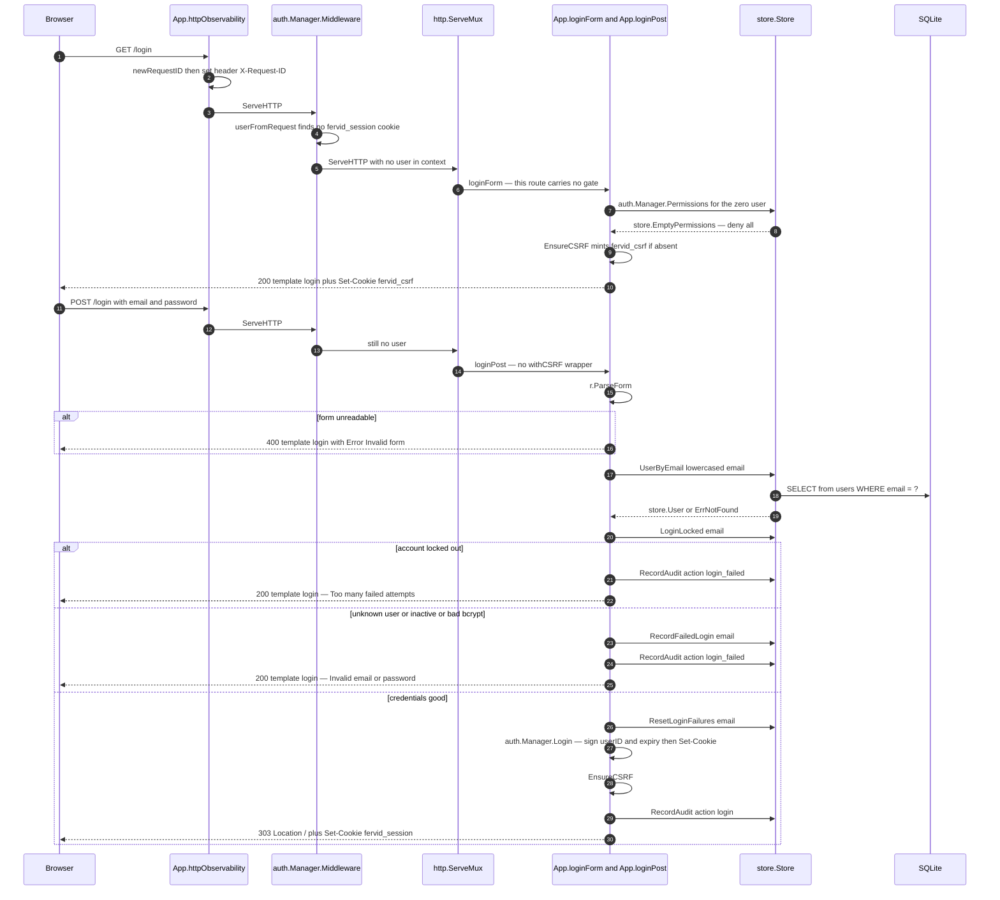
```mermaid
sequenceDiagram
    autonumber
    participant B as Browser
    participant O as App.httpObservability
    participant AM as auth.Manager.Middleware
    participant MUX as http.ServeMux
    participant H as App.loginForm and App.loginPost
    participant ST as store.Store
    participant DB as SQLite

    B->>O: GET /login
    O->>O: newRequestID then set header X-Request-ID
    O->>AM: ServeHTTP
    AM->>AM: userFromRequest finds no fervid_session cookie
    AM->>MUX: ServeHTTP with no user in context
    MUX->>H: loginForm — this route carries no gate
    H->>ST: auth.Manager.Permissions for the zero user
    ST-->>H: store.EmptyPermissions — deny all
    H->>H: EnsureCSRF mints fervid_csrf if absent
    H-->>B: 200 template login plus Set-Cookie fervid_csrf

    B->>O: POST /login with email and password
    O->>AM: ServeHTTP
    AM->>MUX: still no user
    MUX->>H: loginPost — no withCSRF wrapper
    H->>H: r.ParseForm
    alt form unreadable
        H-->>B: 400 template login with Error Invalid form
    end
    H->>ST: UserByEmail lowercased email
    ST->>DB: SELECT from users WHERE email = ?
    ST-->>H: store.User or ErrNotFound
    H->>ST: LoginLocked email
    alt account locked out
        H->>ST: RecordAudit action login_failed
        H-->>B: 200 template login — Too many failed attempts
    else unknown user or inactive or bad bcrypt
        H->>ST: RecordFailedLogin email
        H->>ST: RecordAudit action login_failed
        H-->>B: 200 template login — Invalid email or password
    else credentials good
        H->>ST: ResetLoginFailures email
        H->>H: auth.Manager.Login — sign userID and expiry then Set-Cookie
        H->>H: EnsureCSRF
        H->>ST: RecordAudit action login
        H-->>B: 303 Location / plus Set-Cookie fervid_session
    end
```

**Cookie facts, verified.**

| ID | Fact | Cite |
|----|------|------|
| SD1-C1 | Session cookie name is `fervid_session`; value is `base64url(userID:expUnix:HMAC-SHA256)` keyed on `cfg.SessionKey`; lifetime 12 h; `HttpOnly`, `Path=/`, `SameSite=Lax`, `Secure=cfg.SecureCookies` | `internal/auth/auth.go:66-72`, `234-238` |
| SD1-C2 | CSRF cookie name is `fervid_csrf`; value is the first 32 chars of `sign(UnixNano)`; `HttpOnly=false` so the page can read it; no expiry field, so it is a session cookie | `internal/auth/auth.go:182-189` |
| SD1-C3 | `EnsureCSRF` is idempotent — an existing non-empty cookie is returned unchanged, so the token is stable for the browser session | `internal/auth/auth.go:183-185` |
| SD1-C4 | `Logout` clears only `fervid_session`; `fervid_csrf` survives a logout | `internal/auth/auth.go:74-76` |
| SD1-C5 | A failed login answers **200**, not 401; only an unparseable body answers 400 | `internal/app/app.go:586`, `594`, `609` |

### SD1.2 — An authenticated request through all three gates

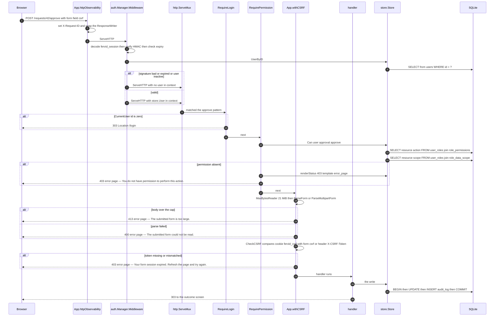
```mermaid
sequenceDiagram
    autonumber
    participant B as Browser
    participant O as App.httpObservability
    participant AM as auth.Manager.Middleware
    participant MUX as http.ServeMux
    participant RL as RequireLogin
    participant RP as RequirePermission
    participant CS as App.withCSRF
    participant HD as handler
    participant ST as store.Store
    participant DB as SQLite

    B->>O: POST /requests/42/approve with form field csrf
    O->>O: set X-Request-ID and wrap the ResponseWriter
    O->>AM: ServeHTTP
    AM->>AM: decode fervid_session then verify HMAC then check expiry
    AM->>ST: UserByID
    ST->>DB: SELECT from users WHERE id = ?
    alt signature bad or expired or user inactive
        AM->>MUX: ServeHTTP with no user in context
    else valid
        AM->>MUX: ServeHTTP with store.User in context
    end
    MUX->>RL: matched the approve pattern
    alt CurrentUser id is zero
        RL-->>B: 303 Location /login
    end
    RL->>RP: next
    RP->>ST: Can user approval approve
    ST->>DB: SELECT resource action FROM user_roles join role_permissions
    ST->>DB: SELECT resource scope FROM user_roles join role_data_scope
    alt permission absent
        RP->>ST: renderStatus 403 template error_page
        RP-->>B: 403 error page — You do not have permission to perform this action.
    end
    RP->>CS: next
    CS->>CS: MaxBytesReader 21 MiB then ParseForm or ParseMultipartForm
    alt body over the cap
        CS-->>B: 413 error page — The submitted form is too large.
    else parse failed
        CS-->>B: 400 error page — The submitted form could not be read.
    end
    CS->>CS: CheckCSRF compares cookie fervid_csrf with form csrf or header X-CSRF-Token
    alt token missing or mismatched
        CS-->>B: 403 error page — Your form session expired. Refresh the page and try again.
    end
    CS->>HD: handler runs
    HD->>ST: the write
    ST->>DB: BEGIN then UPDATE then INSERT audit_log then COMMIT
    HD-->>B: 303 to the outcome screen
```

**Refusal facts, verified.**

| ID | Condition | Status | Body | Cite |
|----|-----------|--------|------|------|
| SD1-E1 | not signed in | **303** to `/login` | redirect, no body | `internal/auth/auth.go:89-91` |
| SD1-E2 | signed in, grant absent | **403** | `error_page`, message `You do not have permission to perform this action.` | `internal/auth/auth.go:142-145`, `internal/app/app.go:205-207`, `internal/app/http_errors.go:176-181` |
| SD1-E3 | CSRF cookie absent, or token empty, or mismatch | **403** | `error_page`, message `Your form session expired. Refresh the page and try again.` | `internal/app/app.go:572-575`, `internal/auth/auth.go:167-180` |
| SD1-E4 | body above 21 MiB | **413** | `error_page`, `The submitted form is too large.` | `internal/app/app.go:564-568`, `internal/app/http_errors.go:22` |
| SD1-E5 | form unparseable | **400** | `error_page`, `The submitted form could not be read.` | `internal/app/app.go:568` |
| SD1-E6 | store returns `ErrForbidden` | **403** | `error_page` | `internal/app/http_errors.go:191-192`, `199-211` |
| SD1-E7 | store returns `ErrValidation` / `ErrDuplicate` / `ErrInactiveHead` | **400** | `error_page` with `friendly(err)` | `internal/app/http_errors.go:193-194`, `internal/app/app.go:1628-1641` |
| SD1-E8 | store returns `ErrNotFound` | **404** | `error_page` | `internal/app/http_errors.go:187-188` |
| SD1-E9 | store returns `ErrLockedMonth` | **409** | `error_page` | `internal/app/http_errors.go:189-190` |
| SD1-E10 | an unrouted POST | **405** — `GET /` is a registered catch-all, so the *path* matches and the *method* does not | `internal/app/app.go:376` |
| SD1-E11 | the error page is deliberately chrome-less: `renderStatus` forces `Shell{Chrome: none}` when `name == "error_page"` | — | no sidebar, no tab bar, no badge queries | `internal/app/http_errors.go:121-125` |

**Observation, worth a test.** `GET /login` and `POST /login` carry no
`RequireLogin`, and `CheckCSRF` returns `true` unconditionally for GET/HEAD/
OPTIONS (`internal/auth/auth.go:168-170`), so every gate on a GET route is a
permission gate only.

---

## SD2 — Page render and the permission-driven shell

### SD2 mechanics

| ID | Step | What happens | Cite |
|----|------|--------------|------|
| SD2-S1 | `data.User` | `auth.CurrentUser(r)` — the context value the middleware put there | `internal/app/http_errors.go:102` |
| SD2-S2 | `data.CSRF` | `EnsureCSRF(w, r)` — every rendered form gets the live token | `internal/app/http_errors.go:103` |
| SD2-S3 | `data.Perms` | `a.auth.Permissions(user)` → `store.EffectivePermissions` → two SELECTs; on error `EmptyPermissions` so a failure denies rather than grants | `internal/app/http_errors.go:112`, `internal/auth/auth.go:100-117`, `internal/store/permissions.go:560-596` |
| SD2-S4 | `data.Shell` | skipped entirely for an htmx fragment or the error page; otherwise `buildPageShell` | `internal/app/http_errors.go:121-125` |
| SD2-S5 | nav groups | `buildShell(perms)` filters `navSpec`; a group left with no items disappears | `internal/app/nav.go:103-123` |
| SD2-S6 | item visibility | `navItemVisible` — `item.Resource == ""` is visible to everyone, otherwise `perms.Can(item.Resource, item.Action)` | `internal/app/nav.go:269-277` |
| SD2-S7 | mobile tab bar | `resolveTabs(perms)`: Home is the floor, the centre action is the first of approve → pay → new the caller holds, right is Payments or Budget, More is last | `internal/app/nav.go:198-235` |
| SD2-S8 | active item | `activeNavKey(path)` — longest matching href wins | `internal/app/nav.go:170-193` |
| SD2-S9 | badges | `store.BadgeCounts(userID, perms)` — one statement of scalar sub-selects, only the permitted ones, memoised 15 s | `internal/store/badges.go:71-119` |
| SD2-S10 | bell | `store.UnreadNotificationCount(userID)`; a failure costs the badge, never the page | `internal/app/nav.go:152-159` |
| SD2-S11 | write order | render into a `bytes.Buffer` first, then `WriteHeader(status)`, then `Write` — a template error becomes a plain 500 and never a half-written page | `internal/app/http_errors.go:127-145` |

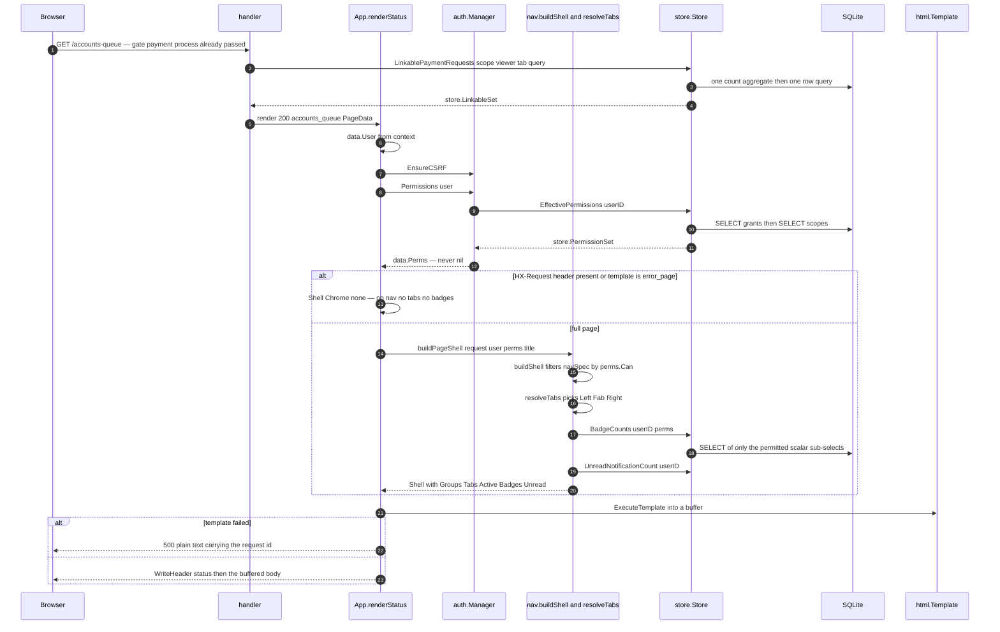
```mermaid
sequenceDiagram
    autonumber
    participant B as Browser
    participant HD as handler
    participant RS as App.renderStatus
    participant AU as auth.Manager
    participant NV as nav.buildShell and resolveTabs
    participant ST as store.Store
    participant DB as SQLite
    participant TPL as html.Template

    B->>HD: GET /accounts-queue — gate payment process already passed
    HD->>ST: LinkablePaymentRequests scope viewer tab query
    ST->>DB: one count aggregate then one row query
    ST-->>HD: store.LinkableSet
    HD->>RS: render 200 accounts_queue PageData
    RS->>RS: data.User from context
    RS->>AU: EnsureCSRF
    RS->>AU: Permissions user
    AU->>ST: EffectivePermissions userID
    ST->>DB: SELECT grants then SELECT scopes
    ST-->>AU: store.PermissionSet
    AU-->>RS: data.Perms — never nil
    alt HX-Request header present or template is error_page
        RS->>RS: Shell Chrome none — no nav no tabs no badges
    else full page
        RS->>NV: buildPageShell request user perms title
        NV->>NV: buildShell filters navSpec by perms.Can
        NV->>NV: resolveTabs picks Left Fab Right
        NV->>ST: BadgeCounts userID perms
        ST->>DB: SELECT of only the permitted scalar sub-selects
        NV->>ST: UnreadNotificationCount userID
        NV-->>RS: Shell with Groups Tabs Active Badges Unread
    end
    RS->>TPL: ExecuteTemplate into a buffer
    alt template failed
        RS-->>B: 500 plain text carrying the request id
    else
        RS-->>B: WriteHeader status then the buffered body
    end
```

### SD2.1 — Menu hiding is not enforcement: the second, server-side check

`nav.go` decides what is *drawn*. Every one of those doors is checked again on
the data path, by a different mechanism, in a different file. These are the
three shapes that check takes.

| ID | Shape | Drawn gate | Route gate | Data-path gate | Cite |
|----|-------|-----------|------------|----------------|------|
| SD2-X1 | row scope on a single record | nav item `request:view` | `RequirePermission("request","view")` | `loadViewableRequest` → `canViewRequest(scope, u, req)` → ~~**403**~~ **404** for `all`/`assigned`/`own`/none | `internal/app/nav.go:61`, `internal/app/app.go:488`, `internal/app/requests.go:229-241`, `332-343`; correction: `internal/app/requests.go:288-308` |
| SD2-X2 | scope on a list | same nav item | same route gate | `effectiveScope` may only *narrow* — `?scope=all` cannot widen an `own` holder — then `requestWhere` adds `r.requester_id=?` or `r.manager_id=?` | `internal/app/requests.go:347-354`, `internal/store/requests.go:1206-1219` |
| SD2-X3 | ownership beyond a verb | action bar requires `.User.ID == .Request2.ManagerID` **and** `approval:accept_partial` | `RequirePermission("approval","accept_partial")` only | `store.AcceptPartial` and `store.RaiseConcern` both reject `before.ManagerID != actor.ID` with `ErrForbidden` | `internal/app/templates.go:901`, `internal/app/app.go:483-484`, `internal/store/store.go:980-982`, `1021-1023` |

> **Correction to SD2-X1 — the row-scope refusal is 404 now, not 403.** F-G-002, fixed in Wave 3
> (`1fac147`). A row that existed but was out of scope answered 403 while a row that did not exist
> answered 404, so the status code was an existence oracle: a requester could walk the id space and
> count the company's requests. `loadViewableRequest` now answers **404** *"The requested record was
> not found."* through the same path as a missing id, and says why in its own comment
> (`internal/app/requests.go:288-308`). The same change was made at the two other sites that
> re-implement the check: `requestReassignApprover` (`internal/app/app.go:1622-1627`) and
> `recoverableDetail` (`internal/app/recoverables.go:195-198`). Every "→ 403" for an out-of-scope
> *request* elsewhere in this document should be read as **404**; the 403s for a missing *verb*
> are unchanged. See `docs/qa/results/REPAIR-LOG.md`, Wave 3.

Worked examples of a control that disappears while the route stays gated:

| ID | Control | Template condition | Route it posts to |
|----|---------|--------------------|-------------------|
| SD2-C1 | *Take for processing* in the Accounts queue becomes a plain *View* link | `{{if $.Perms.Can "reservation" "reserve"}}` | `POST /requests/{id}/record-payment` (`internal/app/templates.go:722`) |
| SD2-C2 | a takeable picker row becomes a read-only `.co.is-taken` anchor | `{{if $.Perms.Can "reservation" "reserve"}}` | same route (`internal/app/templates.go:572-579`) |
| SD2-C3 | *Release* / *Cancel and release* vanish from the payment form | `{{if .Perms.Can "reservation" "release"}}` | `GET /requests/{id}/reservation` (`internal/app/templates.go:372`, `444`) |
| SD2-C4 | the vendor combobox degrades to a plain `<select>` | `{{if .Perms.Can "vendor" "view"}}` | `GET /vendors/search` (`internal/app/templates.go:1900`) |
| SD2-C5 | *Release hold* / *Put on hold* appear only with `payment:hold` | `$mayHold` | `POST /requests/{id}/unhold`, `/hold` (`internal/app/templates.go:2447-2451`) |

**Two findings a test should pin.**
`internal/app/nav.go:62-63` declares `Badge: "approvals"` and
`Badge: "accounts_queue"`, but `badgeSpecs` (`internal/store/badges.go:33-46`)
defines only `my_payments`, `receipts_missing` and `open_months` — so those two
badges never render a number. And `permsFor` resolves permissions on
`context.Background()`, not `r.Context()` (`internal/auth/auth.go:104`), so the
permission query is not cancelled with the request.

---

## SD3 — Raise a request

### SD3 routes and gates

| ID | Route | Gate | Handler | Cite |
|----|-------|------|---------|------|
| SD3-R1 | `GET /requests/new` | `request:create` | `App.requestNew` — chooser without `?type=`, form with a known one | `internal/app/app.go:443`, `internal/app/requests.go:71-98` |
| SD3-R2 | `GET /requests/new/fields` | `request:create` | `App.requestFormFields` → `renderPartial` `request_form_fields` | `internal/app/app.go:444`, `internal/app/requests.go:105-127` |
| SD3-R3 | `POST /requests/duplicate-check` | `request:create` + `withCSRF` | `App.requestDuplicateCheck` → `renderPartial` `request_duplicates` | `internal/app/app.go:445`, `internal/app/requests.go:249-274` |
| SD3-R4 | `POST /requests` | `request:create` + `withCSRF` | `App.requestCreate` | `internal/app/app.go:446`, `internal/app/requests.go:147-174` |
| SD3-R5 | `GET /requests/{id}/submitted` | `request:view` | `App.requestSubmitted` | `internal/app/app.go:447`, `internal/app/requests.go:218-224` |

htmx wiring, read from the markup:

| ID | Trigger | Request | Target |
|----|---------|---------|--------|
| SD3-H1 | `change` on the treatment radio group | `hx-get /requests/new/fields`, `hx-include="closest form"` | `#form-fields` (`internal/app/templates.go:1843`) |
| SD3-H2 | `change` on `#rcategory` | same | `#form-fields` (`internal/app/templates.go:1737`) |
| SD3-H3 | `change` on `#project` | same | `#form-fields` (`internal/app/templates.go:1789`) |
| SD3-H4 | `blur` on `#amount` | `hx-post /requests/duplicate-check`, `hx-include="closest form"` | `#dup-check` (`internal/app/templates.go:1865`) |
| SD3-H5 | `blur` on `#invoice-no` | same | `#dup-check` (`internal/app/templates.go:1931`) |

### SD3.1 — Chooser, adaptive form, advisory duplicate check

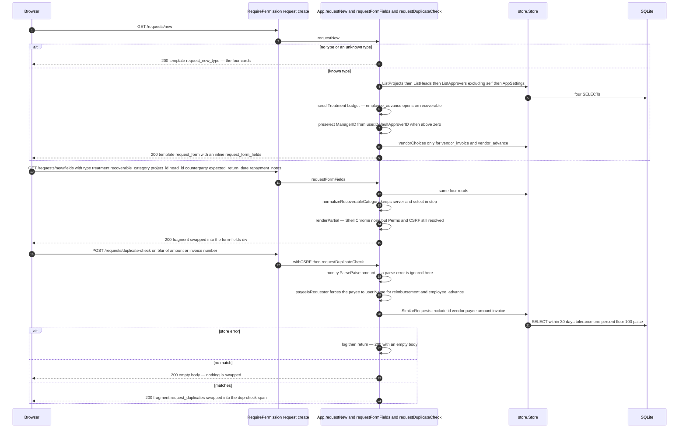
```mermaid
sequenceDiagram
    autonumber
    participant B as Browser
    participant RP as RequirePermission request create
    participant HD as App.requestNew and requestFormFields and requestDuplicateCheck
    participant ST as store.Store
    participant DB as SQLite

    B->>RP: GET /requests/new
    RP->>HD: requestNew
    alt no type or an unknown type
        HD-->>B: 200 template request_new_type — the four cards
    else known type
        HD->>ST: ListProjects then ListHeads then ListApprovers excluding self then AppSettings
        ST->>DB: four SELECTs
        HD->>HD: seed Treatment budget — employee_advance opens on recoverable
        HD->>HD: preselect ManagerID from user.DefaultApproverID when above zero
        HD->>ST: vendorChoices only for vendor_invoice and vendor_advance
        HD-->>B: 200 template request_form with an inline request_form_fields
    end

    B->>RP: GET /requests/new/fields with type treatment recoverable_category project_id head_id counterparty expected_return_date repayment_notes
    RP->>HD: requestFormFields
    HD->>ST: same four reads
    HD->>HD: normalizeRecoverableCategory keeps server and select in step
    HD->>HD: renderPartial — Shell Chrome none but Perms and CSRF still resolved
    HD-->>B: 200 fragment swapped into the form-fields div

    B->>RP: POST /requests/duplicate-check on blur of amount or invoice number
    RP->>HD: withCSRF then requestDuplicateCheck
    HD->>HD: money.ParsePaise amount — a parse error is ignored here
    HD->>HD: payeeIsRequester forces the payee to user.Name for reimbursement and employee_advance
    HD->>ST: SimilarRequests exclude id vendor payee amount invoice
    ST->>DB: SELECT within 30 days tolerance one percent floor 100 paise
    alt store error
        HD->>HD: log then return — 200 with an empty body
    else no match
        HD-->>B: 200 empty body — nothing is swapped
    else matches
        HD-->>B: 200 fragment request_duplicates swapped into the dup-check span
    end
```

`SimilarRequests` is advisory only: `POST /requests` neither calls it nor reads
its result, and legitimate repeat payments exist (G6) —
`internal/store/requests.go:1306-1354`, `internal/app/requests.go:243-248`.

### SD3.2 — POST /requests, one transaction, D1

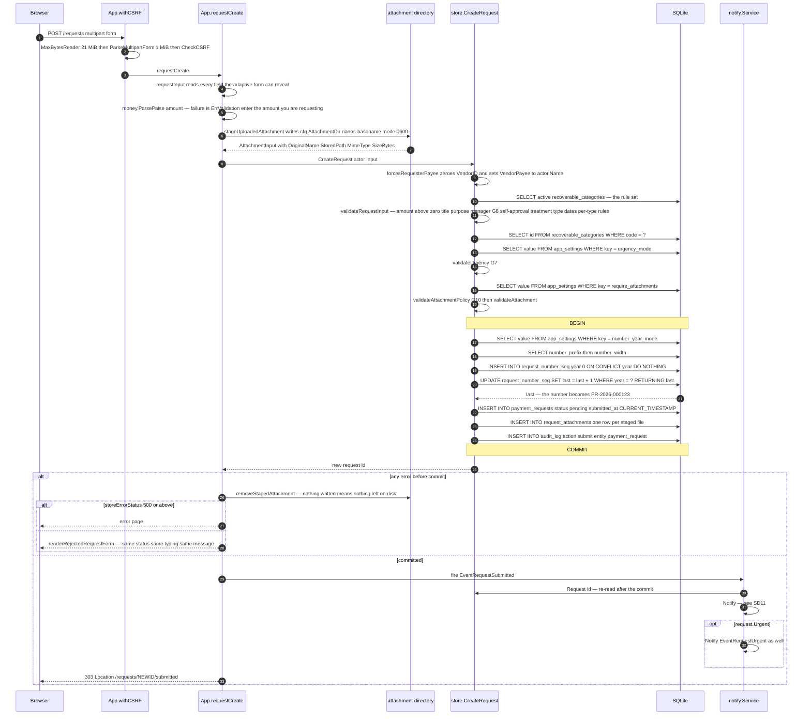
```mermaid
sequenceDiagram
    autonumber
    participant B as Browser
    participant CS as App.withCSRF
    participant HD as App.requestCreate
    participant FS as attachment directory
    participant ST as store.CreateRequest
    participant DB as SQLite
    participant NF as notify.Service

    B->>CS: POST /requests multipart form
    CS->>CS: MaxBytesReader 21 MiB then ParseMultipartForm 1 MiB then CheckCSRF
    CS->>HD: requestCreate
    HD->>HD: requestInput reads every field the adaptive form can reveal
    HD->>HD: money.ParsePaise amount — failure is ErrValidation enter the amount you are requesting
    HD->>FS: stageUploadedAttachment writes cfg.AttachmentDir nanos-basename mode 0600
    FS-->>HD: AttachmentInput with OriginalName StoredPath MimeType SizeBytes
    HD->>ST: CreateRequest actor input

    ST->>ST: forcesRequesterPayee zeroes VendorID and sets VendorPayee to actor.Name
    ST->>DB: SELECT active recoverable_categories — the rule set
    ST->>ST: validateRequestInput — amount above zero title purpose manager G8 self-approval treatment type dates per-type rules
    ST->>DB: SELECT id FROM recoverable_categories WHERE code = ?
    ST->>DB: SELECT value FROM app_settings WHERE key = urgency_mode
    ST->>ST: validateUrgency G7
    ST->>DB: SELECT value FROM app_settings WHERE key = require_attachments
    ST->>ST: validateAttachmentPolicy G10 then validateAttachment
    Note over ST,DB: BEGIN
    ST->>DB: SELECT value FROM app_settings WHERE key = number_year_mode
    ST->>DB: SELECT number_prefix then number_width
    ST->>DB: INSERT INTO request_number_seq year 0 ON CONFLICT year DO NOTHING
    ST->>DB: UPDATE request_number_seq SET last = last + 1 WHERE year = ? RETURNING last
    DB-->>ST: last — the number becomes PR-2026-000123
    ST->>DB: INSERT INTO payment_requests status pending submitted_at CURRENT_TIMESTAMP
    ST->>DB: INSERT INTO request_attachments one row per staged file
    ST->>DB: INSERT INTO audit_log action submit entity payment_request
    Note over ST,DB: COMMIT
    ST-->>HD: new request id

    alt any error before commit
        HD->>FS: removeStagedAttachment — nothing written means nothing left on disk
        alt storeErrorStatus 500 or above
            HD-->>B: error page
        else
            HD-->>B: renderRejectedRequestForm — same status same typing same message
        end
    else committed
        HD->>NF: fire EventRequestSubmitted
        NF->>ST: Request id — re-read after the commit
        NF->>NF: Notify — see SD11
        opt request.Urgent
            NF->>NF: Notify EventRequestUrgent as well
        end
        HD-->>B: 303 Location /requests/NEWID/submitted
    end
```

| ID | Fact | Cite |
|----|------|------|
| SD3-F1 | The number is allocated **inside** the transaction, from `request_number_seq`, by `UPDATE … SET last=last+1 … RETURNING last`. Two concurrent creates serialise on that row; `busy_timeout=5000` makes the loser wait rather than fail. | `internal/store/requests.go:52-76`, `401-413`, `internal/store/store.go:36` |
| SD3-F2 | Number format is `<prefix>-<year>-<NNNNNN>`, all three parts read from `app_settings` *inside the same tx*, so a numbering change mid-flight cannot produce a hybrid. `number_year_mode` = `calendar` \| `financial` \| `none`; width clamped to 1–12, default 6. | `internal/store/requests.go:19-76` |
| SD3-F3 | Row, number, `submitted_at`, every attachment row and the audit row commit together or not at all. There is no draft state — `requestStatuses` has no `draft`. | `internal/store/requests.go:414-451`, `86-89` |
| SD3-F4 | `hidden` is never validation: the fields the fragment did not render are still read by `requestInput` and still rejected by `validateRequestInput`. | `internal/app/requests.go:296-328`, `internal/store/requests.go:127-247` |
| SD3-F5 | The file is on disk *before* `BEGIN` and is unlinked on every failure path. A crash between write and commit leaves an orphan file with no row. | `internal/app/app.go:913-958`, `internal/app/requests.go:161-171` |
| SD3-F6 | Notification is fired **after** commit, from a fresh `store.Request` read, and its failure is logged and swallowed. | `internal/app/notifications.go:29-52` |
| SD3-F7 | `store.CreateRequest` accepts type `recoverable` (`requestTypes`), but no card offers it: `requestTypeOptions` lists only the four. It is reachable only by a hand-rolled POST. | `internal/store/requests.go:78-81`, `internal/app/requests.go:42-55` |

---

## SD4 — Approve, with amount adjustment

### SD4 routes and gates

| ID | Route | Gate | Handler | Cite |
|----|-------|------|---------|------|
| SD4-R1 | `POST /requests/{id}/approve` | `approval:approve` + `withCSRF` | `App.requestApprove` | `internal/app/app.go:494`, `internal/app/requests.go:716-728` |

The sheet is `#approve-sheet`, a plain `<form method="post">` — no htmx. It
carries `csrf`, `approved_amount` (prefilled with `amountValue .Request2.Amount`,
i.e. the requested amount with the `₹` stripped) and an optional `note`
(`internal/app/templates.go:2206-2221`).

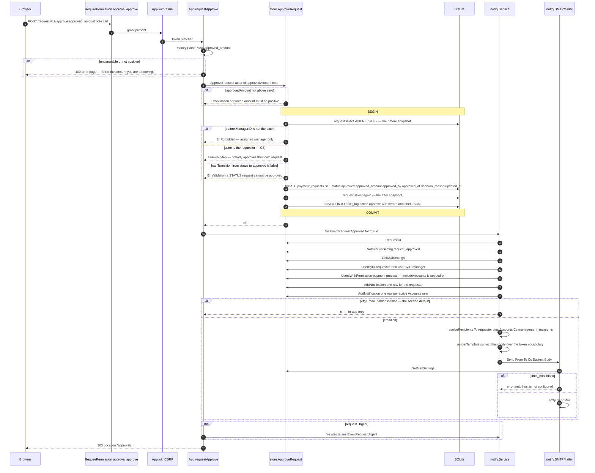
```mermaid
sequenceDiagram
    autonumber
    participant B as Browser
    participant RP as RequirePermission approval approve
    participant CS as App.withCSRF
    participant HD as App.requestApprove
    participant ST as store.ApproveRequest
    participant DB as SQLite
    participant NF as notify.Service
    participant ML as notify.SMTPMailer

    B->>RP: POST /requests/42/approve approved_amount note csrf
    RP->>CS: grant present
    CS->>HD: token matched
    HD->>HD: money.ParsePaise approved_amount
    alt unparseable or not positive
        HD-->>B: 400 error page — Enter the amount you are approving.
    end
    HD->>ST: ApproveRequest actor id approvedAmount note
    alt approvedAmount not above zero
        ST-->>HD: ErrValidation approved amount must be positive
    end
    Note over ST,DB: BEGIN
    ST->>DB: requestSelect WHERE r.id = ? — the before snapshot
    alt before.ManagerID is not the actor
        ST-->>HD: ErrForbidden — assigned manager only
    else actor is the requester — G8
        ST-->>HD: ErrForbidden — nobody approves their own request
    else canTransition from status to approved is false
        ST-->>HD: ErrValidation a STATUS request cannot be approved
    end
    ST->>DB: UPDATE payment_requests SET status approved approved_amount approved_by approved_at decision_reason updated_at
    ST->>DB: requestSelect again — the after snapshot
    ST->>DB: INSERT INTO audit_log action approve with before and after JSON
    Note over ST,DB: COMMIT
    ST-->>HD: nil

    HD->>NF: fire EventRequestApproved for this id
    NF->>ST: Request id
    NF->>ST: NotificationSetting request_approved
    NF->>ST: GetMailSettings
    NF->>ST: UserByID requester then UserByID manager
    NF->>ST: UsersWithPermission payment process — IncludeAccounts is seeded on
    NF->>ST: AddNotification one row for the requester
    NF->>ST: AddNotification one row per active Accounts user
    alt cfg.EmailEnabled is false — the seeded default
        NF-->>HD: nil — in-app only
    else email on
        NF->>NF: resolveRecipients To requester plus Accounts Cc management_recipients
        NF->>NF: renderTemplate subject then body over the token vocabulary
        NF->>ML: Send From To Cc Subject Body
        ML->>ST: GetMailSettings
        alt smtp_host blank
            ML-->>NF: error smtp host is not configured
        else
            ML->>ML: smtp.SendMail
        end
    end
    opt request.Urgent
        HD->>NF: fire also raises EventRequestUrgent
    end
    HD-->>B: 303 Location /approvals
```

| ID | Fact | Cite |
|----|------|------|
| SD4-F1 | Three independent guards, in this order: assigned-manager, G8 self-approval, legal transition. `legalTransitions` allows `approved` only from `pending` and from `cancellation_requested`. | `internal/store/requests.go:687-697`, `91-101` |
| SD4-F2 | `approved_amount` may be **less** than `amount`; it may not be zero or negative. Nothing caps it *above* `amount` — an approver may approve **more** than was asked. | `internal/store/requests.go:675-677`, `698` |
| SD4-F3 | The audit row carries the full before/after `store.Request` as JSON, which is what feeds `diffRequestAudit` and the `.tl-change` lines in the thread. | `internal/store/requests.go:705-710`, `1100-1117` |
| SD4-F4 | Seeded audience for `request_approved` is requester + Accounts. The **manager is not** a recipient. Management recipients are Cc on **email only** and never receive an in-app row. | `internal/store/migrations_notifications.go:41-43`, `internal/notify/service.go:133-163`, `216-218` |
| SD4-F5 | `email_enabled` defaults to `0` for all twelve events, so a fresh install delivers in-app rows only. **Still true of the twenty-one the vocabulary now has** — migration v9's nine rows leave `EmailEnabled` unset, so `seedNotificationSettings` writes `email_enabled=0` for them too (`internal/store/migrations_notifications.go:87-129`, `132-144`). | `internal/store/migrations_notifications.go:79`, `28-68`; correction: `internal/notify/events.go:22-79` |
| SD4-F6 | Approval does **not** clear `reminder_last_sent`; only `SubmitRequest`, `UpdateRequest` and `ReassignRequest` do. | `internal/store/requests.go:483`, `622`, `783` |

---

## SD5 — Return, reject and reassign

### SD5 routes and gates

| ID | Route | Gate | Store method | Required text | `manager_id` | Audit action |
|----|-------|------|--------------|---------------|--------------|--------------|
| SD5-R1 | `POST /requests/{id}/return` | `approval:return` + `withCSRF` | `ReturnRequest` → `decideRequest(to=returned)` | form field **`comment`**, message `a comment is required to return a request` | **unchanged** | `return` |
| SD5-R2 | `POST /requests/{id}/reject` | `approval:reject` + `withCSRF` | `RejectRequest` → `decideRequest(to=rejected)` | form field **`reason`**, message `a reason is required to reject a request` | **unchanged** | `reject` |
| SD5-R3 | *approval reassignment* | `approval:reassign` is a grantable cell — **and, since Wave 3, the gate on `POST /requests/{id}/reassign-approver` (`internal/app/app.go:569`)** | `ReassignRequest` | `reason` + `manager_id` | **overwritten**, `reminder_last_sent` cleared | `approval_reassign` |

Cites: `internal/app/app.go:495-496`, `internal/app/requests.go:730-746`,
`internal/store/requests.go:714-757`, `759-801`, `internal/app/permmap.go:69`.

> **Divergence — SD5-R3 has no route.** `store.ReassignRequest` is defined and
> tested but is referenced by no handler: `grep ReassignRequest internal/ cmd/`
> outside `_test.go` matches only its own definition at
> `internal/store/requests.go:759`. `POST /requests/{id}/reassign`
> (`internal/app/app.go:466`) is *reservation* reassignment, a different entity
> concern with the audit action `reassign`. So the `approval:reassign` grant
> (`internal/store/permissions.go:152`, surfaced in the roles matrix at
> `internal/app/permmap.go:69`) is grantable but unreachable over HTTP, and an
> approver cannot hand an approval to a colleague through the UI. The two audit
> action names are deliberately distinct so trails do not confuse them
> (`internal/store/requests.go:791-795`).
>
> **Closed — F-A-06 / F-C-02, Wave 3 (`1fac147`).** `POST /requests/{id}/reassign-approver` was
> added at `internal/app/app.go:569`, gated on `approval:reassign`, over the same tested
> `store.ReassignRequest`. Handler `requestReassignApprover` (`internal/app/app.go:1615-1647`)
> takes `manager_id` and `reason`, refuses either when blank with a 400, and answers **404** for a
> request outside the caller's scope (`:1622-1627`). The path is deliberately **not** `/reassign`,
> and `app.go:565-566` says so: that one is still the reservation handler of SD10-R5. The two audit
> action names stay distinct, which is what makes the trails readable. See
> `docs/qa/results/REPAIR-LOG.md`, Wave 3.

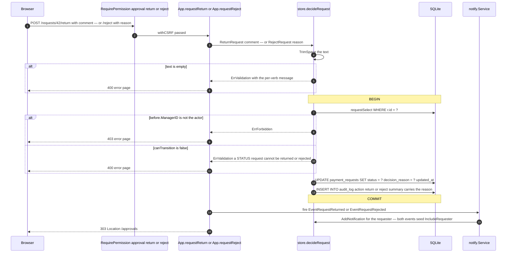
```mermaid
sequenceDiagram
    autonumber
    participant B as Browser
    participant RP as RequirePermission approval return or reject
    participant HD as App.requestReturn or App.requestReject
    participant ST as store.decideRequest
    participant DB as SQLite
    participant NF as notify.Service

    B->>RP: POST /requests/42/return with comment — or /reject with reason
    RP->>HD: withCSRF passed
    HD->>ST: ReturnRequest comment — or RejectRequest reason
    ST->>ST: TrimSpace the text
    alt text is empty
        ST-->>HD: ErrValidation with the per-verb message
        HD-->>B: 400 error page
    end
    Note over ST,DB: BEGIN
    ST->>DB: requestSelect WHERE r.id = ?
    alt before.ManagerID is not the actor
        ST-->>HD: ErrForbidden
        HD-->>B: 403 error page
    else canTransition is false
        ST-->>HD: ErrValidation a STATUS request cannot be returned or rejected
        HD-->>B: 400 error page
    end
    ST->>DB: UPDATE payment_requests SET status = ? decision_reason = ? updated_at
    ST->>DB: INSERT INTO audit_log action return or reject summary carries the reason
    Note over ST,DB: COMMIT
    HD->>NF: fire EventRequestReturned or EventRequestRejected
    NF->>ST: AddNotification for the requester — both events seed IncludeRequester
    HD-->>B: 303 Location /approvals
```

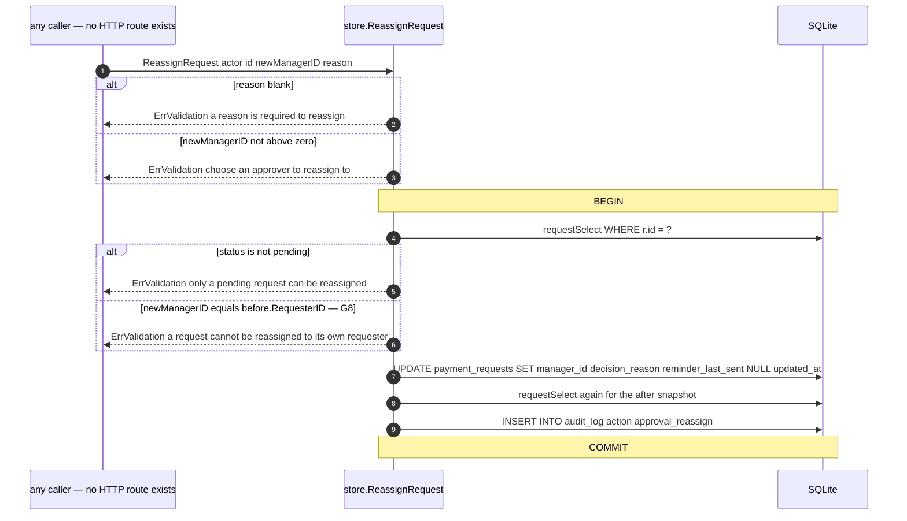
```mermaid
sequenceDiagram
    autonumber
    participant CALLER as any caller — no HTTP route exists
    participant ST as store.ReassignRequest
    participant DB as SQLite

    CALLER->>ST: ReassignRequest actor id newManagerID reason
    alt reason blank
        ST-->>CALLER: ErrValidation a reason is required to reassign
    else newManagerID not above zero
        ST-->>CALLER: ErrValidation choose an approver to reassign to
    end
    Note over ST,DB: BEGIN
    ST->>DB: requestSelect WHERE r.id = ?
    alt status is not pending
        ST-->>CALLER: ErrValidation only a pending request can be reassigned
    else newManagerID equals before.RequesterID — G8
        ST-->>CALLER: ErrValidation a request cannot be reassigned to its own requester
    end
    ST->>DB: UPDATE payment_requests SET manager_id decision_reason reminder_last_sent NULL updated_at
    ST->>DB: requestSelect again for the after snapshot
    ST->>DB: INSERT INTO audit_log action approval_reassign
    Note over ST,DB: COMMIT
```

| ID | Fact | Cite |
|----|------|------|
| SD5-F1 | Return and reject share one store method; only the target status, the audit action and the missing-text message differ. Both write the text into the single `decision_reason` column, so a later reject overwrites an earlier return's words in the row — the history survives only in `audit_log`. | `internal/store/requests.go:714-757` |
| SD5-F2 | `returned → pending` is the only edge back in, and only `SubmitRequest` takes it. `rejected` has **no** outgoing edge — re-raising creates a brand new row with a new number. | `internal/store/requests.go:91-101`, `456-494`, `805-856` |
| SD5-F3 | A returned request does not reset the reminder clock; the reset happens when the requester resubmits. | `internal/store/requests.go:734` vs `483` |
| SD5-F4 | `requestReraise` is **not** wired to `a.fire`, so a re-raised request sends no `request_submitted` notification and the new approver is never told. | `internal/app/requests.go:759-766` |

---

## SD6 — Edit while pending

### SD6 routes and gates

| ID | Route | Gate | Handler | Cite |
|----|-------|------|---------|------|
| SD6-R1 | `GET /requests/{id}/edit` | `request:edit` | `App.requestEditForm` | `internal/app/app.go:489`, `internal/app/requests.go:570-581` |
| SD6-R2 | `POST /requests/{id}/edit` | `request:edit` + `withCSRF` | `App.requestEdit` | `internal/app/app.go:490`, `internal/app/requests.go:645-678` |

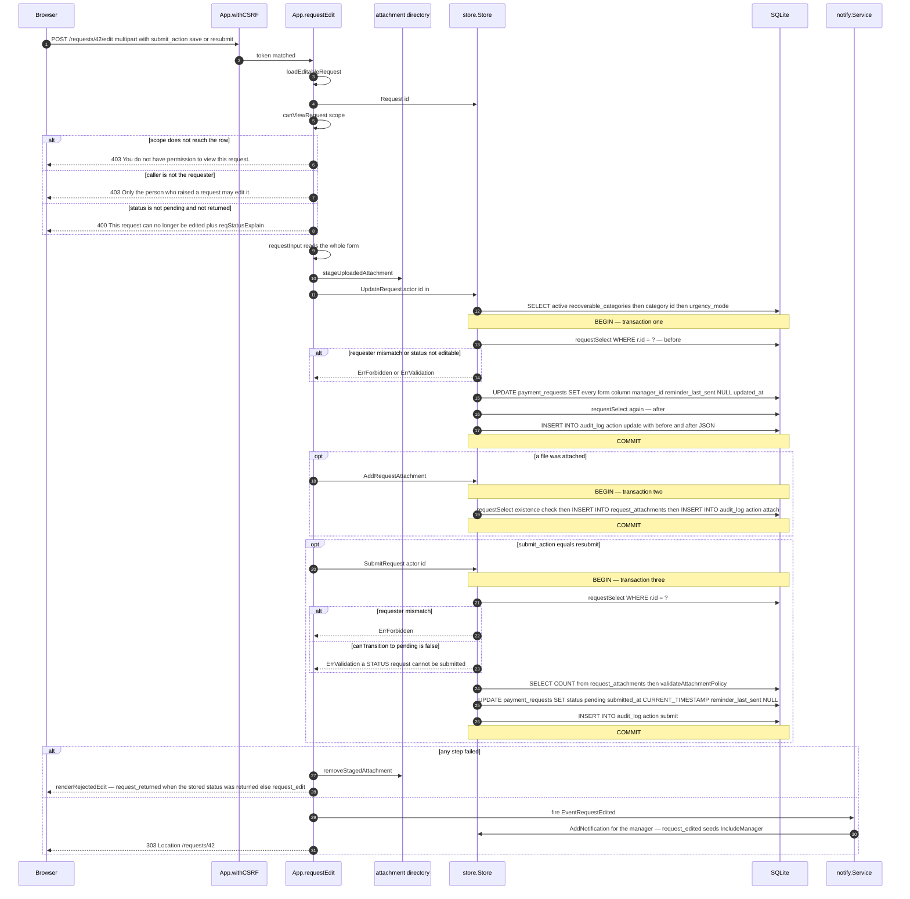
```mermaid
sequenceDiagram
    autonumber
    participant B as Browser
    participant CS as App.withCSRF
    participant HD as App.requestEdit
    participant FS as attachment directory
    participant ST as store.Store
    participant DB as SQLite
    participant NF as notify.Service

    B->>CS: POST /requests/42/edit multipart with submit_action save or resubmit
    CS->>HD: token matched
    HD->>HD: loadEditableRequest
    HD->>ST: Request id
    HD->>HD: canViewRequest scope
    alt scope does not reach the row
        HD-->>B: 403 You do not have permission to view this request.
    else caller is not the requester
        HD-->>B: 403 Only the person who raised a request may edit it.
    else status is not pending and not returned
        HD-->>B: 400 This request can no longer be edited plus reqStatusExplain
    end
    HD->>HD: requestInput reads the whole form
    HD->>FS: stageUploadedAttachment

    HD->>ST: UpdateRequest actor id in
    ST->>DB: SELECT active recoverable_categories then category id then urgency_mode
    Note over ST,DB: BEGIN — transaction one
    ST->>DB: requestSelect WHERE r.id = ? — before
    alt requester mismatch or status not editable
        ST-->>HD: ErrForbidden or ErrValidation
    end
    ST->>DB: UPDATE payment_requests SET every form column manager_id reminder_last_sent NULL updated_at
    ST->>DB: requestSelect again — after
    ST->>DB: INSERT INTO audit_log action update with before and after JSON
    Note over ST,DB: COMMIT

    opt a file was attached
        HD->>ST: AddRequestAttachment
        Note over ST,DB: BEGIN — transaction two
        ST->>DB: requestSelect existence check then INSERT INTO request_attachments then INSERT INTO audit_log action attach
        Note over ST,DB: COMMIT
    end

    opt submit_action equals resubmit
        HD->>ST: SubmitRequest actor id
        Note over ST,DB: BEGIN — transaction three
        ST->>DB: requestSelect WHERE r.id = ?
        alt requester mismatch
            ST-->>HD: ErrForbidden
        else canTransition to pending is false
            ST-->>HD: ErrValidation a STATUS request cannot be submitted
        end
        ST->>DB: SELECT COUNT from request_attachments then validateAttachmentPolicy
        ST->>DB: UPDATE payment_requests SET status pending submitted_at CURRENT_TIMESTAMP reminder_last_sent NULL
        ST->>DB: INSERT INTO audit_log action submit
        Note over ST,DB: COMMIT
    end

    alt any step failed
        HD->>FS: removeStagedAttachment
        HD-->>B: renderRejectedEdit — request_returned when the stored status was returned else request_edit
    else
        HD->>NF: fire EventRequestEdited
        NF->>ST: AddNotification for the manager — request_edited seeds IncludeManager
        HD-->>B: 303 Location /requests/42
    end
```

| ID | Fact | Cite |
|----|------|------|
| SD6-F1 | One `UPDATE` does all three things the flow promises: it rewrites the fields, it sets `manager_id` from the submitted form (**rerouting** to a possibly different approver), and it sets `reminder_last_sent=NULL` (**resetting the reminder clock**). | `internal/store/requests.go:618-630` |
| SD6-F2 | The re-notification is `EventRequestEdited`, seeded to `IncludeManager` — it goes to whoever `manager_id` names *after* the update, because `fire` re-reads the row post-commit. | `internal/app/requests.go:676`, `internal/app/notifications.go:34`, `internal/store/migrations_notifications.go:32-34` |
| SD6-F3 | The event fires even when `submit_action=save` and the request was never resubmitted, so the approver is emailed "edited and sent back for your approval" for a save that did not resubmit. | `internal/app/requests.go:663-677`, `internal/store/migrations_notifications.go:33-34` |
| SD6-F4 | The handler runs **three separate transactions**. A failure of transaction three after transaction two committed unlinks the file from disk while its `request_attachments` row survives — a dangling attachment. Reachable when a hand-rolled POST sends `submit_action=resubmit` on a `pending` request, since `pending → pending` is not a legal transition. | `internal/app/requests.go:657-675`, `internal/store/requests.go:91-101`, `469-471` |
| SD6-F5 | `editedRequest` overlays the posted values onto the stored row for the re-render, preserving number, status, names, `approved_amount` and timestamps — the fields the form never owned. | `internal/app/requests.go:700-711` |

---

## SD7 — Reserve from the queue and from the picker, with the race

### SD7 routes and gates

| ID | Entry point | Markup | Route | Gate |
|----|-------------|--------|-------|------|
| SD7-R1 | Accounts queue row — *Take for processing* | `<form method="post">` inside the table cell | `POST /requests/{id}/record-payment` | `reservation:reserve` + `withCSRF` |
| SD7-R2 | Payment picker row — the whole `.co` is a submit button | `<form method="post">` wrapping `<button class="co">` | the **same** route | the same gate |

Cites: `internal/app/templates.go:722` (queue), `572-579` (picker),
`internal/app/app.go:451`, `internal/app/linking.go:82-99`.

Both entry points are POSTs by design — selecting a request *mutates*, so a GET
must never do it (`internal/app/templates.go:557-560`).

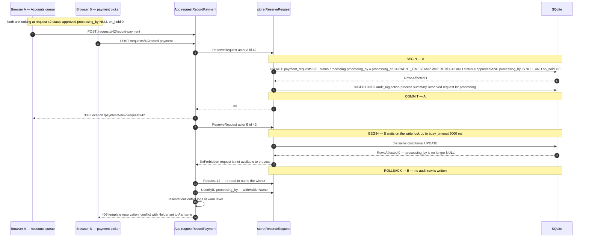
```mermaid
sequenceDiagram
    autonumber
    participant B1 as Browser A — Accounts queue
    participant B2 as Browser B — payment picker
    participant HD as App.requestRecordPayment
    participant ST as store.ReserveRequest
    participant DB as SQLite

    Note over B1,B2: both are looking at request 42 status approved processing_by NULL on_hold 0

    B1->>HD: POST /requests/42/record-payment
    B2->>HD: POST /requests/42/record-payment

    HD->>ST: ReserveRequest actor A id 42
    Note over ST,DB: BEGIN — A
    ST->>DB: UPDATE payment_requests SET status processing processing_by A processing_at CURRENT_TIMESTAMP WHERE id = 42 AND status = approved AND processing_by IS NULL AND on_hold = 0
    DB-->>ST: RowsAffected 1
    ST->>DB: INSERT INTO audit_log action process summary Reserved request for processing
    Note over ST,DB: COMMIT — A
    ST-->>HD: nil
    HD-->>B1: 303 Location /payments/new?request=42

    HD->>ST: ReserveRequest actor B id 42
    Note over ST,DB: BEGIN — B waits on the write lock up to busy_timeout 5000 ms
    ST->>DB: the same conditional UPDATE
    DB-->>ST: RowsAffected 0 — processing_by is no longer NULL
    ST-->>HD: ErrForbidden request is not available to process
    Note over ST,DB: ROLLBACK — B — no audit row is written
    HD->>ST: Request 42 — re-read to name the winner
    HD->>ST: UserByID processing_by — withHolderName
    HD->>HD: reservationConflict logs at warn level
    HD-->>B2: 409 template reservation_conflict with Holder set to A's name
```

| ID | Fact | Cite |
|----|------|------|
| SD7-F1 | The whole concurrency guarantee is one conditional `UPDATE` and its `RowsAffected`. There is no `SELECT … FOR UPDATE`, no application lock, and no advisory read before the write. | `internal/store/store.go:730-753` |
| SD7-F2 | The losing caller receives **409 Conflict** rendering `reservation_conflict`, with `PageData.Holder` = the winner's name or the literal `Someone else` when the name cannot be resolved. Not a 403 and not an error page. | `internal/app/linking.go:58-71`, `85-97` |
| SD7-F3 | The losing transaction writes nothing — the audit row is inside the same tx, after the `RowsAffected` check, so a lost race leaves no trace beyond the warn log line. | `internal/store/store.go:746-752`, `internal/app/linking.go:64-65` |
| SD7-F4 | `busy_timeout(5000)` and `foreign_keys(1)` ride on the DSN, per connection, precisely so a concurrent reservation waits instead of failing with `SQLITE_BUSY`. | `internal/store/store.go:27-36` |
| SD7-F5 | Availability is re-derived per row from `status='approved' AND processing_by IS NULL AND !on_hold`, never from the queue tab, so no tab can hand the UI a *Take* button it must not have. | `internal/store/store.go:1223-1229` |
| SD7-F6 | The same 409 conflict screen answers three other reads: `GET /payments/new?request={id}` when the caller no longer holds it, and `POST …/settlement-preview` likewise. | `internal/app/linking.go:240-242`, `290-292` |
| SD7-F7 | Both counts and rows are scoped by `a.auth.Scope(u, "request")`, so an Accounts user with `own` scope sees only their own requests in the queue. | `internal/app/linking.go:158-160`, `174-176`, `internal/store/store.go:1101-1107` |

---

## SD8 — Settlement

### SD8 routes and gates

| ID | Route | Gate | Handler | Writes? | Cite |
|----|-------|------|---------|---------|------|
| SD8-R1 | `GET /payments/new?request={id}` | `payment:create` | `App.paymentForm` → `App.paymentEntry` | no | `internal/app/app.go:384`, `655-667`, `internal/app/linking.go:233-264` |
| SD8-R2 | `POST /requests/{id}/settlement-preview` | `payment:settle` + `withCSRF` | `App.settlementPreview` | **no — pure, D8** | `internal/app/app.go:454`, `internal/app/linking.go:280-309` |
| SD8-R3 | `POST /payments` | `payment:create` + `withCSRF` | `App.paymentCreate` | **yes** | `internal/app/app.go:387`, `internal/app/app.go:690-729` |

htmx: the preview button carries
`hx-post="/requests/{id}/settlement-preview"`,
`hx-include="#amount, #paid_on, #payment_mode, #reference_no, #remarks, [name=csrf], [name=head_id], [name=vendor_payee], [name=invoice_no]"`,
`hx-target="#settle-mount"`, `hx-swap="innerHTML"`
(`internal/app/templates.go:445-449`). The same button also carries
`formaction`/`formmethod`/`formenctype="application/x-www-form-urlencoded"` so
the no-JS path renders the full `settlement_confirm` page instead
(`internal/app/templates.go:446`, `internal/app/linking.go:327-335`). The file
input lives in the outer multipart form, so the advice is transmitted exactly
once, by the final POST (`internal/app/templates.go:347-354`, `429`).

### SD8.1 — Prefill, pure preview, swap

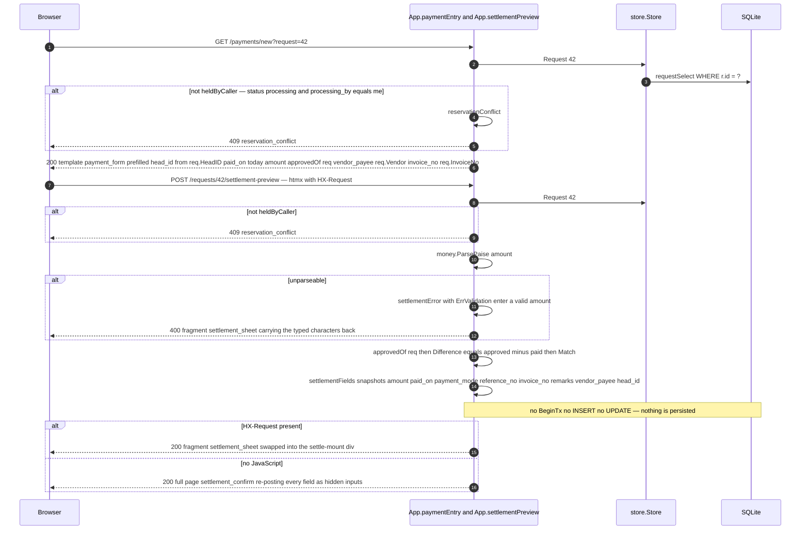
```mermaid
sequenceDiagram
    autonumber
    participant B as Browser
    participant HD as App.paymentEntry and App.settlementPreview
    participant ST as store.Store
    participant DB as SQLite

    B->>HD: GET /payments/new?request=42
    HD->>ST: Request 42
    ST->>DB: requestSelect WHERE r.id = ?
    alt not heldByCaller — status processing and processing_by equals me
        HD->>HD: reservationConflict
        HD-->>B: 409 reservation_conflict
    end
    HD-->>B: 200 template payment_form prefilled head_id from req.HeadID paid_on today amount approvedOf req vendor_payee req.Vendor invoice_no req.InvoiceNo

    B->>HD: POST /requests/42/settlement-preview — htmx with HX-Request
    HD->>ST: Request 42
    alt not heldByCaller
        HD-->>B: 409 reservation_conflict
    end
    HD->>HD: money.ParsePaise amount
    alt unparseable
        HD->>HD: settlementError with ErrValidation enter a valid amount
        HD-->>B: 400 fragment settlement_sheet carrying the typed characters back
    end
    HD->>HD: approvedOf req then Difference equals approved minus paid then Match
    HD->>HD: settlementFields snapshots amount paid_on payment_mode reference_no invoice_no remarks vendor_payee head_id
    Note over HD,DB: no BeginTx no INSERT no UPDATE — nothing is persisted
    alt HX-Request present
        HD-->>B: 200 fragment settlement_sheet swapped into the settle-mount div
    else no JavaScript
        HD-->>B: 200 full page settlement_confirm re-posting every field as hidden inputs
    end
```

### SD8.2 — POST /payments, the settled and partial branches

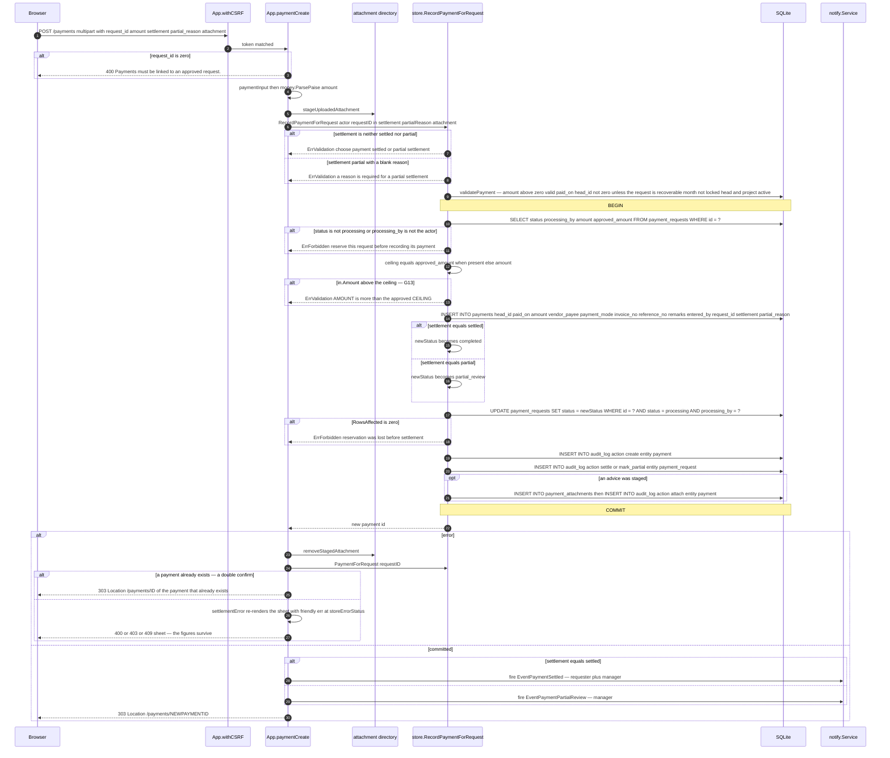
```mermaid
sequenceDiagram
    autonumber
    participant B as Browser
    participant CS as App.withCSRF
    participant HD as App.paymentCreate
    participant FS as attachment directory
    participant ST as store.RecordPaymentForRequest
    participant DB as SQLite
    participant NF as notify.Service

    B->>CS: POST /payments multipart with request_id amount settlement partial_reason attachment
    CS->>HD: token matched
    alt request_id is zero
        HD-->>B: 400 Payments must be linked to an approved request.
    end
    HD->>HD: paymentInput then money.ParsePaise amount
    HD->>FS: stageUploadedAttachment
    HD->>ST: RecordPaymentForRequest actor requestID in settlement partialReason attachment

    alt settlement is neither settled nor partial
        ST-->>HD: ErrValidation choose payment settled or partial settlement
    else settlement partial with a blank reason
        ST-->>HD: ErrValidation a reason is required for a partial settlement
    end
    ST->>DB: validatePayment — amount above zero valid paid_on head_id not zero unless the request is recoverable month not locked head and project active
    Note over ST,DB: BEGIN
    ST->>DB: SELECT status processing_by amount approved_amount FROM payment_requests WHERE id = ?
    alt status is not processing or processing_by is not the actor
        ST-->>HD: ErrForbidden reserve this request before recording its payment
    end
    ST->>ST: ceiling equals approved_amount when present else amount
    alt in.Amount above the ceiling — G13
        ST-->>HD: ErrValidation AMOUNT is more than the approved CEILING
    end
    ST->>DB: INSERT INTO payments head_id paid_on amount vendor_payee payment_mode invoice_no reference_no remarks entered_by request_id settlement partial_reason
    alt settlement equals settled
        ST->>ST: newStatus becomes completed
    else settlement equals partial
        ST->>ST: newStatus becomes partial_review
    end
    ST->>DB: UPDATE payment_requests SET status = newStatus WHERE id = ? AND status = processing AND processing_by = ?
    alt RowsAffected is zero
        ST-->>HD: ErrForbidden reservation was lost before settlement
    end
    ST->>DB: INSERT INTO audit_log action create entity payment
    ST->>DB: INSERT INTO audit_log action settle or mark_partial entity payment_request
    opt an advice was staged
        ST->>DB: INSERT INTO payment_attachments then INSERT INTO audit_log action attach entity payment
    end
    Note over ST,DB: COMMIT
    ST-->>HD: new payment id

    alt error
        HD->>FS: removeStagedAttachment
        HD->>ST: PaymentForRequest requestID
        alt a payment already exists — a double confirm
            HD-->>B: 303 Location /payments/ID of the payment that already exists
        else
            HD->>HD: settlementError re-renders the sheet with friendly err at storeErrorStatus
            HD-->>B: 400 or 403 or 409 sheet — the figures survive
        end
    else committed
        alt settlement equals settled
            HD->>NF: fire EventPaymentSettled — requester plus manager
        else
            HD->>NF: fire EventPaymentPartialReview — manager
        end
        HD-->>B: 303 Location /payments/NEWPAYMENTID
    end
```

| ID | Fact | Cite |
|----|------|------|
| SD8-F1 | The payment insert, the request transition and both audit rows are one transaction — S13. A re-record is refused twice: by the `status='processing'` guard and by the partial unique index `idx_payments_request ON payments(request_id) WHERE request_id IS NOT NULL`. | `internal/store/store.go:883-957`, `internal/store/migrations.go:289` |
| SD8-F2 | `settled → completed` even when paid < approved (S10). Only `partial` produces `partial_review`. | `internal/store/store.go:921-924` |
| SD8-F3 | G13 ceiling is `COALESCE(approved_amount, amount)`; the browser's `#diff-banner` previews the refusal but enforces nothing. | `internal/store/store.go:901-910`, `web/static/fervid-app.js:494-527` |
| SD8-F4 | The preview is genuinely pure — no `BeginTx`, no staging, no writes — which is what lets the sheet say *Not saved yet* honestly. | `internal/app/linking.go:275-309`, `internal/app/templates.go:533` |
| SD8-F5 | `PaymentInput.HeadID` comes from the **hidden** `head_id` input seeded from `req.HeadID`, which is `0` when the request has no head. | `internal/app/templates.go:389`, `internal/app/linking.go:244-247` |
| SD8-F6 | `payment:settle` and `payment:mark_partial` are enforced **only** on the pure preview route. `POST /payments` is gated on `payment:create`, and the store checks only that the caller holds the reservation — so the two settle verbs never gate the write. **No longer true — fixed as F-D-10 in Wave 3 (`1fac147`): the write is double-gated `payment:create` + `payment:settle`, and `settlement=partial` additionally requires `payment:mark_partial` in the handler.** | `internal/app/app.go:387`, `454`, `internal/store/store.go:866-900`, `internal/app/permmap.go:89-92`; correction: `internal/app/app.go:441-447`, `831-835` |
| SD8-F7 | `settlementError` echoes the raw typed characters back even when the amount was what failed to parse. | `internal/app/linking.go:341-364` |
| SD8-F8 | A linked payment can never afterwards be edited or voided — `UpdatePayment` and `VoidPayment` both refuse `before.RequestID != nil`, and `GET /payments/{id}/edit` redirects to the detail rather than serving a form whose save can only fail (S12). | `internal/store/store.go:607-611`, `648-651`, `internal/app/app.go:803-806` |

> **Suspected defect — headless recoverable requests cannot be paid.**
> `validateRequestInput` requires project and head only for the budget types; a
> `recoverable` treatment with a category that needs neither (`employee_advance`,
> `other`) is valid with `head_id` NULL (`internal/store/requests.go:161-166`,
> `232-245`). `paymentEntry` then renders `head_id=0`
> (`internal/app/linking.go:244-247`, `internal/app/templates.go:389`), the
> payment form offers no head selector, and `validatePayment` rejects
> `in.HeadID == 0` with `ErrValidation` (`internal/store/store.go:1620-1623`).
> The request can be raised, approved and reserved, and then nothing can settle
> it. Test: raise `employee_advance` / `recoverable` / category `other`, approve,
> reserve, POST `/payments` — expect 400 `valid head, date, and positive amount
> are required`.
>
> **Confirmed and fixed — F-D-11 / F-E-01 / F-G-001, Wave 1 (`633997b`).** The head became
> **optional** rather than collected: migration **v8** rebuilds `payments` with `head_id INTEGER
> REFERENCES heads(id)` and no `NOT NULL` (`internal/store/migrations.go:173`, the rebuild at
> `:435-495`), and `validatePayment` grew a `headOptional bool` parameter
> (`internal/store/store.go:1922-1923`) that `RecordPaymentForRequest` passes as `treatment ==
> "recoverable"` (`store.go:1115`). The other two call sites — the free-standing ledger writers —
> still pass `false` (`store.go:701`, `:744`), so a budget or reimbursement payment still requires a
> head. Four payment readers that inner-joined `heads` would have dropped a NULL-head row on the
> floor and are now `LEFT JOIN` + `COALESCE(py.head_id,0)` (`store.go:830-838`, `:846-856`,
> `:1483`, `:1509`), which is why `Payment.HeadID` is still a plain `int64` in Go and reads `0` for
> a recoverable settlement. `TC-E-031` and `TC-E-042` came back from `fixme` on this fix — both
> needed a *paid* recoverable, which v8 made possible for the first time. See
> `docs/qa/results/REPAIR-LOG.md`, Wave 1 and decision 1.

---

## SD9 — Partial review

### SD9 routes and gates

| ID | Route | Gate | Handler | Cite |
|----|-------|------|---------|------|
| SD9-R1 | `GET /requests/{id}/partial-review` | `request:view` — everyone on the thread may follow it | `App.requestPartialReview` | `internal/app/app.go:482`, `internal/app/linking.go:377-426` |
| SD9-R2 | `POST /requests/{id}/accept-partial` | `approval:accept_partial` + `withCSRF` | `App.requestAcceptPartial` | `internal/app/app.go:483`, `internal/app/linking.go:477-484` |
| SD9-R3 | `POST /requests/{id}/raise-concern` | `approval:accept_partial` + `withCSRF` | `App.requestRaiseConcern` | `internal/app/app.go:484`, `internal/app/linking.go:488-495` |

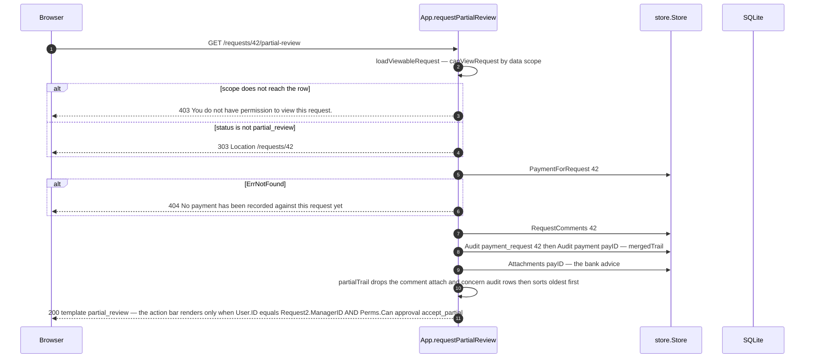
```mermaid
sequenceDiagram
    autonumber
    participant B as Browser
    participant HD as App.requestPartialReview
    participant ST as store.Store
    participant DB as SQLite

    B->>HD: GET /requests/42/partial-review
    HD->>HD: loadViewableRequest — canViewRequest by data scope
    alt scope does not reach the row
        HD-->>B: 403 You do not have permission to view this request.
    else status is not partial_review
        HD-->>B: 303 Location /requests/42
    end
    HD->>ST: PaymentForRequest 42
    alt ErrNotFound
        HD-->>B: 404 No payment has been recorded against this request yet
    end
    HD->>ST: RequestComments 42
    HD->>ST: Audit payment_request 42 then Audit payment payID — mergedTrail
    HD->>ST: Attachments payID — the bank advice
    HD->>HD: partialTrail drops the comment attach and concern audit rows then sorts oldest first
    HD-->>B: 200 template partial_review — the action bar renders only when User.ID equals Request2.ManagerID AND Perms.Can approval accept_partial
```

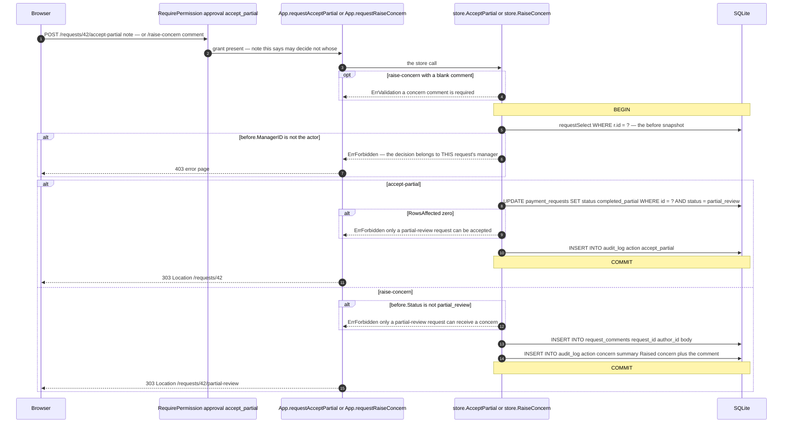
```mermaid
sequenceDiagram
    autonumber
    participant B as Browser
    participant RP as RequirePermission approval accept_partial
    participant HD as App.requestAcceptPartial or App.requestRaiseConcern
    participant ST as store.AcceptPartial or store.RaiseConcern
    participant DB as SQLite

    B->>RP: POST /requests/42/accept-partial note — or /raise-concern comment
    RP->>HD: grant present — note this says may decide not whose
    HD->>ST: the store call
    opt raise-concern with a blank comment
        ST-->>HD: ErrValidation a concern comment is required
    end
    Note over ST,DB: BEGIN
    ST->>DB: requestSelect WHERE r.id = ? — the before snapshot
    alt before.ManagerID is not the actor
        ST-->>HD: ErrForbidden — the decision belongs to THIS request's manager
        HD-->>B: 403 error page
    end
    alt accept-partial
        ST->>DB: UPDATE payment_requests SET status completed_partial WHERE id = ? AND status = partial_review
        alt RowsAffected zero
            ST-->>HD: ErrForbidden only a partial-review request can be accepted
        end
        ST->>DB: INSERT INTO audit_log action accept_partial
        Note over ST,DB: COMMIT
        HD-->>B: 303 Location /requests/42
    else raise-concern
        alt before.Status is not partial_review
            ST-->>HD: ErrForbidden only a partial-review request can receive a concern
        end
        ST->>DB: INSERT INTO request_comments request_id author_id body
        ST->>DB: INSERT INTO audit_log action concern summary Raised concern plus the comment
        Note over ST,DB: COMMIT
        HD-->>B: 303 Location /requests/42/partial-review
    end
```

| ID | Fact | Cite |
|----|------|------|
| SD9-F1 | **The check that matters** is `before.ManagerID != actor.ID`, in the store, on both decisions. Holding `approval:accept_partial` says a person may accept a shortfall; it never says whose. An admin holds every grant and is still refused. | `internal/store/store.go:971-982`, `1018-1023` |
| SD9-F2 | The template gates the action bar on `and (eq .User.ID .Request2.ManagerID) (.Perms.Can "approval" "accept_partial")` — the same two conditions, drawn. | `internal/app/templates.go:901` |
| SD9-F3 | `completed_partial` is terminal: `legalTransitions` gives it no outgoing edge, so the written-off balance stays visible for the life of the record (G14). | `internal/store/requests.go:98-101` |
| SD9-F4 | Raising a concern changes **no** status and reverses nothing — the money has already left. It writes a comment plus an audit row whose summary is that comment; both `RequestThread` and `partialTrail` drop the `concern` audit row so the words appear once. | `internal/store/store.go:1004-1034`, `internal/store/requests.go:1176`, `internal/app/linking.go:450-472` |
| SD9-F5 | Neither decision fires a notification — `a.fire` is absent from both handlers, so the requester is never told their partial was accepted or disputed. | `internal/app/linking.go:477-495` |
| SD9-F6 | The trail spans two entity types, merged in the app layer because no store read crosses entities; ties break on `audit_log.id`, the only strictly monotonic record. | `internal/app/linking.go:1001-1020` |

---

## SD10 — Hold and unhold; release and reassign a reservation

### SD10 routes and gates

| ID | Route | Gate | Store call | Extra params |
|----|-------|------|-----------|--------------|
| SD10-R1 | `POST /requests/{id}/hold` | `payment:hold` + `withCSRF` | `HoldRequest(actor, id, reason)` | `reason` mandatory in the store |
| SD10-R2 | `POST /requests/{id}/unhold` | `payment:hold` + `withCSRF` | `UnholdRequest(actor, id)` | none — no reason required |
| SD10-R3 | `GET /requests/{id}/reservation` | **`RequireLogin` only** | — | the handler asks for the verb that matches the caller's standing |
| SD10-R4 | `POST /requests/{id}/release` | `reservation:release` + `withCSRF` | `ReleaseRequest(actor, id, reason, confirmed, authorized)` | `confirmed = FormValue("confirm") == "on"`; `authorized = Can(u, "reservation", "reassign")` |
| SD10-R5 | `POST /requests/{id}/reassign` | `reservation:reassign` + `withCSRF` | `ReassignReservation(actor, id, to, reason, authorized)` | `to_user_id` and `confirm` enforced in the **handler**; `authorized = Can(u, "reservation", "reassign")` |
| SD10-R6 | `GET /requests/{id}/reservation/stale` | `payment:process` | — | the 26 h nudge, Q6 |

Cites: `internal/app/app.go:464-475`, `internal/app/linking.go:521-566`,
`623-635`, `642-675`, `694-720`, `730-752`, `internal/store/store.go:761-795`,
`802-858`, `1037-1083`.

> **Divergence.** `authorized` is **not** derived from any payment scope. For
> both release and reassign it is exactly
> `a.auth.Can(u, "reservation", "reassign")` — releasing work that is not yours
> is taking it off somebody, which is the verb that grants that
> (`internal/app/linking.go:630`, `670`, and the comment at `616-618`).

### SD10.1 — Hold and unhold

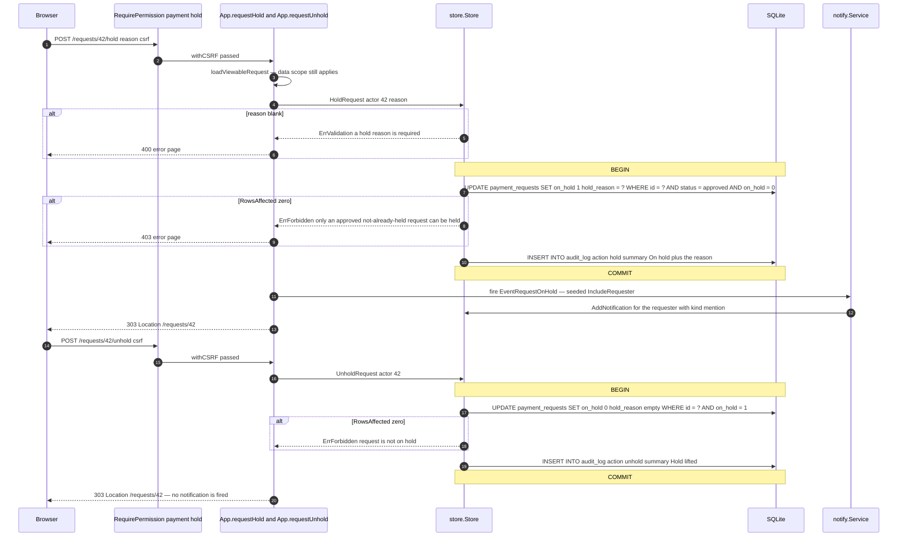
```mermaid
sequenceDiagram
    autonumber
    participant B as Browser
    participant RP as RequirePermission payment hold
    participant HD as App.requestHold and App.requestUnhold
    participant ST as store.Store
    participant DB as SQLite
    participant NF as notify.Service

    B->>RP: POST /requests/42/hold reason csrf
    RP->>HD: withCSRF passed
    HD->>HD: loadViewableRequest — data scope still applies
    HD->>ST: HoldRequest actor 42 reason
    alt reason blank
        ST-->>HD: ErrValidation a hold reason is required
        HD-->>B: 400 error page
    end
    Note over ST,DB: BEGIN
    ST->>DB: UPDATE payment_requests SET on_hold 1 hold_reason = ? WHERE id = ? AND status = approved AND on_hold = 0
    alt RowsAffected zero
        ST-->>HD: ErrForbidden only an approved not-already-held request can be held
        HD-->>B: 403 error page
    end
    ST->>DB: INSERT INTO audit_log action hold summary On hold plus the reason
    Note over ST,DB: COMMIT
    HD->>NF: fire EventRequestOnHold — seeded IncludeRequester
    NF->>ST: AddNotification for the requester with kind mention
    HD-->>B: 303 Location /requests/42

    B->>RP: POST /requests/42/unhold csrf
    RP->>HD: withCSRF passed
    HD->>ST: UnholdRequest actor 42
    Note over ST,DB: BEGIN
    ST->>DB: UPDATE payment_requests SET on_hold 0 hold_reason empty WHERE id = ? AND on_hold = 1
    alt RowsAffected zero
        ST-->>HD: ErrForbidden request is not on hold
    end
    ST->>DB: INSERT INTO audit_log action unhold summary Hold lifted
    Note over ST,DB: COMMIT
    HD-->>B: 303 Location /requests/42 — no notification is fired
```

| ID | Fact | Cite |
|----|------|------|
| SD10-F1 | A hold is not a status. The request stays `approved`, and the queue's own availability test (`approved · unclaimed · not on hold`) removes it from the takeable set — L7. | `internal/store/store.go:1047`, `1225`, `internal/app/linking.go:677-689` |
| SD10-F2 | `on_hold=1` implies `status='approved'`: `RequestCancellation`, `DecideCancellation` and `CancelRequest` each clear `on_hold` and `hold_reason` on the way out of `approved`. | `internal/store/requests.go:889`, `941`, `985` |
| SD10-F3 | `UnholdRequest` matches on `on_hold=1` only — it does not require `status='approved'`, so it would lift a stale hold on any status. Belt and braces given SD10-F2. | `internal/store/store.go:1070` |
| SD10-F4 | Unhold fires no notification, so the requester is told the hold was placed and never told it was lifted. | `internal/app/linking.go:710-720` |
| SD10-F5 | Readers ask `activeHold(req)` = `req.OnHold && req.Status == "approved"`, never the raw column, so the pill, the waiting line and the release control cannot disagree. | `internal/app/linking.go:802-810`, `internal/app/requests.go:405-413` |

### SD10.2 — Release and reassign

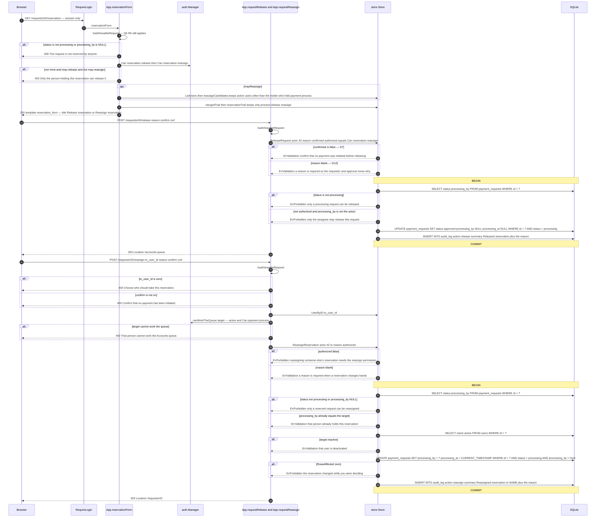
```mermaid
sequenceDiagram
    autonumber
    participant B as Browser
    participant RL as RequireLogin
    participant FM as App.reservationForm
    participant AU as auth.Manager
    participant HD as App.requestRelease and App.requestReassign
    participant ST as store.Store
    participant DB as SQLite

    B->>RL: GET /requests/42/reservation — session only
    RL->>FM: reservationForm
    FM->>FM: loadViewableRequest — Q5 R6 still applies
    alt status is not processing or processing_by is NULL
        FM-->>B: 409 This request is not reserved by anyone.
    end
    FM->>AU: Can reservation release then Can reservation reassign
    alt not mine-and-may-release and not may-reassign
        FM-->>B: 403 Only the person holding this reservation can release it.
    end
    opt mayReassign
        FM->>ST: ListUsers then reassignCandidates keeps active users other than the holder who hold payment process
    end
    FM->>ST: mergedTrail then reservationTrail keeps only process release reassign
    FM-->>B: 200 template reservation_form — title Release reservation or Reassign reservation

    B->>HD: POST /requests/42/release reason confirm csrf
    HD->>HD: loadViewableRequest
    HD->>ST: ReleaseRequest actor 42 reason confirmed authorized equals Can reservation reassign
    alt confirmed is false — S7
        ST-->>HD: ErrValidation confirm that no payment was initiated before releasing
    else reason blank — G12
        ST-->>HD: ErrValidation a reason is required so the requester and approver know why
    end
    Note over ST,DB: BEGIN
    ST->>DB: SELECT status processing_by FROM payment_requests WHERE id = ?
    alt status is not processing
        ST-->>HD: ErrForbidden only a processing request can be released
    else not authorized and processing_by is not the actor
        ST-->>HD: ErrForbidden only the assignee may release this request
    end
    ST->>DB: UPDATE payment_requests SET status approved processing_by NULL processing_at NULL WHERE id = ? AND status = processing
    ST->>DB: INSERT INTO audit_log action release summary Released reservation plus the reason
    Note over ST,DB: COMMIT
    HD-->>B: 303 Location /accounts-queue

    B->>HD: POST /requests/42/reassign to_user_id reason confirm csrf
    HD->>HD: loadViewableRequest
    alt to_user_id is zero
        HD-->>B: 400 Choose who should take this reservation.
    else confirm is not on
        HD-->>B: 400 Confirm that no payment has been initiated.
    end
    HD->>ST: UserByID to_user_id
    HD->>AU: canWorkTheQueue target — active and Can payment process
    alt target cannot work the queue
        HD-->>B: 400 That person cannot work the Accounts queue.
    end
    HD->>ST: ReassignReservation actor 42 to reason authorized
    alt authorized false
        ST-->>HD: ErrForbidden reassigning someone else's reservation needs the reassign permission
    else reason blank
        ST-->>HD: ErrValidation a reason is required when a reservation changes hands
    end
    Note over ST,DB: BEGIN
    ST->>DB: SELECT status processing_by FROM payment_requests WHERE id = ?
    alt status not processing or processing_by NULL
        ST-->>HD: ErrForbidden only a reserved request can be reassigned
    else processing_by already equals the target
        ST-->>HD: ErrValidation that person already holds this reservation
    end
    ST->>DB: SELECT name active FROM users WHERE id = ?
    alt target inactive
        ST-->>HD: ErrValidation that user is deactivated
    end
    ST->>DB: UPDATE payment_requests SET processing_by = ? processing_at = CURRENT_TIMESTAMP WHERE id = ? AND status = processing AND processing_by = OLD
    alt RowsAffected zero
        ST-->>HD: ErrForbidden the reservation changed while you were deciding
    end
    ST->>DB: INSERT INTO audit_log action reassign summary Reassigned reservation to NAME plus the reason
    Note over ST,DB: COMMIT
    HD-->>B: 303 Location /requests/42
```

| ID | Fact | Cite |
|----|------|------|
| SD10-F6 | Reassignment never returns the request to the open queue: `status` stays `processing` and only `processing_by` moves, so no third party can slip in between — G11. The `WHERE … processing_by = <old>` clause is the compare-and-swap. | `internal/store/store.go:840-850` |
| SD10-F7 | `confirmed` is a store parameter for release and a **handler** check for reassign, because `ReassignReservation` has no `confirmed` parameter — one screen asks the same question for both branches. | `internal/store/store.go:762-764`, `internal/app/linking.go:653-656`, `637-641` |
| SD10-F8 | `canWorkTheQueue` is an app-layer rule with real consequences: a reservation parked on somebody without `payment:process` strands the request — the new holder gets 403 on `/accounts-queue`, and anybody re-reserving gets 409. | `internal/app/linking.go:580-596` |
| SD10-F9 | Neither release nor reassign fires a notification, although the reservation form promises *The requester and the approver are both notified.* **Fixed as F-D-12 / F-F-06 in Wave 4 (`709dfa6`): release fires `reservation_released` and reassign fires `reservation_reassigned`, two of the nine events migration v9 added, so the form's promise is true now. Unhold fires `request_unheld` on the same pass.** | `internal/app/linking.go:623-675`, `internal/app/templates.go:1042`; correction: `internal/app/linking.go:712`, `755`, `803`, `internal/notify/events.go:22-67` |
| SD10-F10 | Release is first in DOM order and last on screen via `order: 2`, because HTML makes the first submit button the form default and `hidden` does not exempt it. | `internal/app/templates.go:1045-1052` |

---

## SD11 — Notification fan-out and the reminder scheduler

### SD11.1 — notify.Service.Notify

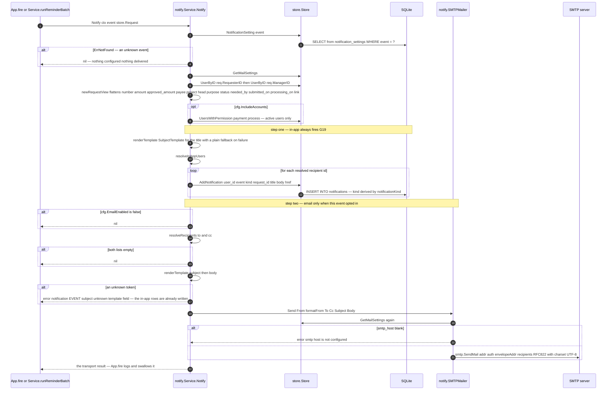
```mermaid
sequenceDiagram
    autonumber
    participant CALLER as App.fire or Service.runReminderBatch
    participant NF as notify.Service.Notify
    participant ST as store.Store
    participant DB as SQLite
    participant ML as notify.SMTPMailer
    participant SMTP as SMTP server

    CALLER->>NF: Notify ctx event store.Request
    NF->>ST: NotificationSetting event
    ST->>DB: SELECT from notification_settings WHERE event = ?
    alt ErrNotFound — an unknown event
        NF-->>CALLER: nil — nothing configured nothing delivered
    end
    NF->>ST: GetMailSettings
    NF->>ST: UserByID req.RequesterID then UserByID req.ManagerID
    NF->>NF: newRequestView flattens number amount approved_amount payee project head purpose status needed_by submitted_on processing_on link
    opt cfg.IncludeAccounts
        NF->>ST: UsersWithPermission payment process — active users only
    end

    Note over NF,DB: step one — in-app always fires G19
    NF->>NF: renderTemplate SubjectTemplate for the title with a plain fallback on failure
    NF->>NF: resolveInAppUsers
    loop for each resolved recipient id
        NF->>ST: AddNotification user_id event kind request_id title body href
        ST->>DB: INSERT INTO notifications — kind derived by notificationKind
    end

    Note over NF,ML: step two — email only when this event opted in
    alt cfg.EmailEnabled is false
        NF-->>CALLER: nil
    end
    NF->>NF: resolveRecipients to and cc
    alt both lists empty
        NF-->>CALLER: nil
    end
    NF->>NF: renderTemplate subject then body
    alt an unknown token
        NF-->>CALLER: error notification EVENT subject unknown template field — the in-app rows are already written
    end
    NF->>ML: Send From formatFrom To Cc Subject Body
    ML->>ST: GetMailSettings again
    alt smtp_host blank
        ML-->>NF: error smtp host is not configured
    else
        ML->>SMTP: smtp.SendMail addr auth envelopeAddr recipients RFC822 with charset UTF-8
    end
    NF-->>CALLER: the transport result — App.fire logs and swallows it
```

### SD11.2 — Recipient resolution

| ID | Audience | In-app resolution | Email resolution | Cite |
|----|----------|-------------------|------------------|------|
| SD11-A1 | requester | `cfg.IncludeRequester && req.RequesterID != 0` → `req.RequesterID` | `+= v.RequesterEmail` in **To** | `internal/notify/service.go:135-137`, `206-208` |
| SD11-A2 | manager | `cfg.IncludeManager && req.ManagerID != 0`, suppressed for `request_urgent` when `status != "pending"` | `+= v.ManagerEmail` in **To**, suppressed post-approval urgent | `internal/notify/service.go:138-140`, `209-211` |
| SD11-A3 | accounts | `cfg.IncludeAccounts` → every id from `UsersWithPermission("payment","process")` — **except** for `request_cancellation_requested` and `reminder_stale_reservation`, where a non-nil `req.ProcessingBy` receives it alone | `+= accounts` emails in **To**, suppressed for pre-approval urgent | `internal/notify/service.go:141-152`, `212-214`, `internal/store/notifications.go:155-175` |
| SD11-A4 | management | **never** — `resolveInAppUsers` does not consult it | `MailSettings.ManagementRecipients` added to **Cc** for `request_approved` and post-approval `request_urgent` | `internal/notify/service.go:215-218` |
| SD11-A5 | static lists | not used | `cfg.ToRecipients` seeds **To**, `cfg.CcRecipients` seeds **Cc**; split on `, ; newline`, lowercased, deduped against To | `internal/notify/service.go:205`, `215`, `283-308` |

Kind, derived once at write time: `reminder_pending` and
`reminder_stale_reservation` → `reminder`; `request_returned`,
`request_on_hold`, `request_rejected` → `mention`; everything else → `activity`
(`internal/store/inapp.go:56-65`). That is what the `.segmented` filter on
`GET /notifications` queries (`internal/store/inapp.go:91-98`).

Template rendering is **not** Go templates: `renderTemplate` substitutes
`{{token}}` from a fixed 14-key vocabulary and errors on an unknown key, because
the strings are admin-editable and an editable string reaching `text/template`
is an execution surface (`internal/notify/service.go:224-274`,
`internal/app/notifications.go:109-114`).

### SD11.3 — The scheduler goroutine

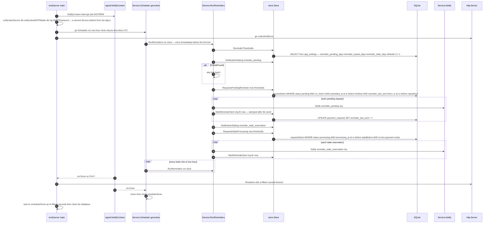
```mermaid
sequenceDiagram
    autonumber
    participant MAIN as cmd/server main
    participant SIG as signal.NotifyContext
    participant SCH as Service.Scheduler goroutine
    participant RR as Service.RunReminders
    participant ST as store.Store
    participant DB as SQLite
    participant NF as Service.Notify
    participant SRV as http.Server

    MAIN->>SIG: NotifyContext Interrupt and SIGTERM
    MAIN->>MAIN: notify.NewService db notify.NewSMTPMailer db cfg.SMTPPassword — a second Service distinct from the App's
    MAIN->>SCH: go Scheduler ctx one hour clock returns time.Now UTC
    MAIN->>SRV: go ListenAndServe

    SCH->>RR: RunReminders ctx clock — once immediately before the first tick
    RR->>ST: ReminderThresholds
    ST->>DB: SELECT from app_settings — reminder_pending_days reminder_repeat_days reminder_stale_days defaults 3 1 1
    RR->>ST: NotificationSetting reminder_pending
    alt ErrNotFound
        RR->>RR: skip this batch
    end
    RR->>ST: RequestsPendingReminder now thresholds
    ST->>DB: requestSelect WHERE status pending AND on_hold 0 AND submitted_at at or before firstDue AND reminder_last_sent NULL or at or before repeatDue
    loop each pending request
        RR->>NF: Notify reminder_pending req
        RR->>ST: MarkReminderSent req.ID now — stamped after the send
        ST->>DB: UPDATE payment_requests SET reminder_last_sent = ?
    end
    RR->>ST: NotificationSetting reminder_stale_reservation
    RR->>ST: RequestsStaleProcessing now thresholds
    ST->>DB: requestSelect WHERE status processing AND processing_at at or before staleBefore AND no live payment exists
    loop each stale reservation
        RR->>NF: Notify reminder_stale_reservation req
        RR->>ST: MarkReminderSent req.ID now
    end

    loop every ticker tick of one hour
        SCH->>RR: RunReminders ctx clock
    end

    SIG-->>MAIN: ctx.Done on Ctrl-C
    MAIN->>SRV: Shutdown with a fifteen second timeout
    SIG-->>SCH: ctx.Done
    SCH->>SCH: return then close schedulerDone
    MAIN->>MAIN: wait on schedulerDone up to fifteen seconds then close the database
```

| ID | Fact | Cite |
|----|------|------|
| SD11-F1 | In-app rows are written **before** any email is attempted, so an SMTP outage or a broken admin template never costs the user their record — G19. | `internal/notify/service.go:60-68` |
| SD11-F2 | There is deliberately no `EmailEnabled` short-circuit in `runReminderBatch`: the in-app reminder always fires and `Notify` decides on its own whether an email follows. | `internal/notify/reminders.go:27-33` |
| SD11-F3 | Thresholds are re-read **once per run**, so a Configuration change takes effect on the next tick without a restart. | `internal/notify/reminders.go:13-23` |
| SD11-F4 | `MarkReminderSent` is stamped *after* the send — a `Notify` error aborts the whole batch and leaves the stamp unwritten, so the next tick retries. | `internal/notify/reminders.go:38-47` |
| SD11-F5 | The clock is injected (`func() time.Time { return time.Now().UTC() }`) and the scheduler shares the shutdown context, so Ctrl-C stops it with the server and main waits for an in-flight reminder before closing the database. | `cmd/server/main.go:97-102`, `132-138` |
| SD11-F6 | Days are counted as **calendar boundaries crossed**, not elapsed hours — a request submitted at 23:00 has waited a day at 01:00. | `internal/store/reminders.go:52-58` |
| SD11-F7 | `main` builds its own `notify.Service` and `SMTPMailer`; the `App` builds a second pair. Two Services share one `*store.Store` and one SMTP configuration, so behaviour matches, but a test that stubs the App's mailer does not stub the scheduler's. | `cmd/server/main.go:97`, `internal/app/app.go:203-204` |
| SD11-F8 | A pending reminder addresses `IncludeManager`; a stale-reservation reminder addresses `IncludeAccounts`, narrowed to `req.ProcessingBy` when set. | `internal/store/migrations_notifications.go:62-67`, `internal/notify/service.go:143-148` |

---

## SD12 — Money and reporting flow

### SD12.1 — Rupees typed to paise stored

| ID | Hop | Helper | Type | Cite |
|----|-----|--------|------|------|
| SD12-H1 | typing in a `.money-field` input | JS `rawAmount` strips all but digits and one dot, `indianGroup` re-groups, `inWords` narrates | display string | `web/static/fervid-app.js:224-242`, `244-264` |
| SD12-H2 | form submit, **capture phase** | JS strips grouping back to plain digits before htmx serialises | `"100000.50"` | `web/static/fervid-app.js:340-346` |
| SD12-H3 | server parse | `money.ParsePaise` — trims space, strips a leading `₹`, removes commas, `ParseFloat`, `Round(f*100)`, rejects empty / NaN / Inf / non-positive | `int64` paise | `internal/money/money.go:15-34` |
| SD12-H4 | request write | `RequestInput.Amount` → `payment_requests.amount` | `int64` | `internal/app/requests.go:322-327`, `internal/store/requests.go:414-427` |
| SD12-H5 | approval write | form `approved_amount` → `ApproveRequest(approvedAmount)` → `payment_requests.approved_amount` | `int64`, nullable | `internal/app/requests.go:717-722`, `internal/store/requests.go:698` |
| SD12-H6 | payment write | form `amount` → `PaymentInput.Amount` → `payments.amount`, ceiling `COALESCE(approved_amount, amount)` | `int64` | `internal/app/app.go:1499-1515`, `internal/store/store.go:901-913` |
| SD12-H7 | grid actual | `SUM(CASE WHEN py.voided_at IS NULL AND COALESCE(pr.treatment,'') <> 'recoverable' THEN py.amount ELSE 0 END)` | `int64` | `internal/store/store.go:1387-1400` |
| SD12-H8 | report actual | `Report` loops months and re-runs `Grid`, then folds rows / projects / totals | `int64` | `internal/store/store.go:1480-1511` |
| SD12-H9 | recoverable register | `COALESCE(py.amount, COALESCE(pr.approved_amount, pr.amount))` over `treatment='recoverable' AND status NOT IN (rejected, cancelled, withdrawn)` — **plus, since Wave 4, the caller's `request` data scope, added to the same `WHERE` by `recoverableScope`** | `int64` | `internal/store/recoverables.go:254-258`; correction: `internal/store/recoverables.go:335-357`, applied at `:401`, `:509`, `:548` |
| SD12-H10 | display | `money.FormatPaise` (**includes `₹`**), `money.FormatShort` (L / Cr), `money.Percent`, `money.InWords`, `app.amountValue` (strips the `₹` for an input whose `.cur` prefix draws its own), `app.approvedOf`, `app.subPaise`, `app.threadValue` | string | `internal/money/money.go:36-79`, `101-119`, `173-178`, `internal/app/requests.go:1051-1058`, `1113-1130`, `internal/app/linking.go:812-821` |

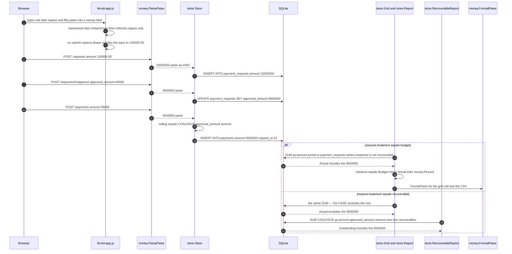
```mermaid
sequenceDiagram
    autonumber
    participant B as Browser
    participant JS as fervid-app.js
    participant MP as money.ParsePaise
    participant ST as store.Store
    participant DB as SQLite
    participant GR as store.Grid and store.Report
    participant RC as store.RecoverableReport
    participant FMT as money.FormatPaise

    B->>JS: types one lakh rupees and fifty paise into a money-field
    JS->>JS: rawAmount then indianGroup then inWords rupees only
    JS->>JS: on submit capture phase rewrites the input to 100000.50
    B->>MP: POST /requests amount 100000.50
    MP-->>ST: 10000050 paise as int64
    ST->>DB: INSERT INTO payment_requests amount 10000050

    B->>MP: POST /requests/42/approve approved_amount 95000
    MP-->>ST: 9500000 paise
    ST->>DB: UPDATE payment_requests SET approved_amount 9500000

    B->>MP: POST /payments amount 95000
    MP-->>ST: 9500000 paise
    ST->>ST: ceiling equals COALESCE approved_amount amount
    ST->>DB: INSERT INTO payments amount 9500000 request_id 42

    alt request.treatment equals budget
        GR->>DB: SUM py.amount joined to payment_requests where treatment is not recoverable
        DB-->>GR: Actual includes the 9500000
        GR->>GR: Variance equals Budget minus Actual then money.Percent
        GR->>FMT: FormatPaise for the grid cell and the CSV
    else request.treatment equals recoverable
        GR->>DB: the same SUM — the CASE excludes the row
        DB-->>GR: Actual excludes the 9500000
        RC->>DB: SUM COALESCE py.amount approved_amount amount over live recoverables
        DB-->>RC: Outstanding includes the 9500000
    end
```

| ID | Fact | Cite |
|----|------|------|
| SD12-F1 | **Where recoverables are excluded from actuals**: two places in one query — the aggregate `CASE` and the `EXISTS` clause that decides whether a head appears at all. Both test `COALESCE(pr.treatment,'') <> 'recoverable'`, so a historical payment with no linked request keeps counting exactly as it always did. | `internal/store/store.go:1388`, `1395-1398` |
| SD12-F2 | `Report` is a fold over `Grid` per month, so the exclusion is inherited by monthly, project and head reports and by `GET /reports/ytd.csv` — there is no second actuals query to keep in step. | `internal/store/store.go:1492-1508`, `internal/app/app.go:1474` |
| SD12-F3 | A voided payment is excluded by `py.voided_at IS NULL`, but a payment linked to a request can never be voided (SD8-F8), so in the request flow the only exclusion that fires is the treatment test. | `internal/store/store.go:1388`, `648-651` |
| SD12-F4 | The recoverable register does **not** wait for a payment: `COALESCE(py.amount, approved_amount, amount)` reports the approved or requested figure while the row is still unpaid, labelled `Awaiting payment`. | `internal/store/recoverables.go:256-258`, `264-279` |
| SD12-F5 | `money.ParsePaise` rejects zero and negative amounts, so a request or payment of `0` fails at the parse and never reaches validation. | `internal/money/money.go:30-33` |
| SD12-F6 | `ParsePaise` accepts a leading `₹` and Indian grouping, which is what lets a re-rendered rejected form round-trip its own `amountValue` output. | `internal/money/money.go:17-19`, `internal/app/requests.go:1051-1058` |
| SD12-F7 | Both CSV exports write `money.FormatPaise` output, so every amount cell contains `₹` and Indian digit grouping — not a number a spreadsheet will sum. | `internal/app/app.go:1453`, `1485`, `internal/app/requests.go:943` |
| SD12-F8 | `money.InWords` truncates paise rather than rounding, so 199 paise reads *One*. The Go and JS implementations are deliberate mirrors. | `internal/money/money.go:101-119`, `web/static/fervid-app.js:244-264` |
| SD12-F9 | A partial settlement's `payments.amount` is the **paid** figure, so the grid actual reflects what left the bank, not what was approved — including for a request that later closes `completed_partial`. | `internal/store/store.go:911-913`, `1388` |

---

## Information-flow integrity table

For each flow: the datum that must survive end to end, the field name it wears
at every hop, and the **single** place a mismatch first becomes visible. These
rows are the test specification.

| ID | Flow | Datum that must survive | Field name at each hop | First place a mismatch shows |
|----|------|-------------------------|------------------------|------------------------------|
| IF1 | SD1 session + chain | caller identity and the CSRF pairing | `users.id` → cookie payload `userID:exp:HMAC` (`fervid_session`) → `store.User.ID` in the request context → `auth.CurrentUser(r).ID` → `audit_log.actor_id`; token: `fervid_csrf` cookie value ≡ form field `csrf` ≡ header `X-CSRF-Token` | `auth.Manager.CheckCSRF` (`internal/auth/auth.go:167-180`) — a mismatch is the 403 `error_page` with `Your form session expired.`; identity drift shows first in `audit_log.actor_name` on the next write |
| IF2 | SD2 shell | one permission set decides both the menu and the data | `role_permissions.resource/action` → `store.PermissionSet` → `PageData.Perms` → `NavItem.Resource/Action` (drawn) **and** the same `Can`/`Scope` call on the data path | `canViewRequest` (`internal/app/requests.go:332-343`) — a control visible where the route or the row check refuses answers 403 on click; nav vs route drift shows first as a sidebar link that renders an error page |
| IF3 | SD3 raise | the requested amount, the allocated number and the attachment, all committed together | form `amount` → `money.ParsePaise` → `RequestInput.Amount` → `payment_requests.amount`; `request_number_seq.last` → `payment_requests.number`; `AttachmentInput.StoredPath` → `request_attachments.stored_path`; `audit_log.after_json.number/amount/manager_id` | `GET /requests/{id}/submitted` (`internal/app/requests.go:218-224`) — it renders `Request2.Number` and `Request2.Amount`; a duplicate or skipped number shows there, a lost attachment shows in the thread's `attachment` entry |
| IF4 | SD4 approve | requested → approved amount, and the identity of the approver | `payment_requests.amount` → sheet input `approved_amount` (prefilled via `amountValue`) → `money.ParsePaise` → `ApproveRequest(approvedAmount)` → `payment_requests.approved_amount`, `approved_by`, `approved_at` → `audit_log.after_json.ApprovedAmount` → `RequestView.ApprovedAmount` → `{{approved_amount}}` | the approvals queue after the 303, then `approvedOf(req)` on `GET /payments/new?request={id}` (`internal/app/linking.go:816-821`, `internal/app/templates.go:378`) — the prefilled *Amount actually paid* is the first screen that shows the ceiling the store will enforce |
| IF5 | SD5 refusals | the reason text and the untouched `manager_id` | return: form `comment` → `decideRequest(reason)` → `payment_requests.decision_reason` + `audit_log.summary`; reject: form `reason` → same columns; `payment_requests.manager_id` must be byte-identical before and after | `GET /requests/{id}` — the returned-correction screen quotes `DecisionReason`, and the thread's `return`/`reject` line quotes `audit_log.summary`; a changed `manager_id` shows first as the request vanishing from the original approver's `/approvals` (`scope: "assigned"`, `internal/app/requests.go:896`) |
| IF6 | SD6 edit while pending | the edited amount, the new approver, and a cleared reminder clock | form fields → `RequestInput` → one `UPDATE` writing `amount`, `manager_id`, `reminder_last_sent=NULL` → `audit_log.before_json`/`after_json` → `diffRequestAudit` → `.tl-change` lines | the thread on `GET /requests/{id}` — `threadField`/`threadValue` print `Amount` and `Approver` old→new (`internal/app/requests.go:1113-1144`); a reminder clock that did not reset shows as a missing `reminder_pending` notification after `reminder_pending_days` |
| IF7 | SD7 reserve | exclusive ownership of one request | `payment_requests.status='processing'` + `processing_by` + `processing_at` → `Request.ProcessingBy` → `heldByCaller` → `LinkableSet.Available` vs `Unavailable` → `audit_log` action `process` | the loser's response: **409** `reservation_conflict` naming `PageData.Holder` (`internal/app/linking.go:58-71`). Two `process` audit rows for one request id, or two `payments` rows for one `request_id`, is the invariant break |
| IF8 | SD8 settlement | approved → paid, and the status that follows from the choice | `payment_requests.approved_amount` → `SettlementPreview.Approved`; form `amount` → `money.ParsePaise` → `PaymentInput.Amount` → `SettlementPreview.Paid` → `payments.amount`; form `settlement` → `payments.settlement` → `payment_requests.status` (`completed` \| `partial_review`); `partial_reason` → `payments.partial_reason` | `GET /payments/{id}` (`payment_detail`) — it renders what was approved beside what was paid and the merged two-entity trail (`internal/app/app.go:737-791`). A status that does not match `settlement` shows there and in the queue's `paid` vs `partial_review` tabs |
| IF9 | SD9 partial review | the shortfall, and that only the request's own manager decided it | `approvedOf(req) - Payment.Amount` (via `subPaise`) → the `.compare` block → `AcceptPartial` guard `before.ManagerID == actor.ID` → `payment_requests.status='completed_partial'` → `audit_log` action `accept_partial` | the 403 from `store.AcceptPartial` / `store.RaiseConcern` (`internal/store/store.go:980-982`, `1021-1023`) — the definitive test is an **admin** holding `approval:accept_partial` who is not the manager: expect 403, not a state change |
| IF10 | SD10 hold and reservation moves | `on_hold` never outliving `status='approved'`, and every move carrying a reason | `payment_requests.on_hold` + `hold_reason` → `activeHold(req)` → the pill, `waitingOn` and the takeable set; release: form `confirm`+`reason` → `ReleaseRequest(confirmed, authorized)` → `status='approved'`, `processing_by=NULL`; reassign: form `to_user_id` → `processing_by` (CAS on the old value) | the Accounts queue tabs (`internal/store/store.go:1113-1121`) — a held request must be absent from `approved` and present in `hold`; a `hold` count that includes a non-`approved` row is the invariant break. `reservationTrail` on `GET /requests/{id}/reservation` is where a missing reason shows |
| IF11 | SD11 fan-out and reminders | one in-app row per resolved recipient, always; email only when opted in; no repeat inside the cadence | event key → `notification_settings.event` → `include_requester`/`include_manager`/`include_accounts` → `resolveInAppUsers` → `notifications.user_id` + `kind` (from `notificationKind`) + `href` → the bell count `UnreadNotificationCount`; reminders: `payment_requests.reminder_last_sent` ← `MarkReminderSent(now)` | `GET /notifications` and the bell badge in `shell_topbar` (`internal/app/templates.go:74`) — a missing recipient shows as an absent row; a duplicate reminder shows as two `reminder` rows inside `reminder_repeat_days`, which means `reminder_last_sent` was not stamped |
| IF12 | SD12 money and reporting | one paise integer from the form to the grid, with recoverables excluded from actuals | typed rupees → JS `rawAmount` → `money.ParsePaise` → `payment_requests.amount` → `payment_requests.approved_amount` → `payments.amount` → `GridRow.Actual` (treatment-filtered `SUM`) → `ReportRow.Actual` → `money.FormatPaise`; recoverables instead → `RecoverableRow.Amount` / `RecoverableMetrics.OutstandingAmount` | the variance grid cell for the request's head, `/grid?month=YYYY-MM` (`internal/store/store.go:1387-1400`). The decisive test: one budget payment and one recoverable payment of equal amount on the same head in the same month — the grid actual must move by exactly the budget one, and `/recoverables` outstanding by exactly the other |

---

## Appendix A — Coverage IDs touched

`R1 R2 R6 R9` · `T1 T2 T3 T4 T5 T6 T7 T8 T9 T10 T11 T12` ·
`A6 A15 A16 A17` · `Q4 Q5 Q6` · `L7 L8 L9 L11` ·
`S1 S2 S3 S4 S5 S6 S7 S9 S10 S11 S12 S13` · `V2 V4` ·
`N1 N2 N3 N4 N5 N6 N7 N8` · `D1 D2 D7 D8` · `X5 X6` ·
gaps `G1 G2 G6 G7 G8 G10 G11 G12 G13 G14 G15 G19 G20`.

## Appendix B — Behaviours this document asserts and a test can pin

| ID | Assertion | Where it is checked |
|----|-----------|---------------------|
| B1 | A signed-out POST to a gated route answers 303 to `/login`, never 403 | `internal/auth/auth.go:87-95`, `140-148` |
| B2 | A signed-in POST with a stale CSRF token answers 403 rendering `error_page` with no sidebar | `internal/app/app.go:572-575`, `internal/app/http_errors.go:121` |
| B3 | An htmx fragment carries `Perms` and `CSRF` but no `Shell`, and runs no badge query | `internal/app/app.go:536-552`, `internal/app/http_errors.go:121-123` |
| B4 | One POST creates, numbers and submits a request — there is no draft route and no second submit | `internal/app/app.go:437-447`, `internal/store/requests.go:365-452` |
| B5 | The duplicate check never blocks a submit and answers 200 even when it fails internally | `internal/app/requests.go:249-274` |
| B6 | Nobody approves their own request, at three layers | `internal/store/requests.go:551-557`, `142-144`, `692-694` |
| B7 | The reservation race is decided by one conditional UPDATE; the loser gets 409 and writes nothing | `internal/store/store.go:730-753`, `internal/app/linking.go:85-97` |
| B8 | The settlement preview persists nothing | `internal/app/linking.go:280-309` |
| B9 | A payment may never exceed `COALESCE(approved_amount, amount)` | `internal/store/store.go:901-910` |
| B10 | The partial decision belongs to the request's own manager, not to a grant holder | `internal/store/store.go:980-982`, `1021-1023` |
| B11 | `on_hold=1` implies `status='approved'` at every exit from approved | `internal/store/requests.go:889`, `941`, `985` |
| B12 | In-app notification rows are written before any email is attempted | `internal/notify/service.go:60-68` |
| B13 | Recoverable payments never reach budget actuals, in the grid or in any report | `internal/store/store.go:1388`, `1395-1398`, `1492-1508` |
| B14 | An unrouted POST answers 405 | `internal/app/app.go:376` |
