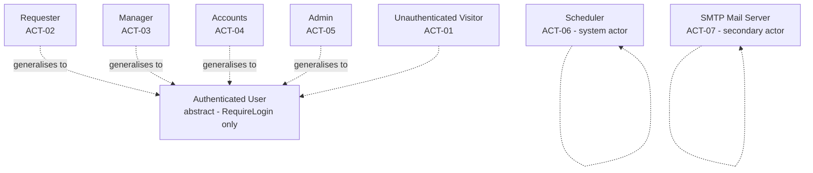
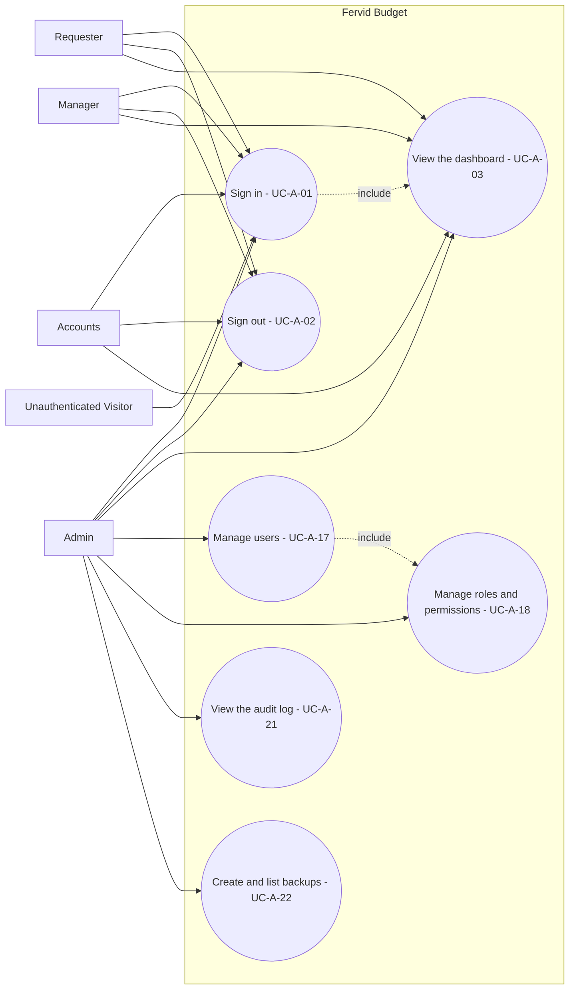
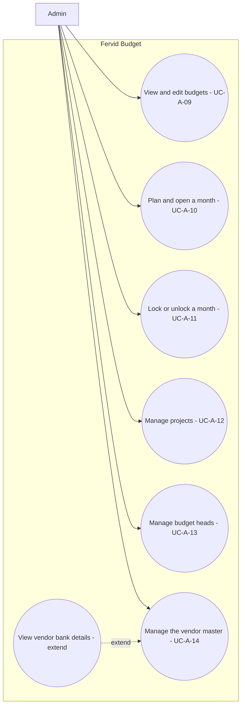
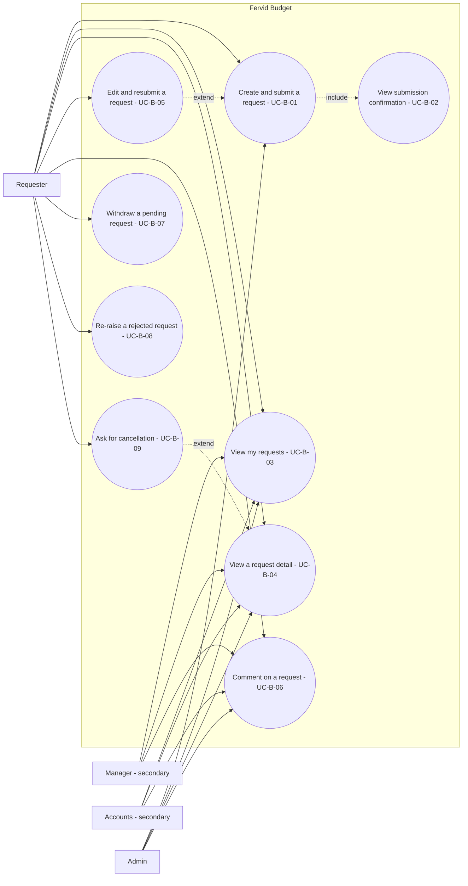
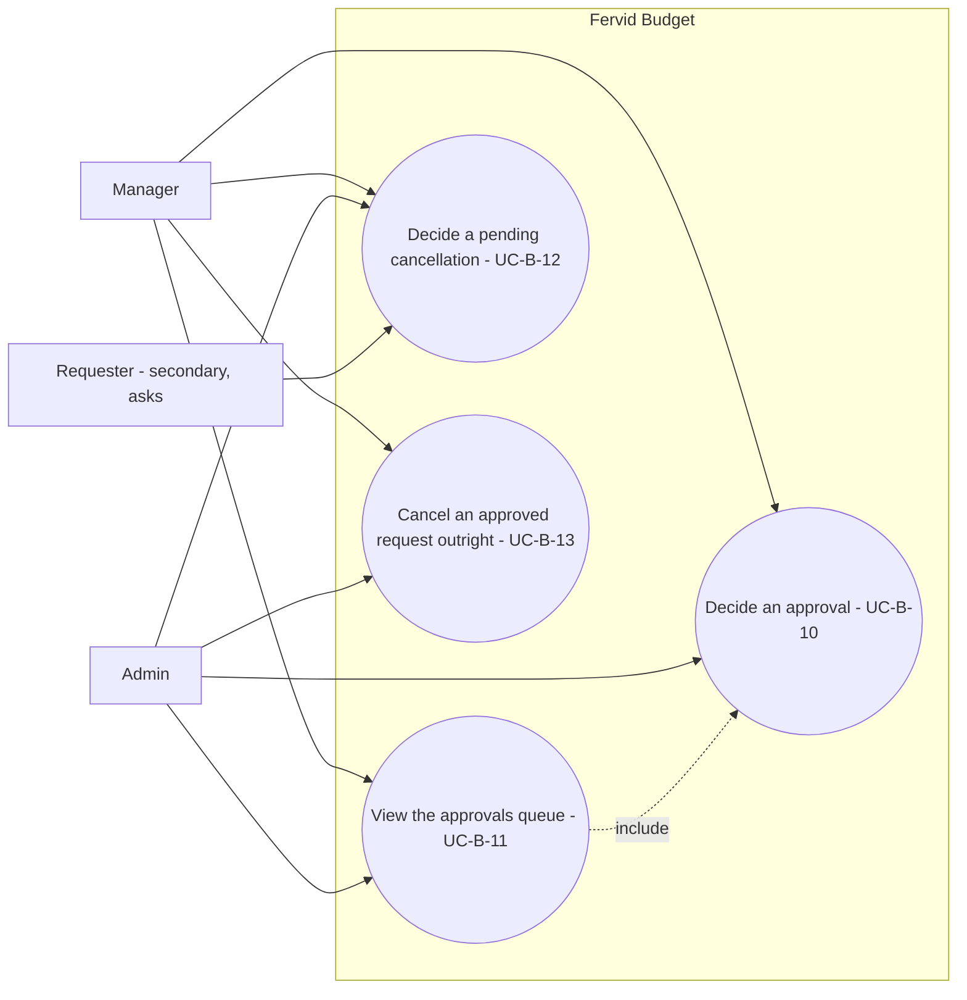
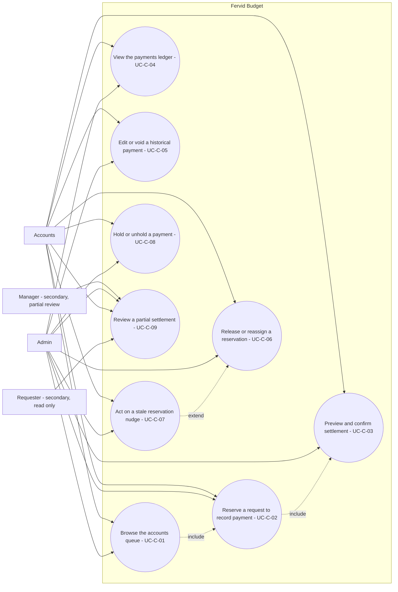
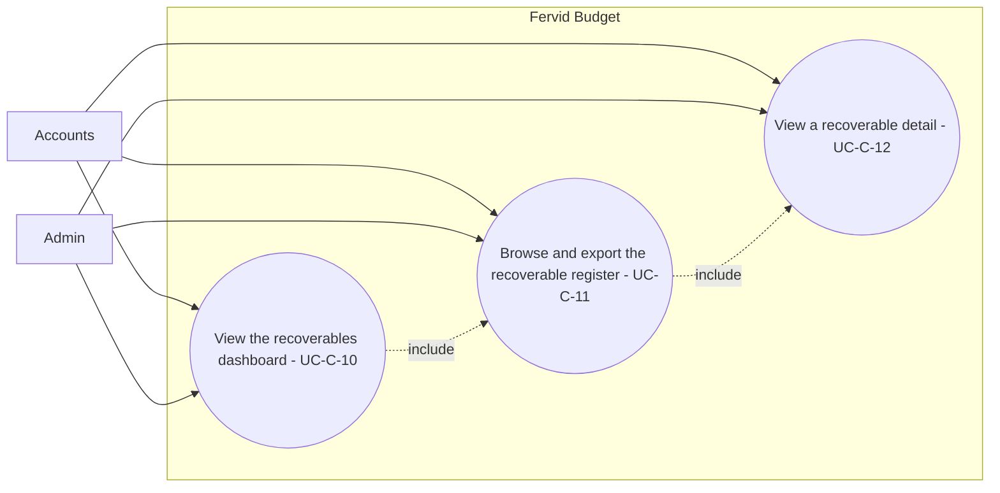
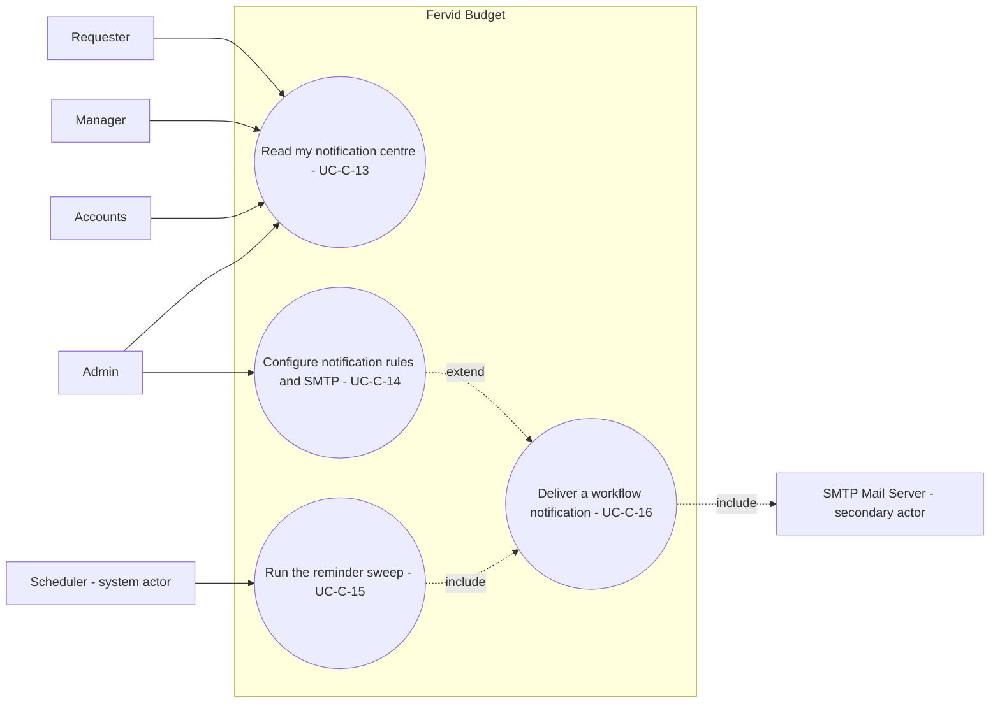
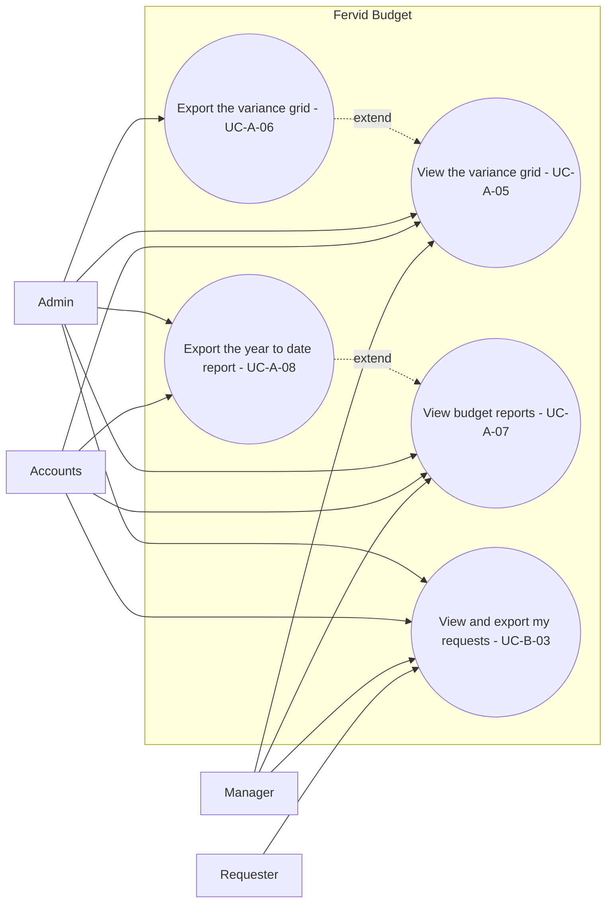

# 04 — Use-case diagram and actor model

Everything below is derived from the code, not from the specs: actors from
`seedSystemRoles` / `systemRoleDefaults` in `internal/store/migrations.go` and
the four-table permission model in `internal/store/permissions.go`; use cases
from every `mux.Handle`/`mux.HandleFunc` line in `App.routes`
(`internal/app/app.go:362-524`, 97 registrations) plus the nav in
`internal/app/nav.go`. Where a handler or store method narrows a grant beyond
what the roles table says, that narrowing is cited and carried into the
actor × use-case matrix as a footnote — the matrix is not intuition, it is the
grant tables in §1 read against the ownership checks in §4's citations.

ID scheme (shared with the use-case specifications another document writes
from this map): `UC-A-nn` platform, RBAC and admin; `UC-B-nn` requests and
approvals; `UC-C-nn` settlement, recoverables and notifications. Coverage IDs
in parentheses point at `docs/superpowers/specs/2026-07-25-payment-requests-coverage.md`.

---

## 1. Actor catalogue

Five of the seven rows are backed by a database role or a goroutine; two
(`Unauthenticated Visitor`, and the seeded roles considered as a *union*) are
modelling conveniences over what the code actually resolves per request.

| ID | Actor | Backed by | Grants held (resource:action) | Data scope | How a real person gets it |
|---|---|---|---|---|---|
| ACT-01 | Unauthenticated Visitor | No session; `auth.CurrentUser(r).ID == 0` | None — `store.EmptyPermissions()` returns a `dbPermissionSet` with nil maps, so every `Can` call is `false` (`internal/store/permissions.go:68,92-99`) | none | Simply has not signed in. `auth.Manager.RequireLogin` (`internal/auth/auth.go:87-95`) redirects every gated route to `/login`; only `GET /login`, `POST /login` (`internal/app/app.go:364-365`) and `GET /static/` (`:363`, no auth wrapper at all) are reachable unauthenticated. |
| ACT-02 | Requester | Seeded system role **Requester** (`internal/store/migrations.go:352-364`) | `request:{view,create,edit,withdraw,reraise,comment,cancel}`, `attachment:{view,create}` | `request=own` (`role_data_scope` row from `Scopes: []ScopeGrant{{"request","own"}}`, migrations.go:363) | An Admin checks the "Requester" role for the account on `POST /users` (`role_ids` form field → `store.SetUserRoles`, `internal/store/permissions.go:460-492`), or the account inherited it from `backfillUserRoles`/`assignDefaultRoleTx` — but those two default every non-admin legacy user to **Accounts**, not Requester (migrations.go:483-486, 502-505), so in practice Requester must be assigned explicitly. |
| ACT-03 | Manager | Seeded system role **Manager** (migrations.go:365-378) | `request:{view,comment}`, `approval:{approve,reject,return,reassign,accept_partial,cancel}`, `grid:view`, `report:view` | `request=all` | Same assignment path as Requester (`POST /users` role checkbox). Being *named* the approver on a specific request is a separate, per-request fact (`payment_requests.manager_id`), set by the requester's approver picker at submission (`store.ListApprovers`) or by an admin's default-approver setting (`SetUserDefaultApprover`, permissions.go:512-555) — holding the Manager role is necessary but not sufficient to decide any one request; see §5 footnotes. |
| ACT-04 | Accounts | Seeded system role **Accounts** (migrations.go:379-395) | `request:{view,comment}`, `payment:{view,create,edit,void,process,settle,mark_partial,hold}`, `reservation:{reserve,release}`, `attachment:{view,create}`, `grid:view`, `report:{view,export}`, `recoverable_report:{view,export}` | `request=all`, `payment=all` | Same assignment path. Also the legacy-role backfill default for every non-admin account (migrations.go:483-486, 502-505), and migration v5 separately (and now redundantly) grants `reservation:{reserve,release}` to any pre-existing Accounts role row on databases that upgraded before Phase 3 shipped (migrations.go:293-312). |
| ACT-05 | Admin | Seeded system role **Admin** (migrations.go:396-402) | Every one of the 66 canonical `(resource,action)` pairs — `adminGrants()` walks `resourceOrder`/`resourceActions` in full (permissions.go:150-183, migrations.go:404-412) | `request=all`, `payment=all` (explicit `ScopeGrant`s; every other resource in the vocabulary is unscoped, see `scopedResources`, permissions.go:185) | The bootstrap account: `app.New` calls `st.EnsureUser(ctx, cfg.AdminEmail, cfg.AdminName, adminHash, "admin")` on every boot (`internal/app/app.go:315-321`), and the legacy-role backfill / `assignDefaultRoleTx` map the literal string `"admin"` to the Admin system role (migrations.go:483-486, 501-516). Anyone else becomes Admin only if an existing Admin checks that role for them on `POST /users`. |
| ACT-06 | Scheduler (system actor) | The reminder goroutine started in `cmd/server/main.go:97-102` | None — it never resolves a `User`/`PermissionSet` at all; it calls `notify.Service.RunReminders` → `store.RequestsPendingReminder` / `store.RequestsStaleProcessing` directly, in-process, with no HTTP request and no `actor` argument (`internal/notify/reminders.go:13-49`) | n/a — bypasses the permission layer entirely | Nobody logs in as it. `main()` launches it as a goroutine sharing the server's shutdown context the instant the process starts (`cmd/server/main.go:98-102`), ticking hourly (`notify.Service.Scheduler`, `internal/notify/reminders.go:54-66`) for the life of the process. |
| ACT-07 | SMTP Mail Server (secondary actor) | External system reached via `net/smtp.SendMail` in `internal/notify/mailer.go:35-61` | n/a — outside the application's authorisation boundary entirely | n/a | Configured, not "granted": host/port/username/from-address are admin-editable `app_settings` rows edited at `POST /admin/notifications/smtp` (`notification:edit`, `internal/app/app.go:418`); the password comes only from the `SMTPPassword` environment variable and is never persisted (`internal/notify/mailer.go:25-26,29`). The application calls out to it; it never calls in. |

**Multiple roles, union access.** `user_roles` is a flat many-to-many table
(migrations.go:67-71) with no notion of a "higher" role. `EffectivePermissions`
(permissions.go:557-598) loops every role a user holds and unions every grant
into one map (`ps.add`, called once per `(resource,action)` row regardless of
which role contributed it, permissions.go:565-581); for scoped resources it
keeps the **broadest** scope via `mergeScope`/`scopeRank` — `all` (3) beats
`assigned` (2) beats `own` (1) beats no grant (0) (permissions.go:117-137,
583-596). So a user holding both Requester and Manager sees the union of both
grant sets and resolves to `request=all` (Manager's scope), not `own`. Nothing
in the schema or the resolver expresses "Manager implies Requester" or any
other inheritance — the breadth is arithmetic over whatever rows exist in
`user_roles`, not a hierarchy.

---

## 2. Actor generalisation diagram

There is **no role-hierarchy in the data**: `roles`, `role_permissions`,
`role_data_scope` and `user_roles` (migrations.go:43-71) are flat tables, and
Admin's completeness is a fact about what `adminGrants()` enumerates
(permissions.go:150-183; migrations.go:404-412), not a structural "Admin
extends Manager extends Accounts" relationship. The only generalisation drawn
below is the standard UML abstraction of "any authenticated user" — every
seeded role can sign in, sign out and reach the dashboard through the exact
same `RequireLogin` gate (`internal/auth/auth.go:87-95`) — and it is drawn as
an abstract actor, not a fifth role. Do not read the arrows as "Admin can do
everything Manager can therefore Admin *is a* Manager": that inference does
not follow from anything in `permissions.go`, and §5's footnotes show
concrete cases (self-approval, partial-review ownership) where Admin's own
grant breadth is *not* enough to act, exactly as it is not enough for Manager.

Notes on the diagram: the dotted `generalises to` edges are the only
generalisation relationships this model claims. `Unauthenticated Visitor` is
linked to `Authenticated User` only to show it is the actor that has *not yet*
become one (login is the transition), not a subtype of it. `Scheduler` and
`SMTP Mail Server` are drawn unconnected to the human branch on purpose: one
initiates work the way a primary actor does (it calls `RunReminders`), the
other is a supporting actor the system calls out to — forcing them under one
"System Actor" umbrella would claim a relationship (a shared interface or
shared behaviour) that does not exist between a ticker goroutine and an SMTP
socket.

---

## 3. Use-case diagrams

Mermaid has no native use-case notation. Each diagram below is a
`flowchart LR` with the system boundary as a `subgraph`, actors as nodes
outside it, plain edges for associations, and `-.->|include|` /
`-.->|extend|` for the two use-case relationships, per the brief's
convention. Every node label avoids `( ) : , # "` per the shared brief.

### 3.1 Platform, RBAC and admin

`Manage users` includes `Manage roles and permissions` because assigning a
role to a user (`POST /users`, `role_ids` field) reads the same role catalogue
`GET /roles` renders — the two screens share `store.AllRoles`/`UserRoles`
(`internal/app/app.go:1127-1165,1231-1265`).

### 3.2 Masters and vendors

Only Admin reaches any of these six use cases under the seeded grant sets —
Requester, Manager and Accounts hold no `vendor`, `vendor_bank`, `project`,
`head`, `budget` or `month` grants at all (grant lists in §1). `View vendor
bank details` is drawn as an `extend` because it is optional behaviour on top
of the base vendor screen: the bank block only appears when the caller
additionally holds `vendor_bank:view`, and the store leaves the columns out of
the query rather than the template hiding them (`internal/store/vendors.go:16,48,50,129,136`).

### 3.3 Requests

`Create and submit` includes `View submission confirmation` because
`requestCreate` never renders a second screen on success — it redirects
straight to `/requests/{id}/submitted` (`internal/app/requests.go:172-173`).
`Edit and resubmit` extends `Create and submit` because it is the same
adaptive form (`requestFormData`, `internal/app/requests.go:359-384`) reused
for a correction, gated to the requester and only while the request is
`pending` or `returned` (`loadEditableRequest`, `internal/app/requests.go:587-601`).

### 3.4 Approvals and cancellation

Every use case in this diagram is gated at the store on
`payment_requests.manager_id == actor.ID`, never on the grant's scope —
`ApproveRequest` (`internal/store/requests.go:687-694`, including the G8
self-approval refusal at 692-694), `decideRequest` for return/reject
(`:728-730`), `CancelRequest` (`:976-978`) and `DecideCancellation`
(`:931-933`) all check the named manager before anything else, and `GET
/approvals` hardcodes `Scope: "assigned"` regardless of the caller's own
`request` scope grant (`internal/app/requests.go:896`). Admin holding every
grant does not widen this: see §5 footnotes.

### 3.5 Linking and settlement

`Review a partial settlement` is the one screen four different actors touch
at four different strengths — see the UC-C-09 row in §4 and its footnote in
§5, because it is exactly the shape of finding the brief calls out: a manager
who is not this request's own manager can still open the screen (`request:view`
via `loadViewableRequest`) but cannot decide it, and Accounts and Admin can
always view it (scope `all`) but only the *named* manager, however that
manager got the grant, can accept or dispute (`AcceptPartial`,
`internal/store/store.go:980-982`).

### 3.6 Recoverables

Requester and Manager hold no `recoverable_report` grant at all (§1 grant
lists), so neither reaches any of the three routes behind
`recoverable_report:{view,export}` (`internal/app/app.go:403-406`).

### 3.7 Notifications and reminders

`Run the reminder sweep` has no HTTP route — it is `Service.Scheduler` ticking
hourly from `cmd/server/main.go:97-102` — and it always includes `Deliver a
workflow notification` because `RunReminders` calls the same `Notify` every
handler-triggered event calls (`internal/notify/reminders.go:39`,
`internal/notify/service.go:39-82`). `Deliver a workflow notification`
routes an email to the `SMTP Mail Server` only when the admin has switched
that event's email channel on (`cfg.EmailEnabled`, service.go:66-68) — the
in-app row is unconditional (G19, service.go:60-63). `Configure notification
rules and SMTP` is drawn as an `extend` on delivery because it changes *which*
events reach the mailer without being part of the delivery itself.

### 3.8 Dashboard, reporting and exports

Neither Manager nor Accounts holds `grid:export` — only `grid:view` — so
among the seeded roles only Admin can produce the CSV behind `GET
/export.csv` (`grid:export`, app.go:394); Accounts additionally holds
`report:export` so it alone (besides Admin) can pull `GET /reports/ytd.csv`
(app.go:398). Requester holds neither `grid` nor `report` grants and is
absent from every node except its own request export.

---

## 4. Use-case inventory

One row per use case, grouped by ID prefix. "Route(s)" lists every
`mux.Handle`/`mux.HandleFunc` line the use case covers; between them, §4.1–4.3
account for all 97 registrations in `internal/app/app.go:362-524` — the
running tally is given at the end of each subsection so a gap would be
visible. A route with **no** use case is flagged inline as **GAP**; the
reverse case this audit also found — a *grant* with no route — is called out
in the note after §4.2.

### 4.1 Platform, RBAC and admin (UC-A)

| UC ID | Name | Primary actor | Supporting actors | Route(s) | Permission gate(s) | Coverage IDs |
|---|---|---|---|---|---|---|
| UC-A-00 | Fetch a static asset | Unauthenticated Visitor | all | `GET /static/` (app.go:363) | none — no auth wrapper at all | — (infrastructure, not a business use case) |
| UC-A-01 | Sign in | Unauthenticated Visitor | Requester, Manager, Accounts, Admin | `GET /login`, `POST /login` (364-365) | none | — |
| UC-A-02 | Sign out | Requester, Manager, Accounts, Admin | — | `POST /logout` (366) | session only, CSRF | — |
| UC-A-03 | View the work dashboard | Requester, Manager, Accounts, Admin | — | `GET /{$}`, `GET /dashboard` (375, 381) | `RequireLogin` only; each work-area is gated internally on the verb its own queue needs (`dashboard.go:70,82,94,101`) | D1, D2, D4 |
| UC-A-04 | Hit an unregistered page | Requester, Manager, Accounts, Admin | — | `GET /` catch-all (376) | `RequireLogin`; proves the 405-not-404 fact for unrouted POSTs to a path the catch-all's GET pattern matches (`http_errors.go:158-160`) | — |
| UC-A-05 | View the variance grid | Manager, Accounts, Admin | — | `GET /grid` (377) | `grid:view` | — |
| UC-A-06 | Export the variance grid | Admin | — | `GET /export.csv` (394) | `grid:export` | D3 |
| UC-A-07 | View budget reports | Manager, Accounts, Admin | — | `GET /reports/monthly`, `/reports/projects`, `/reports/heads` (395-397) | `report:view` | — |
| UC-A-08 | Export the year-to-date report | Accounts, Admin | — | `GET /reports/ytd.csv` (398) | `report:export` | D3 |
| UC-A-09 | View and edit budgets | Admin | — | `GET /budgets`, `POST /budgets` (421-422) | `budget:view` / `budget:edit` | — |
| UC-A-10 | Plan and open a month | Admin | — | `GET /months`, `POST /months` (382-383) | `month:view` / `month:create` | — |
| UC-A-11 | Lock or unlock a month | Admin | — | `POST /months/{month}/lock`, `/unlock` (423-424) | `month:lock` | — |
| UC-A-12 | Manage projects | Admin | — | `GET /projects`, `POST /projects` (425-426) | `project:view` / `project:edit` | — |
| UC-A-13 | Manage budget heads | Admin | — | `GET /heads`, `POST /heads` (427-428) | `head:view` / `head:edit` | — |
| UC-A-14 | Manage the vendor master | Admin | — | `GET /vendors`, `/vendors/new`, `/vendors/search`, `/vendors/{id}`, `POST /vendors`, `POST /vendors/{id}` (431-436) | `vendor:view`/`create`/`edit` (+`vendor_bank:view`/`edit` narrows the bank block) | — |
| UC-A-15 | Download an attachment | Requester, Accounts, Admin | — | `GET /attachments/{id}` (393) | `attachment:view` — **unscoped**, no ownership check against the parent payment/request (see §Suspected defects in the report) | — |
| UC-A-16 | Upload a payment attachment | Accounts, Admin | — | `POST /payments/{id}/attachments` (392) | `attachment:create` — same unscoped gap as UC-A-15 | — |
| UC-A-17 | Manage users and role assignment | Admin | — | `GET /users`, `POST /users` (509-510) | `user:view` / `user:edit` | R1, R4 |
| UC-A-18 | Manage roles and permissions | Admin | — | `GET /roles`, `POST /roles`, `/roles/new`, `/roles/{id}/copy`, `/roles/{id}/delete` (511-515) | `role:view`/`edit`/`create`/`delete` | R1, R2, R3, R5, R7, R8, R9 |
| UC-A-19 | Manage system configuration | Admin | — | `GET /configuration`, `POST /configuration` (516-517) | `config:view` / `config:edit` | T10 |
| UC-A-20 | Manage recoverable categories | Admin | — | `POST /configuration/recoverable-categories` (520) | `recoverable_category:edit` (screen itself gated `config:view`) | V4 |
| UC-A-21 | View the audit log | Admin | — | `GET /audit` (521) | `audit:view` | C2 |
| UC-A-22 | Create and list backups | Admin | — | `GET /backups`, `POST /backups` (522-523) | `backup:view` / `backup:create` | — |

Routes accounted for in §4.1: 363-366, 375-377, 381-383, 392-398, 421-428,
431-436, 509-523 = **44 of 97**.

### 4.2 Requests, approvals and cancellation (UC-B)

| UC ID | Name | Primary actor | Supporting actors | Route(s) | Permission gate(s) | Coverage IDs |
|---|---|---|---|---|---|---|
| UC-B-01 | Create and submit a payment request | Requester | Admin | `GET /requests/new`, `/requests/new/fields`, `POST /requests/duplicate-check`, `POST /requests` (443-446) | `request:create` | T1-T12, A1, C4, X1 |
| UC-B-02 | View submission confirmation | Requester | Admin | `GET /requests/{id}/submitted` (447) | `request:view` | — |
| UC-B-03 | View and export my requests | Requester, Manager, Accounts, Admin | — | `GET /requests`, `GET /requests/export.csv` (441-442) | `request:view`, scope-filtered | Q5, A5, D3 |
| UC-B-04 | View a request's detail | Requester, Manager, Accounts, Admin | — | `GET /requests/{id}` (488) | `request:view` + `canViewRequest` scope check (`requests.go:332-343`) | Q5, N7 |
| UC-B-05 | Edit and resubmit a request | Requester | Admin | `GET /requests/{id}/edit`, `POST /requests/{id}/edit` (489-490) | `request:edit` + requester-only ownership, `pending`/`returned` only (`requests.go:587-601`) | Q1, A8 |
| UC-B-06 | Comment on a request | Requester | Manager, Accounts, Admin | `POST /requests/{id}/comment` (491) | `request:comment` (+ `request:view` to load it) | N7 |
| UC-B-07 | Withdraw a pending request | Requester | Admin | `POST /requests/{id}/withdraw` (492) | `request:withdraw` + requester-only (`WithdrawRequest`, requests.go:655-657) | Q2 |
| UC-B-08 | Re-raise a rejected request | Requester | Admin | `POST /requests/{id}/reraise` (493) | `request:reraise` + requester-only (`ReraiseRequest`, requests.go:815-817) | Q3 |
| UC-B-09 | Ask for cancellation of an approved request | Requester | Admin | `GET /requests/{id}/cancel`, `POST /requests/{id}/cancel-request` (501-502) | `request:cancel` + requester-only, both at the handler (`requests.go:802,810`) and the store (`RequestCancellation`, requests.go:875-877) | — (gap, see note below the table) |
| UC-B-10 | Decide an approval — approve, return or reject | Manager | Admin | `POST /requests/{id}/approve`, `/return`, `/reject` (494-496) | `approval:approve`/`return`/`reject` + **manager-only** ownership (`ApproveRequest` requests.go:687-694 incl. G8; `decideRequest` requests.go:728-730) | A2, A3, A4 |
| UC-B-11 | View the approvals queue | Manager | Admin | `GET /approvals` (508) | `approval:approve`; the store call always passes `Scope:"assigned"` regardless of the caller's own `request` scope grant (`requests.go:896`) | A5, A6 |
| UC-B-12 | Decide a pending cancellation | Manager | Requester (asks), Admin | `GET /requests/{id}/cancellation`, `POST /requests/{id}/cancellation` (504-505) | `approval:cancel` + manager-only (`DecideCancellation`, requests.go:931-933; handler check requests.go:837) | — (gap, see note below the table) |
| UC-B-13 | Cancel an approved request outright | Manager | Admin | `POST /requests/{id}/cancel` (503) | `approval:cancel` + manager-only (`CancelRequest`, requests.go:976-978) | — (gap, see note below the table) |

**Coverage-matrix gap:** UC-B-09, UC-B-12 and UC-B-13 — the entire
requester-asks / approver-decides / approver-cancels-outright cancellation
flow (`cancellation_requested` and `cancelled` statuses) — have no row in
`docs/superpowers/specs/2026-07-25-payment-requests-coverage.md`. Its L-series
(lifecycle) only runs L1-L11 and neither status appears in it; the
`02-state-machines.md` audit in this same `docs/qa/uml/` set independently
found the same absence ("`cancellation_requested`, `cancelled` … absent from
the spec's canonical enumeration"). The code comments that implement the flow
cite `G1`/`G2`/`G3` (e.g. `internal/store/requests.go:788-792`), but those
`G`-numbers belong to the foundation overview spec's rule list, not to the 92
IDs the coverage matrix enumerates — so the three use cases above are real,
shipped, tested workflow (`requests_test.go` exercises them) that the
92-row backbone simply never counted.

**Gap found the other direction (not a route without a use case, but a grant
without a route):** `approval:reassign` is seeded to Manager and Admin
(migrations.go:371,399), validated by `ValidGrant` (permissions.go:187-198),
editable from the roles screen (`permmap.go:69`), and fully implemented by
`store.ReassignRequest` (`internal/store/requests.go:759-799`, including its
own G8 check at 780-782) — but **no route in `App.routes` calls it.** The
only reachable "reassign" in the UI is `reservation:reassign`
(`POST /requests/{id}/reassign`, UC-C-06), a different resource entirely (who
holds the payment-processing reservation, not who approves). A Manager or
Admin cannot hand a pending request to a different approver through any
screen; the capability is exercised only by `internal/store/requests_test.go:815,818`.

Routes accounted for in §4.2: 441-447, 488-496, 501-505, 508 = **22 of 97**.
Running total: 44 + 22 = **66 of 97**.

### 4.3 Settlement, recoverables and notifications (UC-C)

| UC ID | Name | Primary actor | Supporting actors | Route(s) | Permission gate(s) | Coverage IDs |
|---|---|---|---|---|---|---|
| UC-C-01 | Browse the accounts queue | Accounts | Admin | `GET /accounts-queue` (476) | `payment:process` | S3, S4 |
| UC-C-02 | Reserve a request to record its payment | Accounts | Admin | `POST /requests/{id}/record-payment`, `GET /payments/new`, `/payments/new/options` (451, 384-385) | `reservation:reserve` / `payment:create` | S1, S2, S5, L8 |
| UC-C-03 | Preview and confirm settlement | Accounts | Admin | `POST /requests/{id}/settlement-preview`, `POST /payments` (454, 387) | `payment:settle` / `payment:create` | S9, S10, S13, S15 |
| UC-C-04 | View the payments ledger | Accounts | Admin | `GET /payments`, `GET /payments/{id}` (386, 388) | `payment:view` | S12 |
| UC-C-05 | Edit or void a historical payment | Accounts | Admin | `GET/POST /payments/{id}/edit`, `POST /payments/{id}/void` (389-391) | `payment:edit` / `payment:void` | S12, X6 |
| UC-C-06 | Release or reassign a reservation | Accounts | Admin | `GET /requests/{id}/reservation`, `POST /requests/{id}/release`, `POST /requests/{id}/reassign` (464-466) | GET: session only, gated internally on holding release-or-reassign (`reservationForm`, linking.go:527-538); POST release: `reservation:release`; POST reassign: `reservation:reassign` | S6, S7 |
| UC-C-07 | Act on a stale-reservation nudge | Accounts | Admin | `GET /requests/{id}/reservation/stale` (470) | `payment:process` | S8, N5, Q6 |
| UC-C-08 | Hold or unhold a payment | Accounts | Admin | `POST /requests/{id}/hold`, `/unhold` (474-475) | `payment:hold` | L7, Q6 |
| UC-C-09 | Review and decide a partial settlement | Manager | Accounts, Requester (view only), Admin | `GET /requests/{id}/partial-review`, `POST /requests/{id}/accept-partial`, `POST /requests/{id}/raise-concern` (482-484) | GET: `request:view`; decisions: `approval:accept_partial` + **manager-only** (`AcceptPartial` store.go:980-982, `RaiseConcern` similarly) | S11, L9 |
| UC-C-10 | View the recoverables dashboard | Accounts | Admin | `GET /recoverables` (403) | `recoverable_report:view` | V1-V3 |
| UC-C-11 | Browse and export the recoverable register | Accounts | Admin | `GET /recoverables/list`, `GET /recoverables/list.csv` (404-405) | `recoverable_report:view` / `export` | V3, V6 |
| UC-C-12 | View a recoverable's detail | Accounts | Admin | `GET /recoverables/{id}` (406) | `recoverable_report:view` | V7, V8 |
| UC-C-13 | Read my notification centre | Requester, Manager, Accounts, Admin | — | `GET /notifications`, `POST /notifications/read`, `GET /notifications/{id}/open` (411-413) | `RequireLogin` only — every row is already addressed to the caller | N1, N7 |
| UC-C-14 | Configure notification rules and SMTP | Admin | — | `GET /admin/notifications`, `POST /admin/notifications/smtp`, `/events/{event}`, `/test` (417-420) | `notification:view` / `edit` | N2, N8 |
| UC-C-15 | Run the reminder sweep | Scheduler | SMTP Mail Server, Requester/Manager/Accounts (recipients) | none — `cmd/server/main.go:97-102` invokes `notify.Service.Scheduler` in-process | n/a (bypasses the permission layer) | N4, N5, S8 |
| UC-C-16 | Deliver a workflow notification | System (notify.Service) | SMTP Mail Server, the request's requester/manager/accounts recipients | none — called inline from `requestCreate`, `requestEdit`, `requestApprove`, `requestReturn`, `requestReject`, `requestCancelAsk`, `paymentCreate`, `requestHold`/`requestUnhold` via `a.fire` (`internal/app/notifications.go:29-52`; call sites at `requests.go:172,676,726,735,744,824`, `app.go:724,726`, `linking.go:703`) | n/a | N1, N3, N6 |

Routes accounted for in §4.3: 384-391, 403-406, 411-413, 417-420, 451, 454,
464-466, 470, 474-476, 482-484 = **29 of 97**.

**Grand total: 44 + 22 + 29 = 97 of 97 registered routes covered.** No route
in `App.routes` is without a use case above; the one gap this audit found
runs the other way (§4.2's `approval:reassign` note).

---

## 5. Actor × use-case matrix

`P` primary — the role can complete the use case unaided. `S` secondary —
the role participates but is not who the use case is for. `R` read-only —
the role can open the screen but not act on it. `—` no access under the
seeded grants. Every cell is read off the grant lists in §1; footnotes below
the table record every place a handler- or store-level ownership check
narrows a `P`/`S` further than the raw grant would suggest.

### 5.1 Platform, RBAC and admin

| UC ID | Requester | Manager | Accounts | Admin |
|---|---|---|---|---|
| UC-A-00 | P | P | P | P |
| UC-A-01 | P | P | P | P |
| UC-A-02 | P | P | P | P |
| UC-A-03 | P¹ | P¹ | P¹ | P¹ |
| UC-A-04 | P | P | P | P |
| UC-A-05 | — | P | P | P |
| UC-A-06 | — | — | — | P |
| UC-A-07 | — | P | P | P |
| UC-A-08 | — | — | P | P |
| UC-A-09 | — | — | — | P |
| UC-A-10 | — | — | — | P |
| UC-A-11 | — | — | — | P |
| UC-A-12 | — | — | — | P |
| UC-A-13 | — | — | — | P |
| UC-A-14 | — | — | — | P |
| UC-A-15 | P² | — | P² | P² |
| UC-A-16 | — | — | P² | P² |
| UC-A-17 | — | — | — | P |
| UC-A-18 | — | — | — | P |
| UC-A-19 | — | — | — | P |
| UC-A-20 | — | — | — | P |
| UC-A-21 | — | — | — | P |
| UC-A-22 | — | — | — | P |

¹ The dashboard's *content* is not uniform: each work-area only renders for a
role holding the verb it is built on — `request:create` for "Needs your
action"/"In progress", `approval:approve` for the two approval areas,
`payment:process` for "Approved and unclaimed" (`dashboard.go:70,82,94`).
Manager holds no `request:create`, so a Manager's dashboard shows no
requester-side areas at all; only Admin (who holds every verb) sees every
area including the admin links block (`dashboard.go:101,111-127`).

² `attachment:view`/`attachment:create` are **not** in `scopedResources`
(permissions.go:185), and neither `attachmentDownload`
(`internal/app/app.go:881-911`) nor `AddAttachment`
(`internal/store/store.go:1310-1325+`) checks that the caller can see the
*parent* payment or request. Holding the flat grant is holding the grant for
every attachment in the system — see the report's Suspected defects.

### 5.2 Requests, approvals and cancellation

| UC ID | Requester | Manager | Accounts | Admin |
|---|---|---|---|---|
| UC-B-01 | P | — | — | P³ |
| UC-B-02 | P | — | — | P³ |
| UC-B-03 | P⁴ | P⁴ | P⁴ | P⁴ |
| UC-B-04 | P⁵ | P⁵ | P⁵ | P⁵ |
| UC-B-05 | P⁶ | — | — | P⁶ |
| UC-B-06 | P | S | S | S |
| UC-B-07 | P⁶ | — | — | P⁶ |
| UC-B-08 | P⁶ | — | — | P⁶ |
| UC-B-09 | P⁶ | — | — | P⁶ |
| UC-B-10 | — | P⁷ | — | P⁷ |
| UC-B-11 | — | P⁸ | — | P⁸ |
| UC-B-12 | S⁹ | P⁷ | — | P⁷ |
| UC-B-13 | — | P⁷ | — | P⁷ |

³ Admin holds `request:create`, so an Admin account can raise a request —
but `CreateRequest`'s G8 check (`internal/store/requests.go:142-143`) still
forbids naming themself as their own manager, exactly as it would for any
Requester.

⁴ Requester's list is scoped `own` (only rows they raised); Manager,
Accounts and Admin are scoped `all` and see every request, not just ones
assigned to them (`canViewRequest`, requests.go:332-343, `case "all": return
true`).

⁵ Same scope note as ⁴ — "view detail" for Manager/Accounts/Admin is not
limited to requests they are the named manager of; `request:view` with
`scope=all` opens any request's detail page.

⁶ Edit, withdraw, re-raise and ask-for-cancellation are all gated a second
time at the requester-ownership level regardless of grant scope
(`loadEditableRequest` requests.go:592; `WithdrawRequest` :655-657;
`ReraiseRequest` :815-817; `RequestCancellation` :875-877 and the handler
check at :802,810). Admin's `P` here means "only for requests Admin
personally raised" — identical in kind to Requester's own restriction, not
broader.

⁷ Approve/return/reject/cancel-outright/decide-cancellation are gated on
`payment_requests.manager_id == actor.ID` at the store, never on the grant's
scope (`ApproveRequest` requests.go:687-694; `decideRequest` :728-730;
`CancelRequest` :976-978; `DecideCancellation` :931-933). Manager's `P` and
Admin's `P` both mean "only for requests where this specific account is the
named approver" — an Admin who is not `manager_id` on a given request cannot
decide it despite holding every grant, and per G8 (`requests.go:692-694`)
nobody — including an Admin who is both the requester and, hypothetically,
the manager — may approve their own request.

⁸ `GET /approvals` always queries `Scope:"assigned"`
(`internal/app/requests.go:896`) irrespective of the caller's own `request`
scope grant, so Admin's queue here is exactly the same size as a Manager's:
requests where they are personally named `manager_id`. Admin's broader
`request=all` scope has no effect on this one screen.

⁹ Requester is `S` on UC-B-12 only in the sense that *asking* is a separate
use case (UC-B-09) that puts a row in front of the manager; the requester
holds no `approval:cancel` grant and cannot open or decide the
decision screen itself.

### 5.3 Settlement, recoverables and notifications

| UC ID | Requester | Manager | Accounts | Admin |
|---|---|---|---|---|
| UC-C-01 | — | — | P | P |
| UC-C-02 | — | — | P | P |
| UC-C-03 | — | — | P | P |
| UC-C-04 | — | — | P | P |
| UC-C-05 | — | — | P | P |
| UC-C-06 | — | — | P¹⁰ | P |
| UC-C-07 | — | — | P | P |
| UC-C-08 | — | — | P | P |
| UC-C-09 | R¹¹ | P¹² | R¹¹ | P¹² |
| UC-C-10 | — | — | P | P |
| UC-C-11 | — | — | P | P |
| UC-C-12 | — | — | P | P |
| UC-C-13 | P | P | P | P |
| UC-C-14 | — | — | — | P |
| UC-C-15 | n/a — system-initiated | n/a | n/a | n/a |
| UC-C-16 | n/a — system-initiated | n/a | n/a | n/a |

¹⁰ Accounts holds `reservation:release` but **not** `reservation:reassign`
(only Admin does, per `systemRoleDefaults`, migrations.go:379-395 vs.
396-402) — matching the code comment "Accounts is the role that takes work;
reassign … stays with an administrator" (migrations.go:386-389). So Accounts
can only release a reservation it personally holds
(`reservationForm`'s `mine && mayRelease` check, linking.go:531-538); it
cannot release or reassign someone *else's* stale reservation the way an
Admin can.

¹¹ `GET /requests/{id}/partial-review` needs only `request:view`
(app.go:482), which Requester (own scope) and Accounts (all scope) both
hold, so both can read the screen — but neither holds
`approval:accept_partial` (Requester's grants stop at `request:*`;
Accounts' grants are all `payment:*`/`reservation:*`/`report:*`, no
`approval` resource at all), so neither can post a decision.

¹² Accepting or disputing a shortfall is gated on `approval:accept_partial`
*and* `payment_requests.manager_id == actor.ID`
(`AcceptPartial`, store.go:980-982) — the same "P means only for requests
this account personally manages" pattern as footnote ⁷, explicitly called
out in the shared brief.

---

## 6. Out-of-scope non-use-cases

These are not missing features to add to the inventory above — they are
things the design explicitly forbids, each proven by the *absence* of a
route or column rather than the presence of one. Coverage IDs X1-X6 per
`docs/superpowers/specs/2026-07-25-payment-requests-coverage.md:125-133`.

| ID | Non-use-case | Proof of absence |
|---|---|---|
| X1 | No tax/TDS calculation | No `tax`/`tds` column on `payment_requests` or `payments` in any migration (`internal/store/migrations.go`, `schema.go`); no route under `App.routes` mentions tax or TDS. `vendors.tds_section`/`tds_rate` exist as free-text vendor master fields only (migrations.go:110-111) — nothing reads them into a calculation. |
| X2 | No recoverable repayment tracking | `recoverable_categories`/`recoverable_category` describe *classification* only (`V1`, `V4`, `V5`); there is no route or store method that records money coming back in — `App.routes` has no `POST` under `/recoverables/**`, only the three `GET`s in §4.3 (UC-C-10 to UC-C-12). |
| X3 | No refund/return-of-money | No route named `refund`/`return-of-money` anywhere in `App.routes` (app.go:362-524); the closest verb, `request:return` (`approval:return`), is the *manager sending the request back for correction*, not money moving. |
| X4 | No forfeiture/write-off | `completed_partial` (`AcceptPartial`, store.go:964-999) records that a balance was **not** collected, but there is no route or store method that forfeits, writes off, or debits a vendor/employee for it — the state is terminal and passive. |
| X5 | No direct request-less payment path | `POST /payments` (app.go:387) is `paymentCreate`, which hard-refuses when `request_id` is 0 (`internal/app/app.go:692-696`, "Payments must be linked to an approved request."); the only other payment-creation route, `RecordPaymentForRequest`, requires an active reservation (store.go:898-900). The free-standing `payments` INSERT survives only as a seed/import helper never reachable through `App.routes` (app.go:687-689 comment). |
| X6 | Historical payments untouched | `payments.request_id` is nullable and added additively in migration v4 (migrations.go:268-292); `paymentEditForm`/`paymentEdit`/`paymentVoid` (app.go:793-859, UC-C-05) still operate on any payment with `request_id IS NULL` exactly as before Phase 3, and `paymentDetail` (app.go:737-791) branches explicitly on `p.RequestID != nil` to keep the pre-linking ledger screen for the historical case (app.go:784-790). |

---

*Deliverable produced from `internal/store/permissions.go`,
`internal/store/migrations.go`, `internal/store/seed.go`,
`internal/store/requests.go`, `internal/store/store.go`,
`internal/app/app.go`, `internal/app/nav.go`, `internal/app/dashboard.go`,
`internal/app/requests.go`, `internal/app/linking.go`,
`internal/app/notifications.go`, `internal/app/http_errors.go`,
`internal/auth/auth.go`, `internal/notify/service.go`,
`internal/notify/reminders.go`, `internal/notify/events.go`,
`internal/notify/mailer.go`, `internal/app/vendors.go` and
`cmd/server/main.go`. No application code was modified to produce it.*
