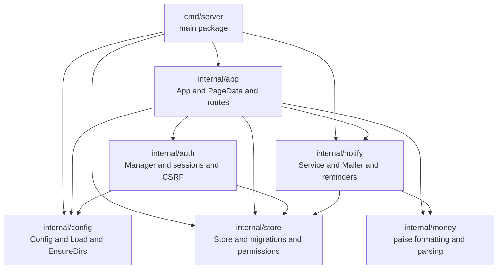
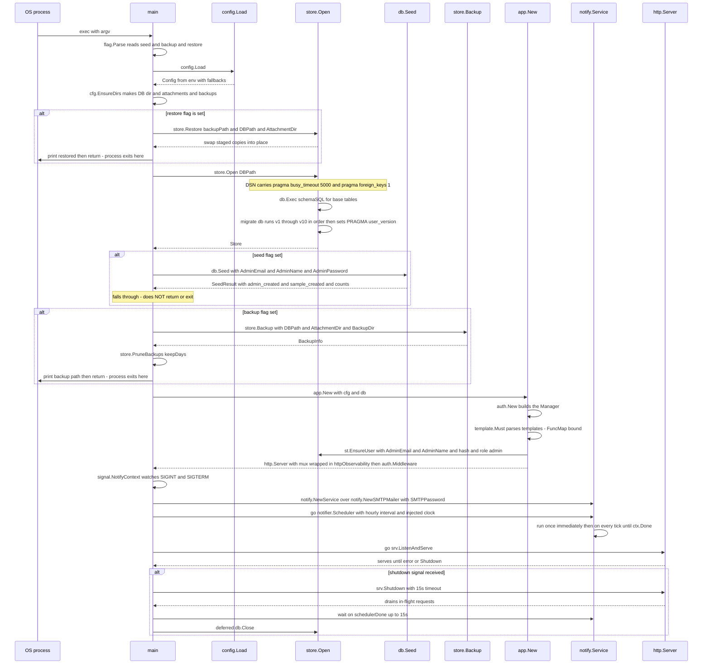
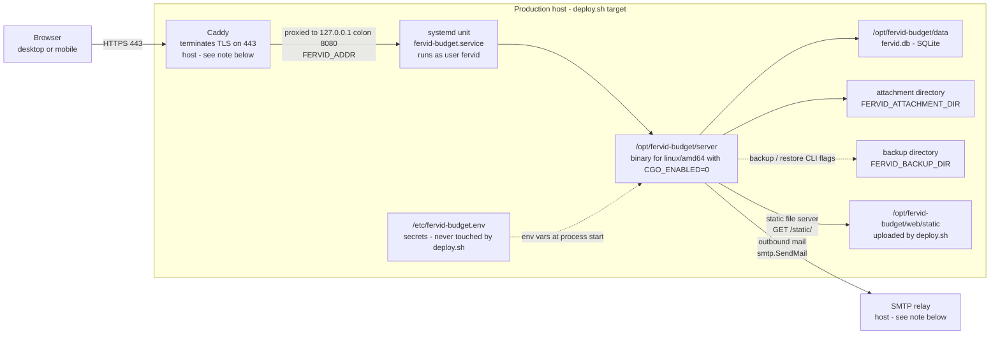

# 06 — Deployment and Component Architecture

Scope: the static shape of the Go packages, how `main()` wires them together and
starts the process, the environment surface that configures a deployment, the
production topology as documented, the client-side asset chain, and how the two
test suites (Go and Playwright) are isolated from each other and from production.
This document does not repeat the HTTP route table — that is
`docs/qa/uml/05-route-permission-matrix.md`'s job.

Every claim below is checked against the code at the cited `file:line`. Where a
brief-supplied fact could not be re-derived from a file this agent opened, it is
marked **[unverified]**.

---

## 1. Package / component diagram

Five internal packages plus `cmd/server`. Arrows point from a dependent to its
dependency (import direction).



Interfaces at the seams:

- `store.PermissionSet` (`internal/store/permissions.go:17-23`) — the read side
  of authorisation. `Can(resource, action) bool` and
  `Scope(resource) string`. `internal/auth` resolves it
  (`auth.Manager.permsFor`, `internal/auth/auth.go:100-105`, calling
  `store.EffectivePermissions`) and hands it to `internal/app` as
  `PageData.Perms` for every template gate. The concrete type,
  `dbPermissionSet` (`internal/store/permissions.go:58-61`), never leaves
  `store`; callers only see the interface, and `store.EmptyPermissions()`
  (`internal/store/permissions.go:68`) is the deny-all fallback used on any
  resolution error (`internal/auth/auth.go:112-117`).
- `notify.Mailer` (`internal/notify/mailer.go:20-22`) — `Send(ctx, Message) error`.
  `internal/app.App` holds both the interface value (`mailer notify.Mailer`,
  `internal/app/app.go:39`) and the `*notify.Service` built over it
  (`internal/app/app.go:203-204`), "kept separately so the rules screen can send
  a test message without inventing an event" (`internal/app/app.go:35-38`). The
  only implementation is `notify.SMTPMailer` (`internal/notify/mailer.go:27-37`),
  constructed identically in `cmd/server/main.go:97` and
  `internal/app/app.go:203`.
- No other exported interface exists in `internal/**`. A repo-wide
  `grep -n "interface {" internal/` returns exactly `store.PermissionSet` and
  `notify.Mailer` — every other cross-package contract (config load, store
  methods, auth manager methods) is a concrete struct or function, not an
  interface boundary.

**Layering.** The dependency graph above has no cycle: `store` and `money`
depend on nothing internal; `config` depends on nothing internal; `auth`
depends on `config` and `store` only; `notify` depends on `store` and `money`
only; `app` sits above all five; `cmd/server` sits above `app`, `config`,
`store` and `notify` directly (it must reach `store` and `notify` itself to run
`--seed`/`--backup`/`--restore` and to start the reminder scheduler before
handing the `*store.Store` to `app.New`). This is a clean, one-directional
layering — nothing in `store`, `money`, `config`, `auth` or `notify` imports
`app`, and nothing in `store`/`money`/`config` imports `auth` or `notify`. The
one thing worth naming rather than calling a violation: `cmd/server` and
`internal/app` both independently construct a `notify.Service` over a
`notify.SMTPMailer` (`cmd/server/main.go:97` for the reminder scheduler,
`internal/app/app.go:203-204` for request-driven notifications and the admin
"send test" action) — two live `*notify.Service` values reading and writing the
same `notifications` / `app_settings` tables through the same `*store.Store`,
never through each other. That is a deliberate duplication (comment at
`internal/app/app.go:35-38` explains the split), not a cycle, but it means a
future change to notification behaviour has two call sites to update.

---

## 2. Component responsibility table

Coverage percentages are recorded in `docs/superpowers/PROGRESS.md:56-57` and
are cited here, not recomputed:
`go test ./... -coverprofile=output/coverage.out` → app 72.5%, auth 92.2%,
notify 86.8%, config 90.9%, money 100%, store 74.1%.

| ID | Package | Responsibility | Key exported types | Depends on | Depended on by | Test files | Coverage % |
|---|---|---|---|---|---|---|---|
| CMP-01 | `cmd/server` | Process entrypoint: flags, config load, `store.Open`, optional seed/backup/restore, app construction, reminder scheduler goroutine, `ListenAndServe`, graceful shutdown | (none exported — `main` package) | `app`, `config`, `store`, `notify` | nothing (leaf) | none (integration-tested indirectly via `internal/app/app_integration_test.go`) | not separately measured |
| CMP-02 | `internal/app` | HTTP handlers, route table, `html/template` set and its `FuncMap`, `PageData` view model, CSRF-wrapped POST handling, error/panic middleware | `App`, `PageData`, `Shell` | `auth`, `config`, `money`, `notify`, `store` | `cmd/server` | `app_integration_test.go`, `http_safety_test.go`, `inapp_app_test.go`, `linking_test.go`, `nav_test.go`, `permmap_test.go`, `phase6_screens_test.go`, `recoverables_app_test.go`, `requests_test.go` | 72.5% |
| CMP-03 | `internal/auth` | Session cookie issue/verify (HMAC-signed, no server-side session store), CSRF double-submit cookie, password hashing/validation, permission-gated route middleware | `Manager`, `HashPassword`, `CheckPassword`, `CurrentUser` | `config`, `store` | `app` | `auth_test.go` | 92.2% |
| CMP-04 | `internal/config` | Environment-variable loading with fallbacks, directory bootstrap | `Config`, `Load`, `EnsureDirs` | (none internal) | `app`, `auth`, `cmd/server` | `config_test.go` | 90.9% |
| CMP-05 | `internal/store` | All persistence: schema + migrations, every domain query/mutation, permission vocabulary and resolution, backup/restore, audit log | `Store`, `PermissionSet`, `User`, `Request`, `Payment`, `Vendor`, `Role`, many more | `money` | `app`, `auth`, `notify`, `cmd/server` | 18 test files (`store_test.go`, `permissions_test.go`, `migrations_test.go`, `backup_test.go`, `linking_test.go`, `requests_test.go`, `requests_schema_test.go`, `recoverables_test.go`, `reminders_test.go`, `notifications_test.go`, `inapp_test.go`, `badges_test.go`, `pragma_test.go`, `approvers_test.go`, `settings_test.go`, `vendors_test.go`, and others) | 74.1% |
| CMP-06 | `internal/money` | `int64` paise arithmetic: parse, format (with `₹`), short format, amount-in-words | `FormatPaise`, `FormatShort`, `ParsePaise`, `InWords` | (none internal) | `app`, `store`, `notify` | `money_test.go` | 100% |
| CMP-07 | `internal/notify` | Event-to-recipient resolution, in-app notification rows, templated email rendering, SMTP transport, hourly reminder scheduler | `Service`, `Mailer`, `SMTPMailer`, `Message`, `RequestView` | `money`, `store` | `app`, `cmd/server` | `mailer_test.go`, `notify_test.go`, `reminders_test.go`, `service_test.go` | 86.8% |

---

## 3. Composition / startup sequence

`cmd/server/main.go:21-141`.



> **Correction — the migration chain grew after this document was written.** At commit `30edd6a`
> the chain ended at v7 and the line above read *"v1 through v7"*. The audit repair waves appended
> v8 `payments_head_nullable` (`internal/store/migrations.go:336`), v9 `notification_events_audit`
> (`:344`) and v10 `payments_vendor_id` (`:352`); the reserved-sequence comment at
> `internal/store/migrations.go:15-33` is the authority for the numbering and is where a v11 will
> appear. `migrate` itself is unchanged — it still applies every version above `PRAGMA user_version`
> in order inside one transaction each. See `docs/qa/results/REPAIR-LOG.md`.

Points confirmed against the code:

- **PRAGMAs ride on the DSN, not a later `db.Exec`.**
  `internal/store/store.go:23-49`, and its own comment
  (`internal/store/store.go:27-35`) states why: `PRAGMA` state is
  per-connection, `database/sql` opens new connections on demand, and
  `modernc.org/sqlite` applies every `_pragma` query parameter to each new
  connection. A single post-open `db.Exec("PRAGMA foreign_keys=1")` would
  configure only whichever pooled connection happened to serve that call —
  every other connection would run with foreign keys off and, more
  operationally significant, with no busy handler, so a concurrent
  `ReserveRequest` would fail immediately with `SQLITE_BUSY` instead of
  waiting up to 5 seconds for the writer ahead of it. `PRAGMA user_version` is
  read/written separately by `migrate` (`internal/store/migrations.go`,
  confirmed present but not fully reproduced here) and is connection-agnostic
  because it is stored in the database file header, not connection state — it
  does not need to ride the DSN.
- **`--seed` falls through to `ListenAndServe` rather than exiting** — verified.
  `cmd/server/main.go:56-68`: the `if *seed` block has no `return` or
  `os.Exit`, unlike the `--restore` block (`main.go:36-43`, which does
  `return`) and the `--backup` block (`main.go:70-81`, which also `return`s).
  After printing the seed summary, control falls straight into
  `app.New(cfg, db)` at `main.go:83` and the server starts normally. This
  matches the brief's stated gotcha exactly: `--seed` is additive
  ("create admin and sample setup data if empty", flag help text at
  `main.go:25`) and the process is meant to keep running afterward, whereas
  `--backup` and `--restore` are one-shot operations that always exit.
- The reminder scheduler is started **before** `ListenAndServe`
  (`main.go:97-102` precedes `main.go:104-108`), sharing the same
  `signal.NotifyContext` cancellation (`main.go:89-90`), so Ctrl-C/SIGTERM
  stops both; the deferred `db.Close()` (`main.go:50-54`) runs after the
  handler waits up to 15s for `schedulerDone` (`main.go:134-138`), specifically
  so a reminder write already in flight finishes before the database handle
  closes underneath it (comment at `main.go:132-133`).

---

## 4. Configuration surface

Every environment variable read by `config.Load` (`internal/config/config.go:28-42`),
plus one read directly by the test harness and one by the E2E web server that
is not part of the shipped `Config` struct.

| Name | Consumed at | Default | Required? | Secret? | Never persisted to DB? |
|---|---|---|---|---|---|
| `FERVID_ADDR` | `internal/config/config.go:30` | `:8080` | No | No | n/a |
| `FERVID_DB` | `internal/config/config.go:31` | `data/fervid.db` | No | No | n/a |
| `FERVID_ATTACHMENT_DIR` | `internal/config/config.go:32` | `data/attachments` | No | No | n/a |
| `FERVID_BACKUP_DIR` | `internal/config/config.go:33` | `data/backups` | No | No | n/a |
| `FERVID_SESSION_KEY` | `internal/config/config.go:34` | 32 random bytes, hex-encoded, via `randomHex(32)` (`internal/config/config.go:80-86`) | No, but see below | **Yes** — HMAC key that signs every session and CSRF cookie (`internal/auth/auth.go:234-238`) | **Yes, never persisted** — lives only in `Config`/process memory |
| `FERVID_SECURE_COOKIES` | `internal/config/config.go:35` | `false` | No | No | n/a |
| `FERVID_ADMIN_EMAIL` | `internal/config/config.go:36` | `admin@fervid.local` | No | No | Persisted, but as an ordinary `users.email` row via `EnsureUser` (`internal/app/app.go:319`) — not a secret |
| `FERVID_ADMIN_PASSWORD` | `internal/config/config.go:37` | No default; a unique password is required | No | **Yes** | **Never persisted in plaintext** — only its bcrypt hash reaches `users.password_hash` (`auth.HashPassword`, `internal/app/app.go:315-321`) |
| `FERVID_ADMIN_NAME` | `internal/config/config.go:38` | `Fervid Admin` | No | No | Persisted as `users.name` — not a secret |
| `FERVID_BACKUP_KEEP_DAYS` | `internal/config/config.go:39` | `30` | No | No | n/a |
| `FERVID_SMTP_PASSWORD` | `internal/config/config.go:40` | `""` (empty) | Effectively yes for outbound mail to work, but the app runs without it | **Yes** | **Never persisted, never logged** — held only in `config.Config.SMTPPassword` and passed straight into `notify.NewSMTPMailer` (`cmd/server/main.go:97`, `internal/app/app.go:203`); the comment at `internal/config/config.go:22-24` states this explicitly, and `store.MailSettings` (`internal/store/notifications.go:23-34`) — the struct the admin "Configuration" screen edits and that *is* written to `app_settings` — has no password field at all |

Two more variables exist but are **not** read by `config.Load` / the shipped
binary — they are test-harness only:

| Name | Consumed at | Default | Required? | Secret? | Notes |
|---|---|---|---|---|---|
| `FERVID_E2E_PORT` | `playwright.config.ts:7` | `4173` | No | No | Selects the Playwright web-server port and derives every other runtime path for that run; never read by Go code |
| (E2E env block) | `playwright.config.ts:39-46` | — | — | — | The Playwright `webServer.command` sets `FERVID_ADDR`, `FERVID_DB`, `FERVID_ATTACHMENT_DIR`, `FERVID_BACKUP_DIR`, `FERVID_SESSION_KEY`, `FERVID_ADMIN_EMAIL`, `FERVID_ADMIN_PASSWORD` for its own spawned server — these are the same names as above, just fixed values for the test run, not new variables |

`EnsureCSRF`/session signing never reads any environment variable directly —
they all flow through `Config.SessionKey`, so `FERVID_SESSION_KEY` is the only
input; if it is unset, `randomHex(32)` mints a fresh key on every process
start (`internal/config/config.go:80-86`), which means **every existing
session and CSRF cookie is invalidated on every restart** unless the operator
pins `FERVID_SESSION_KEY` — a deployment-relevant consequence of leaving it at
its default. `docs/OPERATIONS.md` does not mention `FERVID_SESSION_KEY` at all
(confirmed by reading the full file, `docs/OPERATIONS.md:1-42`) — it covers
only DB/attachment/backup paths, seeding, backup and restore.

---

## 5. Deployment diagram

Drawn strictly from `docs/OPERATIONS.md` and `deploy.sh`. Nothing here beyond
what those two files state; any value not present in either is written
`<configured>`.



Notes on what could and could not be verified:

- The brief's opening description ("browser → Caddy on 443 terminating TLS →
  the app on 127.0.0.1:8080 as a systemd unit") is **not directly stated in
  the two files this section is scoped to.** `deploy.sh` confirms a `systemctl
  restart fervid-budget.service` (`deploy.sh:46`) and a public HTTPS health
  check against `the configured FERVID_PUBLIC_URL` (`deploy.sh:25,53`),
  and `docs/OPERATIONS.md` never mentions Caddy, TLS, or a port at all. Neither
  file states that the app listens on `127.0.0.1:8080` specifically, nor names
  Caddy as the reverse proxy — those two details come from the brief itself,
  not from a file this agent read. They are drawn on the diagram because the
  brief asked for them, but the concrete host/IP/proxy software is marked
  `<configured>` rather than asserted as verified fact.
- The server's real address is `the configured FERVID_DEPLOY_HOST` (`deploy.sh:23`, default
  for `FERVID_DEPLOY_HOST`) and the app directory is
  `/opt/fervid-budget` (`deploy.sh:24`); these two are genuinely in the file
  and are reproduced above, unlike the Caddy/port claim.
- `deploy.sh:11-13` states explicitly: "Your data (SQLite DB, attachments,
  backups under `/opt/fervid-budget/data`) and secrets
  (`/etc/fervid-budget.env`) are NEVER touched by this script" — so the env
  file's existence and path are verified, but its contents are not visible to
  this agent and are marked `<configured>`.
- `deploy.sh` uploads only the binary and `web/static` (`deploy.sh:34-38`); it
  never touches the database, attachments or backups, and never runs
  migrations explicitly — the binary runs `store.Open` → `migrate` on its own
  next start, which is what makes the "still at `user_version = 0`" state
  (§8 below) a live risk on the very next deploy.
- SMTP host/port/username are admin-editable data in `app_settings`
  (`store.MailSettings`, `internal/store/notifications.go:23-34`), not an
  environment variable — so the SMTP relay box in the diagram is a runtime
  destination the app dials out to per-message (`internal/notify/mailer.go:59-61`),
  not a deployment-time configured host. No hostname for it appears in any
  file this agent read; it is `<configured>` by definition.

---

## 6. Static assets and the client side

`web/static/` contains exactly five files (`ls -la web/static/`):
`fervid-app.js` (549 lines), `fervid-ds.css` (4,627 lines), `htmx.min.js`
(minified, one line), `fervid-logo.svg`, and `_kitchensink.html` (a design
reference page, not linked from any route).

Everything under `/static/` is served by one line:
`mux.Handle("GET /static/", http.StripPrefix("/static/", http.FileServer(http.Dir("web/static"))))`
(`internal/app/app.go:363`) — a bare `net/http` file server, no build step, no
bundler, no cache-busting query string.

Every rendered page includes exactly three assets, unconditionally, from the
`top` template (`internal/app/templates.go:36-39`):

```
<link rel="stylesheet" href="/static/fervid-ds.css">
<script src="/static/htmx.min.js" defer></script>
<script src="/static/fervid-app.js" defer></script>
```

**No CDN reference exists anywhere in the template set** — confirmed by the
single `<script src=` pair above being the only two script tags the `top`
template emits, both pointing at `/static/`. `docs/superpowers/PROGRESS.md:345-349`
records that this vendoring is itself a fix: the original `htmx.min.js` was "a
1,172-byte no-op placeholder from the initial commit, so every `hx-*`
attribute in the product was inert," and genuine **htmx 2.0.6** is now
vendored and served locally. The same note states plainly: **"Its hash has
not been checked against the official registry."** This agent did not
independently verify the file's SHA against htmx's published 2.0.6 release
hash either — doing so would require reaching the public registry, which is
out of scope for a static-architecture pass — so that gap stands unresolved
and is repeated here rather than silently closed.

`fervid-app.js` (`web/static/fervid-app.js:1-10`) is explicitly "progressive
enhancement over server-rendered markup. Nothing here decides what a user is
allowed to see... every conditional field is re-validated in Go." Its
responsibilities, each traced to a function:

- **Accordion contract** — `.acc-head`/`.acc-item`/`.acc-body` (and the
  `.pa-*` role-scoped variant), toggled by `setAccordion`
  (`fervid-app.js:54-65`) and `toggleAccordion` (`fervid-app.js:83-85`). The
  open/closed truth ships in the server-rendered markup as `.is-open` on the
  item; the script republishes that through `aria-expanded` and
  `aria-controls` and lazily assigns the body an `id` — it never invents state
  the server did not already render. `initAccordions`
  (`fervid-app.js:71-81`) upgrades any non-`<button>` head with
  `role="button"`/`tabindex`, and a `keydown` listener
  (`fervid-app.js:429-437`) gives Space/Enter parity for those. This is the
  same contract `docs/superpowers/PROGRESS.md:101-105` says the Phase-6 grid
  accordion had to be built against, having initially been built on
  `<details>/<summary>` by mistake.
- **Overlay sheets** — a focus-trapping modal stack (`openDialogs`,
  `fervid-app.js:101-142`): `openDialog`/`closeDialog` push/pop a stack so "a
  sheet opened from a sheet closes in the right order"; a `keydown` handler
  (`fervid-app.js:146-176`) makes Escape close the top dialog and Tab cycle
  within it rather than escape behind it — explicitly contrasted with the
  mockup, which "had neither." Declarative triggers are `[data-open]`/
  `[data-close]` attributes plus clicking the `.overlay` backdrop itself
  (`fervid-app.js:401-419`), and the mobile "More" tab bar sheet
  (`.js-more`/`.ms-close`, `fervid-app.js:356-368`) uses the same primitive.
- **htmx interactions** — the script re-runs its whole `init()` on both
  `htmx:afterSwap` and `htmx:load` (`fervid-app.js:541-542`), so every
  behaviour above (accordions, conditional reveal, money fields, the
  difference banner, the role matrix) re-initialises correctly inside content
  htmx swapped in, not just on first paint. htmx itself contributes no visible
  UI; every `hx-get`/`hx-post`/`hx-target` attribute lives in the Go template
  strings (e.g. the combobox search in `payment_pick_request`,
  `internal/app/templates.go:621-632`, and the settlement preview button,
  `internal/app/templates.go:445-449`).
- **The combobox** — `.combo-list [data-id]` click delegation
  (`fervid-app.js:378-399`): picking a result writes the row's id into a
  hidden `[data-combo-value]` input (what the server actually validates) and
  the row's name into the visible text box (display only, never trusted), then
  clears the results list. Where a picker has no hidden value to fill, the row
  is left as an ordinary link — the same thing a no-JS browser gets, since the
  markup degrades to a plain GET (documented at `internal/app/templates.go:560-565`
  for the payment-request picker specifically).
- Two more behaviours the brief did not name but that live in the same file
  and are worth recording for completeness: `[data-when]` conditional field
  reveal (`fervid-app.js:182-211`, re-synced on every `change` event,
  `fervid-app.js:439-441`) — display-only, re-enforced server-side per the
  file's own header comment — and the Indian-grouping money field with
  amount-in-words (`fervid-app.js:217-334`), which the difference-banner logic
  (`fervid-app.js:498-527`) reuses for its own formatting rather than
  duplicating a second formatter.

The design-system stylesheet is `fervid-ds.css` (4,627 lines, 86,739 bytes) —
one file, no preprocessor, no import graph; `docs/superpowers/PROGRESS.md:239-242,291-293`
records the standing rule that "a missing class is a Phase 0 defect" and that
every class added to a template must be grepped against this file, because an
unstyled class renders as nothing and no automated test catches it.

---

## 7. Test architecture

### Go suite

Both harness constructors build a fully isolated stack per test, never sharing
a database file or process:

- `newTestStore(t)` (`internal/store/store_test.go:617-629`) opens a fresh
  SQLite file at `filepath.Join(t.TempDir(), "fervid-budget-test.db")` through
  the real `store.Open` — so every store test runs the real schema, the real
  PRAGMAs and the real migration chain — and registers `t.Cleanup` to close it.
  `t.TempDir()` gives each test function (and each parallel subtest) its own
  directory, so Go's own test parallelism cannot make two tests contend for
  one database file.
- `newAppTestServer(t)` (`internal/app/app_integration_test.go:40-60+`) goes
  one level up: it builds a `config.Config` pointed at `t.TempDir()` for
  `DBPath`/`AttachmentDir`/`BackupDir`, a fixed-but-throwaway
  `SessionKey`/`AdminEmail`/`AdminPassword`, calls `cfg.EnsureDirs()`,
  `store.Open(cfg.DBPath)`, and then the real `app.New(cfg, st)` — so
  integration tests exercise the actual `*http.Server` construction path,
  including template parsing and admin-user bootstrap, not a mock.
- Coverage per package is the figure already cited in §2, sourced from
  `docs/superpowers/PROGRESS.md:56-57` rather than recomputed here.

### Playwright suite

`playwright.config.ts:1-55`. Ten spec files under `tests/e2e/`
(`baseline.spec.ts`, `components.spec.ts`, `core-workflows.spec.ts`,
`fixtures.ts` [helpers, not a spec], `linking-settlement.spec.ts`,
`regression-issues.spec.ts`, `request-workflow.spec.ts`, `requests.spec.ts`,
`shell.spec.ts`, `ux.spec.ts`, `vendors.spec.ts`).

- **Per-process runtime isolation.** `const runtime = \`output/playwright/runtime/run-${process.pid}\`` (`playwright.config.ts:9`) keys the whole runtime
  directory off the PID of the Playwright process itself, and the
  `webServer.command` (`playwright.config.ts:36-47`) creates
  `${runtime}/attachments` and `${runtime}/backups`, then launches
  `go run ./cmd/server --seed` with `FERVID_DB=${runtime}/fervid-e2e.db` and
  matching attachment/backup dirs. Two Playwright invocations on the same
  machine therefore never share a database file, even if they happen to run
  at the same moment, because each gets its own PID-named runtime tree.
- **`FERVID_E2E_PORT` slot.** `const port = Number(process.env.FERVID_E2E_PORT ?? 4173)` (`playwright.config.ts:7`), and every output path
  (`outputDir`, the HTML report folder, `baseURL`, the spawned server's
  `FERVID_ADDR`) is derived from `port` (`playwright.config.ts:8,13,20,39`).
  The header comment explains the intent directly: "Several agents audit
  different domains at the same time and each needs its own server and its
  own database, so the port, the runtime directory and every output path are
  keyed off `FERVID_E2E_PORT`" (`playwright.config.ts:3-6`) — this is the
  mechanism that lets more than one Playwright runner exist concurrently
  without colliding on a port, an output directory, or the seeded database.
  Unset, it is byte-for-byte the original single-runner configuration on 4173
  (same comment).
- **Two device projects.** `chromium` (`devices['Desktop Chrome']`) and
  `mobile-chrome` (`devices['Pixel 5']`), the latter with
  `testIgnore: /regression-issues\.spec\.ts/` (`playwright.config.ts:27-33`) —
  so that one file is never collected for the mobile project at all, as
  distinct from a test inside a file skipping itself at runtime.
- **`workers: 1` and `fullyParallel: false`** (`playwright.config.ts:14-15`).
  Neither is explained in-file, but the reason is inferable from the rest of
  the configuration this agent read: the suite drives one shared server
  process and one shared seeded database per run (`webServer` is started once
  per `FERVID_E2E_PORT` slot, not once per test or per worker), and the
  workflow specs mutate genuinely shared state — reservations, approvals,
  role assignments — through that one database. Parallel workers hitting the
  same server and the same rows would race on exactly the concurrency
  primitives the app itself defends with a single conditional `UPDATE`
  (`store.ReserveRequest`, `internal/store/store.go:730-753`, "only the first
  committer matches, so a losing caller sees `RowsAffected()==0`") — a real
  app behaviour that a naively parallel test run would trip over as a false
  failure. This inference is **not** independently confirmed by a comment in
  `playwright.config.ts` itself, so it is offered as informed reasoning, not
  as a verified fact.
- **Screenshot convention.** `docs/superpowers/PROGRESS.md:327-331` and
  `.gitignore` (`.gitignore` root) agree:
  `output/playwright/baseline/` is "the frozen pre-redesign record and nothing
  in the suite writes to it," captures go to `current/`
  (`FERVID_SHOT_DIR=<name>` for a third set), and PROGRESS.md records this as
  a trap that already bit once — `baseline.spec.ts` used to overwrite the very
  images it was compared against, and a `make test-all` run destroyed the
  baseline. The `.gitignore` comment (added per the commit referenced in this
  session's git log, "chore: ignore any FERVID_SHOT_DIR capture directory, not
  just baseline/current") confirms the fix generalised to `output/playwright/*/`
  and `output/playwright/*.png` rather than naming `baseline`/`current`
  one at a time.

---

## 8. Operational risks

Ranked by this agent's judgement of severity × likelihood, each with its
evidence. Reported only — no remediation proposed, per the brief.

1. **Production has never run the app and will run the full migration chain,
   untested, on first deploy.** `docs/superpowers/PROGRESS.md:396-398`: "It is
   still on the initial commit at `user_version = 0`, so it will run v1→v5 in
   full on first deploy." That sentence is itself now stale by the project's
   own later history — the migration chain has since grown to v10
   (`internal/store/migrations.go:18-29`, and confirmed live in the file:
   `Version: 1` through `Version: 10` at lines 42, 99, 150, 272, 304, 320,
   327, 336, 344, 352) — so the real exposure is larger than PROGRESS.md's own
   "Known gaps" section currently states: a first production start runs
   **v1 through v10** in one process lifetime, not v1 through v5. Every
   migration is written to be idempotent (`internal/store/migrations.go:35-39`,
   "re-applying it after a `user_version` reset is safe"), but
   idempotent-in-isolation is not the same claim as "the whole chain has been
   proven end-to-end against a database that has never seen any of it," which
   per PROGRESS.md it has not.

   **Correction — the chain is three longer than when this was written.** At
   commit `30edd6a` this paragraph read "grown to v7 … runs v1 through v7",
   citing `Version: 1` through `Version: 7` at lines 39, 96, 147, 269, 301,
   317, 324. The audit repair waves appended v8 (`migrations.go:336`,
   `payments.head_id` nullable), v9 (`:344`, nine further notification rows)
   and v10 (`:352`, `payments.vendor_id`); the version cites above have been
   restated against the current file and the three older ones have all shifted
   by three lines. v8 is the one that matters operationally: it is the only
   **table rebuild** in the chain — create/copy/drop/rename of `payments` with
   `payment_attachments` stashed and restored around it
   (`internal/store/migrations.go:435-495`) — so it is the migration a first
   production start has the most to lose on. See `docs/qa/results/REPAIR-LOG.md`.
2. **SQLite single-writer characteristic under concurrent reservation.**
   `store.Open` sets `busy_timeout(5000)` (`internal/store/store.go:36`), so a
   losing writer waits up to 5 seconds rather than failing immediately — but
   it is still one writer at a time for the whole database. `ReserveRequest`
   (`internal/store/store.go:730-753`) is the one place this is load-bearing
   by design (a single conditional `UPDATE` is the entire concurrency
   guarantee), but every other write path shares the same single-writer file.
   Under real Accounts-team concurrency (several people simultaneously
   reserving, releasing, settling, budgeting) each write serialises behind the
   busy timeout; the design accepts this at the intended scale, but nothing in
   the files read for this document states what request volume the 5-second
   timeout was sized against, and PROGRESS.md records no load test.
3. **Backup coverage is manual and CLI-triggered, not scheduled.**
   `store.Backup`/`store.CreateBackup` (`internal/store/backup.go:39-106`) and
   `store.PruneBackups` (`internal/store/backup.go:163-187`) are real and
   tested (`internal/store/backup_test.go` exists), and `cmd/server`'s
   `--backup` flag runs one and exits (`cmd/server/main.go:70-81`). But nothing
   in `deploy.sh`, `docs/OPERATIONS.md`, or any file this agent read invokes
   `--backup` on a schedule (no cron entry, no systemd timer unit, no
   `deploy.sh` step). `docs/OPERATIONS.md:42` recommends keeping "at least 30
   daily backups... unless local policy says otherwise" and periodically
   testing restore, but a recommendation in a doc is not evidence a backup
   timer exists on the production host — that host's crontab/systemd timers
   are not visible to this agent, so whether backups actually run at all in
   production is **unverified**, not merely un-documented.
4. **`FERVID_SESSION_KEY` defaults to a fresh random key per process start.**
   `internal/config/config.go:34,80-86`: if the operator has not pinned this
   variable in `/etc/fervid-budget.env` (a file this agent cannot see the
   contents of — see §5), every `systemctl restart` — including the one
   `deploy.sh` runs on every deploy (`deploy.sh:46`) — silently invalidates
   every signed-in session and every outstanding CSRF cookie, forcing every
   user to log in again. This is not a security defect (the HMAC signing
   itself is sound, `internal/auth/auth.go:234-238`), but it is an operational
   surprise a deploy could trigger on every release if the env file does not
   pin the key, and its presence/absence in the actual production env file is
   unverified from the code alone.
5. **Two independent `notify.Service` instances read and write the same
   tables.** As noted in §1, `cmd/server/main.go:97` and
   `internal/app/app.go:203-204` each construct their own `*notify.Service`
   over their own `*notify.SMTPMailer`. Both share the same `*store.Store` and
   therefore the same `app_settings`/`notifications` rows, so there is no data
   split — but any future stateful change to `Service` (an in-memory cache,
   a rate limiter, anything that is not purely a pass-through to `store`)
   would silently diverge between the scheduler's view and the request
   handlers' view, because the two are genuinely separate values with no
   shared reference to each other. Today, with `Service` holding no state
   beyond the `*store.Store`/`Mailer` pointers it was built from
   (`internal/notify/service.go:14-21`), this is latent rather than active.

---

## Coverage IDs touched

This document models static architecture, configuration, deployment and test
infrastructure — it does not trace to the payment-requests coverage matrix
(`R1–R9`, `T1–T12`, `A1–A8`, `Q1–Q6`, `L1–L11`, `S1–S15`, `V1–V8`, `N1–N8`,
`D1–D5`, `X1–X6`, `C1–C4`), which is domain/workflow behaviour. **None of the
92 IDs apply to this deliverable**; it is infrastructure documentation the
coverage matrix does not, and should not, enumerate.
